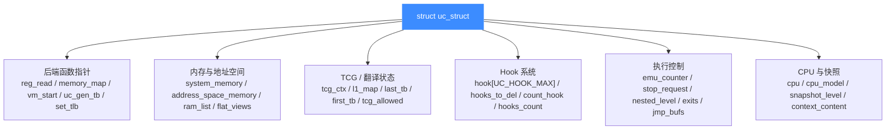

# uc_priv.h 内部私有头文件

> 🧠 [`include/uc_priv.h`](https://github.com/android-security-engineer/unicorn-skills/blob/master/include/uc_priv.h) 是 Unicorn 引擎的「内部宪法」：它定义了核心的 `struct uc_struct`、所有后端函数指针 typedef、Hook 数据结构与遍历宏。读完你会清楚谁该 include 它、它定义了哪些核心类型，以及为什么绑定使用者**不应**直接包含它。

## 📌 概述

`uc_priv.h` 是 **内部私有头文件**，与 `qemu.h` 一起构成 Unicorn 内部实现的两块基石。它不在公开 API 表面（公开 API 是 `include/unicorn/unicorn.h`），但几乎所有 `uc.c`、`list.c`、各架构后端的 `unicorn*.c` 都包含它。

**谁应该 include 它：**

- Unicorn **核心 C 实现**（`uc.c`、`list.c`、`hook.c` 等）
- 各架构后端 glue 代码（`qemu/target/<arch>/unicorn*.c`）
- **内部工具或调试代码**，需要直接读写 `uc_struct` 字段时

**谁不应该 include 它：**

- 语言绑定的最终使用者（Python/Rust/Go/… 用户）
- 只想用公开 API 的应用代码 —— 这些应该只 include `unicorn/unicorn.h`

```c
// include/uc_priv.h 顶部依赖
#include "unicorn/platform.h"
#include <stdio.h>
#include "qemu.h"              // 内部 QEMU glue，同样不对外
#include "qemu/xxhash.h"
#include "unicorn/unicorn.h"   // 公开 API
#include "list.h"              // 内部链表
```

::: warning uc_priv.h 与 qemu.h 是内部头
`uc_priv.h` 和它 include 的 `qemu.h` 都属于内部头文件，其内容随版本可能变动。**绑定使用者不应直接 include 这两个头**，应只依赖 `include/unicorn/unicorn.h` 暴露的稳定 API。直接依赖内部结构体会让你绑死在某一版的字段布局上。
:::

## 🧩 它定义了什么

`uc_priv.h` 主要提供四类内容：

| 类别 | 代表符号 | 用途 |
| --- | --- | --- |
| 宏 / 掩码 | `UC_MODE_*_MASK`、`READ_*`/`WRITE_*`、`UC_MAX_NESTED_LEVEL` | 模式校验、整数按位读写、嵌套层数上限 |
| 函数指针 typedef | `reg_read_t`、`uc_write_mem_t`、`uc_gen_tb_t`、`uc_set_tlb_t` … | 后端填入 `uc_struct` 的回调签名 |
| 结构体 | `struct uc_struct`、`struct hook`、`struct uc_context`、`mmio_cbs`、`HookedRegion` | 引擎状态、Hook 节点、CPU 快照、MMIO 注册块 |
| Hook 遍历宏 / 枚举 | `uc_hook_idx`、`HOOK_FOREACH`、`HOOK_BOUND_CHECK`、`HOOK_EXISTS` | Hook 链表迭代与地址命中判断 |

## 🔢 关键宏

| 宏 | 值 / 定义 | 含义 |
| --- | --- | --- |
| `UC_MAX_NESTED_LEVEL` | `64` | `uc_emu_start()` 最大递归嵌套层数（Hook 回调里再 start） |
| `UC_MODE_ARM_MASK` 等 | 各架构支持 mode 的按位或 | 校验 `uc_open()` 传入的 mode 是否合法 |
| `ARR_SIZE(a)` | `sizeof(a)/sizeof(a[0])` | 数组元素数 |
| `READ_QWORD/DWORD/WORD/BYTE_H/BYTE_L` | 位掩码取值 | 从整数中按宽取低位 |
| `WRITE_DWORD/WORD/BYTE_H/BYTE_L` | 位写回 | 局部写回整数的一部分 |
| `UC_TB_COPY(uc_tb, tb)` | 宏语句 | 把 `TranslationBlock` 的 `pc/icount/size` 拷到精简的 `uc_tb` |
| `UC_HOOK_IDX_MASK` | `(1<<6)-1` | hook 索引占低 6 位 |
| `UC_HOOK_FLAG_NO_STOP` | `1<<6` | 该 hook 在 tracecode 中不停止模拟 |
| `UC_HOOK_FLAG_MASK` | `~UC_HOOK_IDX_MASK` | 标志位掩码 |
| `MEM_BLOCK_INCR` | `32` | realloc 增量，**必须为 2 的幂** |

## 🪝 Hook 类型与遍历宏

`uc_hook_idx` 枚举与公开头里的 `uc_hook_type` **一一对应**，用作 `uc_struct.hook[]` 数组的下标：

| 枚举值 | 对应公开 Hook 类型 |
| --- | --- |
| `UC_HOOK_INTR_IDX` | `UC_HOOK_INTR` |
| `UC_HOOK_INSN_IDX` | `UC_HOOK_INSN` |
| `UC_HOOK_CODE_IDX` | `UC_HOOK_CODE` |
| `UC_HOOK_BLOCK_IDX` | `UC_HOOK_BLOCK` |
| `UC_HOOK_MEM_READ_UNMAPPED_IDX` … `UC_HOOK_MEM_FETCH_PROT_IDX` | 三类 unmapped/prot |
| `UC_HOOK_MEM_READ_IDX` / `WRITE` / `FETCH` | 普通内存访问 |
| `UC_HOOK_MEM_READ_AFTER_IDX` | 读后回调 |
| `UC_HOOK_INSN_INVALID_IDX` | 非法指令 |
| `UC_HOOK_EDGE_GENERATED_IDX` | 边生成 |
| `UC_HOOK_TCG_OPCODE_IDX` | TCG opcode |
| `UC_HOOK_TLB_FILL_IDX` | TLB 填充 |
| `UC_HOOK_MAX` | 数组长度 |

遍历与命中宏：

```c
// 声明游标
HOOK_FOREACH_VAR_DECLARE;            // struct list_item *cur

// 遍历某类 hook 链表
HOOK_FOREACH(uc, hh, UC_HOOK_CODE) {
    // hh 是 struct hook *
}

// 地址是否落在 hook 的 [begin, end] 区间（且未被标记删除）
if (HOOK_BOUND_CHECK(hh, addr)) { ... }

// 快速判断某类 hook 是否存在 / 存在且命中
HOOK_EXISTS(uc, UC_HOOK_CODE);
HOOK_EXISTS_BOUNDED(uc, UC_HOOK_CODE, addr);
```

## 🧱 struct hook：一个 Hook 节点

每个 `uc_hook_add` 注册的 hook 在内部是一个 `struct hook`：

| 字段 | 类型 | 含义 |
| --- | --- | --- |
| `type` | `int` | `UC_HOOK_*` 类型 |
| `insn` | `int` | `UC_HOOK_INSN` 时的指令枚举 |
| `refs` | `int` | 引用计数（同一 hook 可挂在多条链表） |
| `op` / `op_flags` | `int` | `UC_HOOK_TCG_OPCODE` 的 opcode 与标志 |
| `to_delete` | `bool` | 用户删除标记；真正释放**延迟**到安全时机 |
| `begin` / `end` | `uint64_t` | 仅当 PC 或内存地址落在区间内才触发 |
| `callback` | `void *` | 实际是某个 `uc_cb_*` 类型 |
| `user_data` | `void *` | 用户透传数据 |
| `hooked_regions` | `GHashTable *` | 该 hook 已插桩的区域集合（避免重复插桩） |

::: details 为什么要延迟删除
Hook 可能在被遍历途中被回调内代码删除。直接 `free` 会破坏链表遍历，因此先置 `to_delete = true`，由 `hooks_to_del` 链表在退出安全区后统一回收。
:::

## 🏛️ struct uc_struct：引擎核心

`uc_engine` 对外是不透明指针，对内就是 `struct uc_struct`。详细字段说明见 [struct uc_struct 结构](/internals/uc-struct)，这里只列出 `uc_priv.h` 中该结构的逻辑分区：



核心字段速查（节选）：

| 字段 | 类型 | 用途 |
| --- | --- | --- |
| `arch` / `mode` | `uc_arch` / `uc_mode` | 当前架构与模式 |
| `errnum` | `uc_err` | 最近错误码 |
| `reg_read` / `reg_write` | `reg_read_t` / `reg_write_t` | 寄存器读写后端 |
| `init_arch` | `uc_args_uc_t` | `uc_open` 选定的后端初始化入口 |
| `vm_start` | `uc_args_int_uc_t` | 进入 QEMU 主循环 |
| `memory_map` / `memory_map_ptr` | 函数指针 | 内存映射 |
| `uc_gen_tb` / `uc_invalidate_tb` / `tb_flush` | 函数指针 | 翻译块生成 / 失效 / 全清 |
| `set_tlb` | `uc_set_tlb_t` | 切换 TLB 模式 |
| `cpu` | `CPUState *` | 唯一的虚拟 CPU |
| `hook[UC_HOOK_MAX]` | `struct list[]` | 每种 Hook 类型一条链表 |
| `hooks_to_del` | `struct list` | 延迟删除队列 |
| `emu_counter` / `emu_count` | `size_t` | 已执行 / 目标指令数 |
| `stop_request` / `quit_request` | `bool` | 立即停 / 退出当前 TB |
| `nested_level` / `jmp_bufs[]` | `int` / `sigjmp_buf[]` | 支持嵌套 `uc_emu_start` |
| `exits[]` / `ctl_exits` | 数组 / `GTree` | `until` 停止地址集合 |
| `snapshot_level` | `int32_t` | 当前内存快照层级（COW） |

## 🧷 struct uc_context：可分离的快照壳

`uc_context_save/restore` 用的变长结构，尾部 `char data[0]` 承载真实的 CPU 上下文：

| 字段 | 含义 |
| --- | --- |
| `context_size` | 真实内部上下文大小 |
| `mode` / `arch` | 该上下文的模式与架构 |
| `snapshot_level` | 恢复时要回退到的内存快照层级 |
| `ramblock_freed` | 是否曾有 ramblock 被释放 |
| `last_block` | ramblock 链表末元素 |
| `fv` | 当前的 FlatView |
| `data[0]` | 柔性数组，承载 CPU 寄存器等上下文 |

## 📞 后端函数指针 typedef（精选）

`uc_priv.h` 用 typedef 统一了所有后端回调的签名，使 `uc_struct` 成为一张函数指针表：

| typedef | 签名（节选） | 用途 |
| --- | --- | --- |
| `reg_read_t` | `uc_err (*)(void *env, int mode, uint regid, void *value, size_t *size)` | 读寄存器 |
| `reg_write_t` | `uc_err (*)(void *env, int mode, uint regid, const void *value, size_t *size, int *setpc)` | 写寄存器 |
| `uc_write_mem_t` / `uc_read_mem_t` | `bool (*)(AddressSpace *as, hwaddr addr, uint8_t *buf, hwaddr len)` | 物理内存读写 |
| `uc_read_mem_virtual_t` | `bool (*)(uc, vaddr, uint32_t prot, uint8_t *buf, int len)` | 虚拟地址读 |
| `uc_virtual_to_physical_t` | `bool (*)(uc, vaddr, uint32_t prot, uint64_t *res)` | 虚拟→物理地址翻译 |
| `uc_mem_cow_t` | `MemoryRegion *(*)(uc, MemoryRegion *cur, hwaddr begin, size_t size)` | 内存 COW |
| `uc_gen_tb_t` | `uc_err (*)(uc, uint64_t pc, uc_tb *out_tb)` | 在指定 PC 生成翻译块 |
| `uc_invalidate_tb_t` | `void (*)(uc, uint64_t start, size_t len)` | 失效指定地址的 TB |
| `uc_tcg_flush_tlb_t` / `uc_tb_flush_t` | `void (*)(uc)` | 清 TLB / 清所有 TB |
| `uc_set_tlb_t` | `uc_err (*)(uc, int mode)` | 切换 TLB 模式 |
| `uc_context_size_t` / `uc_context_save_t` / `uc_context_restore_t` | size/err/err | CPU 上下文大小/保存/恢复 |
| `uc_add_inline_hook_t` / `uc_del_inline_hook_t` | `void (*)(uc, struct hook *hk, ...)` | inline hook 到 `helper_table` |
| `uc_insn_hook_validate` | `bool (*)(uint32_t insn_enum)` | 校验某指令能否 hook |
| `uc_args_int_t` (`stop_interrupt`) | `bool (*)(uc, int intno)` | 判断某中断是否应停止模拟 |
| `query_t` | `uc_err (*)(uc, uc_query_type, size_t *result)` | `uc_query` 后端 |

## 🛠️ 内联工具函数

头文件还内联了几个高频小工具：

| 函数 | 作用 |
| --- | --- |
| `uc_add_exit(uc, addr)` | 向 `ctl_exits` GTree 插入一个停止地址 |
| `uc_addr_is_exit(uc, addr)` | 判断地址是否为退出点（区分 `use_exits` 与嵌套 `exits[]`） |
| `hooked_regions_hash` / `hooked_regions_equal` | `HookedRegion` 的哈希与相等（用 `qemu_xxhash4`） |
| `hooked_regions_add` / `hooked_regions_check` | 记录/检查 hook 已插桩区域（仅 CODE/BLOCK） |
| `break_translation_loop(uc)` | 退出当前 TB（用户停模拟或改 IP 时调用 `cpu_exit`） |
| `revert_uc_emu_stop(uc)` | 清除 `stop_request` 及 CPU 退出标志，恢复继续模拟 |

## 🧪 uc_tracer（可选）

当编译时定义 `UNICORN_TRACER`，头文件会暴露 `uc_tracer`、`trace_loc`（`UC_TRACE_TB_EXEC` / `UC_TRACE_TB_TRANS`）及 `UC_TRACE_START` / `UC_TRACE_END` 宏，用于内部 TB 执行/翻译阶段的计时。未定义时这些宏为空，零开销。

## ⚠️ 注意

- `uc_priv.h` include 了 `qemu.h`，因此间接拉入大量 vendored QEMU 类型（`MemoryRegion`、`AddressSpace`、`CPUState`、`RAMList`…）。这些类型同样不稳定。
- `struct uc_struct` 字段在不同版本间会增删，**不要在绑定层硬编码偏移**。
- 若只是想读寄存器、映射内存、加 Hook，请走 `unicorn/unicorn.h` 的公开 API；只有在写后端或调试内部状态时才需要 `uc_priv.h`。

## 📖 参考

- 源码：[`include/uc_priv.h`](https://github.com/android-security-engineer/unicorn-skills/blob/master/include/uc_priv.h)
- 公开 API 头：[`include/unicorn/unicorn.h`](https://github.com/android-security-engineer/unicorn-skills/blob/master/include/unicorn/unicorn.h)
- 内部 QEMU glue：[`qemu.h`](https://github.com/android-security-engineer/unicorn-skills/blob/master/include/qemu.h)（同目录）

## 📂 相关源码

| 文件 | 角色 |
|------|------|
| [`include/uc_priv.h`](https://github.com/android-security-engineer/unicorn-skills/blob/master/include/uc_priv.h) | 本页所述内部私有头，定义 `struct uc_struct`、函数指针 typedef、Hook 结构与遍历宏 |
| [`uc.c`](https://github.com/android-security-engineer/unicorn-skills/blob/master/uc.c) | 操作 `uc_struct` 的公共 API 实现（`uc_open` / `uc_close` / `uc_hook_add` 等） |
| [`list.c`](https://github.com/android-security-engineer/unicorn-skills/blob/master/list.c) | 实现 `struct list` 链表操作，被 `uc_struct.hook[]` 使用 |
| [`include/qemu.h`](https://github.com/android-security-engineer/unicorn-skills/blob/master/include/qemu.h) | 被 `uc_priv.h` include 的 QEMU 桥接头，带入 `RAMBlock`/`RAMList` 等类型 |

## 相关页面

- [struct uc_struct 结构](/internals/uc-struct)
- [uc.c 分发层](/internals/uc-dispatch)
- [公开 API](/api/)
- [Hook 体系](/hooks/)
- [快照与 COW 实现](/internals/snapshot-impl)
