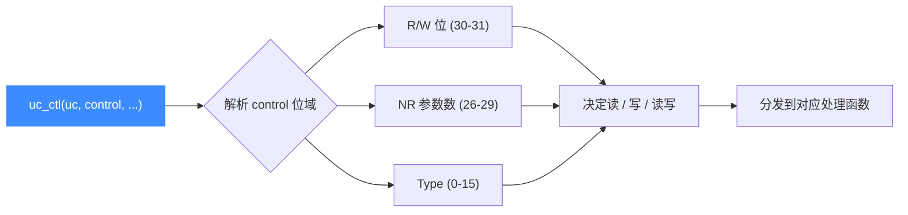
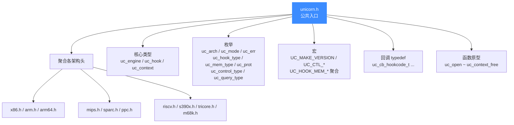

# unicorn.h — 公共 C API 头文件

本页讲 [`include/unicorn/unicorn.h`](https://github.com/android-security-engineer/unicorn-skills/blob/master/include/unicorn/unicorn.h)：它是 Unicorn 引擎对外的唯一入口头文件，所有语言绑定都建筑在它上面。读完你能清楚这个头文件定义了哪些核心类型、枚举、宏与函数原型，知道该 include 谁、不该 include 谁。

## 📌 概述

`unicorn.h` 是 **公共头**（public header）。任何使用 Unicorn C API 的程序——无论是直接写 C，还是 Python/Rust/Go 等绑定的 C 桥接层——都只需 `#include <unicorn/unicorn.h>` 即可获得全部公开接口。它在内部做的事：

1. 前置声明 `struct uc_struct`，并 `typedef` 成对外不透明的 `uc_engine`。
2. 聚合各架构的寄存器/常量头（`x86.h`、`arm.h`、`arm64.h`、`mips.h`、`sparc.h`、`ppc.h`、`riscv.h`、`s390x.h`、`tricore.h`、`m68k.h`）。
3. 定义架构、模式、错误码、Hook 类型、内存访问类型、`uc_ctl` 控制码等全部公开枚举。
4. 声明全部 `UNICORN_EXPORT` API 函数（`uc_open` ~ `uc_context_free`）。

```c
#include <unicorn/unicorn.h>   // 唯一需要 include 的公开头
```

::: warning 内部头不要直接 include
绑定使用者和上层应用**不应**直接 `#include` 以下内部头：

- `include/uc_priv.h` —— 定义 `struct uc_struct` 的真实布局（函数指针表 + 运行时状态），属于引擎内部 ABI，跨版本不保证稳定。要理解其结构请看 [struct uc_struct](/internals/uc-struct)。
- `include/unicorn/qemu.h` / `qemu/` 下任何头 —— 来自 vendored QEMU，是后端实现细节。

对外稳定契约只有 `include/unicorn/unicorn.h` 与 `include/unicorn/<arch>.h` 中的常量。
:::

## 🧱 核心类型与宏

| 标识符 | 类别 | 说明 |
|--------|------|------|
| `uc_engine` | `typedef struct uc_struct` | 引擎不透明句柄，所有 API 的第一个参数 |
| `uc_hook` | `typedef size_t` | Hook 句柄，由 `uc_hook_add` 写出、`uc_hook_del` 注销 |
| `uc_context` | `typedef struct uc_context` | CPU 上下文快照句柄（`uc_context_*`） |
| `UNICORN_EXPORT` | 宏 | 跨平台导出符号（GCC `visibility("default")` / MSVC `__declspec(dllexport)`） |
| `UNICORN_DEPRECATED` | 宏 | 跨平台弃用标记 |
| `UC_API_MAJOR/MINOR/PATCH/EXTRA` | 宏 | API 版本号（当前 `2.1.4`，`EXTRA=255` 表示正式发布） |
| `UC_VERSION_*` | 宏 | 包版本号，默认与 API 版本号一致 |
| `UC_MAKE_VERSION(major, minor)` | 宏 | 拼出可与 `uc_version()` 返回值比较的版本整数 |
| `UC_SECOND_SCALE` | 宏 | `1000000`，秒→微秒换算（`uc_emu_start` 的 `timeout` 单位） |
| `UC_MILISECOND_SCALE` | 宏 | `1000`，毫秒→微秒换算 |

## 🏗️ 架构与模式

### `uc_arch` — 架构枚举

| 值 | 名称 | 说明 |
|----|------|------|
| 1 | `UC_ARCH_ARM` | ARM（含 Thumb / Thumb-2） |
| 2 | `UC_ARCH_ARM64` | AArch64 |
| 3 | `UC_ARCH_MIPS` | MIPS |
| 4 | `UC_ARCH_X86` | x86 / x86-64 |
| 5 | `UC_ARCH_PPC` | PowerPC |
| 6 | `UC_ARCH_SPARC` | SPARC |
| 7 | `UC_ARCH_M68K` | Motorola 68K |
| 8 | `UC_ARCH_RISCV` | RISC-V |
| 9 | `UC_ARCH_S390X` | s390x |
| 10 | `UC_ARCH_TRICORE` | TriCore |
| — | `UC_ARCH_MAX` | 边界哨兵 |

### `uc_mode` — 模式枚举（按位标志）

| 值 | 名称 | 适用架构 | 说明 |
|----|------|----------|------|
| `0` | `UC_MODE_LITTLE_ENDIAN` | 全部 | 小端（默认） |
| `1<<30` | `UC_MODE_BIG_ENDIAN` | 全部 | 大端 |
| `0` | `UC_MODE_ARM` | ARM/ARM64 | ARM（A32）模式 |
| `1<<4` | `UC_MODE_THUMB` | ARM | Thumb/Thumb-2 |
| `1<<5` | `UC_MODE_MCLASS` | ARM | Cortex-M（已弃用，改用 `UC_ARM_CPU_*` + `uc_ctl`） |
| `1<<6` | `UC_MODE_V8` | ARM | ARMv8 A32 编码 |
| `1<<10` | `UC_MODE_ARMBE8` | ARM | 大端数据 + 小端代码（仅 UC1 遗留） |
| `1<<7/8/9` | `UC_MODE_ARM926/946/1176` | ARM | 32 位 CPU 类型（已弃用） |
| `1<<2/3` | `UC_MODE_MIPS32/MIPS64` | MIPS | MIPS32 / MIPS64 ISA |
| `1<<4/5/6` | `UC_MODE_MICRO/MIPS3/MIPS32R6` | MIPS | MicroMips / MIPS III / MIPS32r6（均未实现） |
| `1<<1/2/3` | `UC_MODE_16/32/64` | x86 | 16 / 32 / 64 位 |
| `1<<2/3` | `UC_MODE_PPC32/PPC64` | PPC | 32 / 64 位（PPC64 未实现） |
| `1<<4` | `UC_MODE_QPX` | PPC | QPX（未实现） |
| `1<<2/3` | `UC_MODE_SPARC32/SPARC64` | SPARC | 32 / 64 位 |
| `1<<4` | `UC_MODE_V9` | SPARC | SPARC V9（未实现） |
| `1<<2/3` | `UC_MODE_RISCV32/RISCV64` | RISC-V | 32 / 64 位 |

## ⚠️ 错误码 `uc_err`

所有 API 返回 `uc_err`；`UC_ERR_OK = 0` 表示成功，其余表示具体失败原因，可用 [uc_strerror](/api/strerror) 转文本、用 [uc_errno](/api/errno) 取上次错误。

| 值 | 名称 | 触发场景 |
|----|------|----------|
| 0 | `UC_ERR_OK` | 无错误 |
| 1 | `UC_ERR_NOMEM` | `uc_open`/`uc_emulate` 内存不足 |
| 2 | `UC_ERR_ARCH` | 不支持的架构 |
| 3 | `UC_ERR_HANDLE` | 无效句柄 |
| 4 | `UC_ERR_MODE` | 非法/不支持的模式 |
| 5 | `UC_ERR_VERSION` | 绑定版本不匹配 |
| 6 | `UC_ERR_READ_UNMAPPED` | 读未映射内存中止 |
| 7 | `UC_ERR_WRITE_UNMAPPED` | 写未映射内存中止 |
| 8 | `UC_ERR_FETCH_UNMAPPED` | 取指未映射内存中止 |
| 9 | `UC_ERR_HOOK` | 无效 Hook 类型 |
| 10 | `UC_ERR_INSN_INVALID` | 非法指令中止 |
| 11 | `UC_ERR_MAP` | `uc_mem_map` 映射非法 |
| 12 | `UC_ERR_WRITE_PROT` | 违反写保护中止 |
| 13 | `UC_ERR_READ_PROT` | 违反读保护中止 |
| 14 | `UC_ERR_FETCH_PROT` | 违反执行保护中止 |
| 15 | `UC_ERR_ARG` | 非法参数 |
| 16 | `UC_ERR_READ_UNALIGNED` | 非对齐读 |
| 17 | `UC_ERR_WRITE_UNALIGNED` | 非对齐写 |
| 18 | `UC_ERR_FETCH_UNALIGNED` | 非对齐取指 |
| 19 | `UC_ERR_HOOK_EXIST` | 该事件 Hook 已存在 |
| 20 | `UC_ERR_RESOURCE` | `uc_emu_start` 资源不足 |
| 21 | `UC_ERR_EXCEPTION` | 未处理的 CPU 异常 |
| 22 | `UC_ERR_OVERFLOW` | `uc_reg_*2` 缓冲区不足 |

## 🪝 Hook 体系

### `uc_hook_type` — Hook 事件位标志

`uc_hook_add` 的 `type` 参数可按位或多个事件。常用聚合宏见下表。

| 值 | 名称 | 触发时机 |
|----|------|----------|
| `1<<0` | `UC_HOOK_INTR` | 中断 / 系统调用 |
| `1<<1` | `UC_HOOK_INSN` | 特定指令（x86 in/out/syscall/sysenter/cpuid 等） |
| `1<<2` | `UC_HOOK_CODE` | 代码范围内每条指令 |
| `1<<3` | `UC_HOOK_BLOCK` | 进入基本块 |
| `1<<4` | `UC_HOOK_MEM_READ_UNMAPPED` | 读未映射内存 |
| `1<<5` | `UC_HOOK_MEM_WRITE_UNMAPPED` | 写未映射内存 |
| `1<<6` | `UC_HOOK_MEM_FETCH_UNMAPPED` | 取指未映射内存 |
| `1<<7` | `UC_HOOK_MEM_READ_PROT` | 读受保护内存 |
| `1<<8` | `UC_HOOK_MEM_WRITE_PROT` | 写受保护内存 |
| `1<<9` | `UC_HOOK_MEM_FETCH_PROT` | 取指受保护内存 |
| `1<<10` | `UC_HOOK_MEM_READ` | 内存读 |
| `1<<11` | `UC_HOOK_MEM_WRITE` | 内存写 |
| `1<<12` | `UC_HOOK_MEM_FETCH` | 内存取指 |
| `1<<13` | `UC_HOOK_MEM_READ_AFTER` | 成功读之后 |
| `1<<14` | `UC_HOOK_INSN_INVALID` | 非法指令 |
| `1<<15` | `UC_HOOK_EDGE_GENERATED` | 新 TB 边生成（程序分析用） |
| `1<<16` | `UC_HOOK_TCG_OPCODE` | 特定 TCG 操作码 |
| `1<<17` | `UC_HOOK_TLB_FILL` | TLB 填充请求 |

### Hook 聚合宏

| 宏 | 展开 |
|------|------|
| `UC_HOOK_MEM_UNMAPPED` | READ + WRITE + FETCH UNMAPPED |
| `UC_HOOK_MEM_PROT` | READ + WRITE + FETCH PROT |
| `UC_HOOK_MEM_READ_INVALID` | READ_PROT + READ_UNMAPPED |
| `UC_HOOK_MEM_WRITE_INVALID` | WRITE_PROT + WRITE_UNMAPPED |
| `UC_HOOK_MEM_FETCH_INVALID` | FETCH_PROT + FETCH_UNMAPPED |
| `UC_HOOK_MEM_INVALID` | UNMAPPED + PROT |
| `UC_HOOK_MEM_VALID` | READ + WRITE + FETCH |

::: tip UC_HOOK_MEM_VALID 的微妙之处
`UC_HOOK_MEM_READ` 在 `READ_PROT` / `READ_UNMAPPED` **之前**触发，因此该宏可能在某些非法读时也会回调。需要严格区分合法/非法访问时，分开注册 `UC_HOOK_MEM_*` 与 `UC_HOOK_MEM_*_INVALID`。详见 [内存读 Hook](/hooks/mem-read)。
:::

### 回调函数原型 typedef

| typedef | 签名（节选） | 用途 |
|---------|--------------|------|
| `uc_cb_hookcode_t` | `void (*)(uc_engine*, uint64_t address, uint32_t size, void*)` | `UC_HOOK_CODE` / `UC_HOOK_BLOCK` |
| `uc_cb_hookintr_t` | `void (*)(uc_engine*, uint32_t intno, void*)` | `UC_HOOK_INTR` |
| `uc_cb_hookinsn_invalid_t` | `bool (*)(uc_engine*, void*)` | `UC_HOOK_INSN_INVALID` |
| `uc_cb_insn_in_t` | `uint32_t (*)(uc_engine*, uint32_t port, int size, void*)` | x86 IN 指令 |
| `uc_cb_insn_out_t` | `void (*)(uc_engine*, uint32_t port, int size, uint32_t value, void*)` | x86 OUT 指令 |
| `uc_cb_hookmem_t` | `void (*)(uc_engine*, uc_mem_type, uint64_t address, int size, int64_t value, void*)` | 合法内存访问 |
| `uc_cb_eventmem_t` | `bool (*)(uc_engine*, uc_mem_type, uint64_t address, int size, int64_t value, void*)` | 非法内存访问（返回 true 继续） |
| `uc_cb_tlbevent_t` | `bool (*)(uc_engine*, uint64_t vaddr, uc_mem_type, uc_tlb_entry*, void*)` | `UC_HOOK_TLB_FILL` |
| `uc_hook_edge_gen_t` | `void (*)(uc_engine*, uc_tb *cur_tb, uc_tb *prev_tb, void*)` | `UC_HOOK_EDGE_GENERATED` |
| `uc_hook_tcg_op_2` | `void (*)(uc_engine*, uint64_t address, uint64_t arg1, uint64_t arg2, uint32_t size, void*)` | `UC_HOOK_TCG_OPCODE` |
| `uc_cb_mmio_read_t` | `uint64_t (*)(uc_engine*, uint64_t offset, unsigned size, void*)` | MMIO 读 |
| `uc_cb_mmio_write_t` | `void (*)(uc_engine*, uint64_t offset, unsigned size, uint64_t value, void*)` | MMIO 写 |

## 🧩 内存相关类型

### `uc_prot` — 权限位

| 值 | 名称 |
|----|------|
| 0 | `UC_PROT_NONE` |
| 1 | `UC_PROT_READ` |
| 2 | `UC_PROT_WRITE` |
| 4 | `UC_PROT_EXEC` |
| 7 | `UC_PROT_ALL` |

### `uc_mem_type` — 内存访问类型

枚举值从 16 起：`UC_MEM_READ`(16) / `WRITE` / `FETCH` / `READ_UNMAPPED` / `WRITE_UNMAPPED` / `FETCH_UNMAPPED` / `WRITE_PROT` / `READ_PROT` / `FETCH_PROT` / `READ_AFTER`。

### `uc_mem_region` — 内存区域描述

```c
typedef struct uc_mem_region {
    uint64_t begin; // 区域起始地址（含）
    uint64_t end;   // 区域结束地址（含）
    uint32_t perms; // 权限，UC_PROT_* 组合
} uc_mem_region;
```

由 [uc_mem_regions](/api/mem-regions) 输出，调用方负责用 [uc_free](/api/free) 释放。

### `uc_tlb_entry` — TLB 查询结果

```c
struct uc_tlb_entry {
    uint64_t paddr;  // 物理地址
    uc_prot perms;   // 允许的访问类型
};
```

`UC_HOOK_TLB_FILL` 回调填充此结构；返回 `true` 表示命中，否则触发缺页。

### `uc_tb` — 翻译块描述

```c
typedef struct uc_tb {
    uint64_t pc;     // TB 起始 PC
    uint16_t icount; // 指令数
    uint16_t size;   // 字节数
} uc_tb;
```

`UC_HOOK_EDGE_GENERATED` 回调用以描述当前 TB 与前驱 TB。

### `uc_tlb_type` — TLB 实现

| 值 | 名称 | 说明 |
|----|------|------|
| 0 | `UC_TLB_CPU` | 默认；用 CPU 自带 TLB，适合全系统模拟 |
| 1 | `UC_TLB_VIRTUAL` | 虚地址=物理地址，可用 `UC_HOOK_TLB_FILL` 覆盖条目 |

## 🎛️ `uc_ctl` 控制接口

`uc_ctl` 类似 Linux ioctl，用一个编码过的 `uc_control_type` 同时携带「读/写方向 + 参数个数 + 类型」。方向位由 `UC_CTL_IO_*` 宏表示，组合宏 `UC_CTL(type, nr, rw)` 把它们打包成一个整数。



| 方向宏 | 含义 |
|--------|------|
| `UC_CTL_IO_NONE` (0) | 无入参/出参 |
| `UC_CTL_IO_WRITE` (1) | 仅入参（写操作） |
| `UC_CTL_IO_READ` (2) | 仅出参（读操作） |
| `UC_CTL_IO_READ_WRITE` (3) | 既有入参又有出参 |

### `uc_control_type` 枚举（节选）

| 名称 | R/W | 参数 | 说明 |
|------|-----|------|------|
| `UC_CTL_UC_MODE` | 读 | `(int*)` | 当前模式 |
| `UC_CTL_UC_PAGE_SIZE` | 读/写 | `(uint32_t)` | 页大小 |
| `UC_CTL_UC_ARCH` | 读 | `(int*)` | 当前架构 |
| `UC_CTL_UC_TIMEOUT` | 读 | `(uint64_t*)` | 当前超时 |
| `UC_CTL_UC_USE_EXITS` | 写 | `(int)` | 启用/禁用多 exits 机制 |
| `UC_CTL_UC_EXITS_CNT` | 读 | `(size_t*)` | exits 数量 |
| `UC_CTL_UC_EXITS` | 读/写 | `(uint64_t* exits, size_t len)` | exits 数组 |
| `UC_CTL_CPU_MODEL` | 读/写 | `(int)` | CPU 型号（仅 `uc_open` 后、其它 API 调用前可设） |
| `UC_CTL_TB_REQUEST_CACHE` | 读/写 | `(uint64_t, uc_tb*)` | 请求某地址 TB 缓存 |
| `UC_CTL_TB_REMOVE_CACHE` | 写 | `(uint64_t, uint64_t)` | 失效某段 TB 缓存 |
| `UC_CTL_TB_FLUSH` | 写 | 无 | 清空所有翻译块 |
| `UC_CTL_TLB_FLUSH` | 写 | 无 | 清空 TLB 与所有 TB |
| `UC_CTL_TLB_TYPE` | 写 | `(int)` | 切换 TLB 实现 |
| `UC_CTL_TCG_BUFFER_SIZE` | 读/写 | `(uint32_t)` | TCG 翻译缓冲大小 |
| `UC_CTL_CONTEXT_MODE` | 写 | `(int)` | `context_save/restore` 是否含内存快照 |

头文件还提供一批便捷宏（如 `uc_ctl_get_mode`、`uc_ctl_set_cpu_model`、`uc_ctl_flush_tb`、`uc_ctl_exits_enable` 等），它们展开为对 `uc_ctl` 的调用。完整说明见 [uc_ctl](/api/ctl)。

### `uc_context_content` — 快照内容位标志

| 值 | 名称 | 说明 |
|----|------|------|
| 1 | `UC_CTL_CONTEXT_CPU` | 仅保存 CPU 寄存器（默认） |
| 2 | `UC_CTL_CONTEXT_MEMORY` | 同时保存内存快照（含内部指针，**不可跨引擎实例使用**） |

### `uc_query_type` — 查询类型

| 值 | 名称 | 说明 |
|----|------|------|
| 1 | `UC_QUERY_MODE` | 动态查询当前硬件模式 |
| 2 | `UC_QUERY_PAGE_SIZE` | 查询页大小 |
| 3 | `UC_QUERY_ARCH` | 查询架构（ARM 可借此判断 Thumb） |
| 4 | `UC_QUERY_TIMEOUT` | 是否因超时停止（结果为 True 即是） |

### `uc_tcg_op_code` / `uc_tcg_op_flag`

| 标识 | 说明 |
|------|------|
| `UC_TCG_OP_SUB` (=0) | 同时覆盖 `sub_i32` 与 `sub_i64` |
| `UC_TCG_OP_FLAG_CMP` (`1<<0`) | 仅当操作会写 `cc_dst`（即 cmp 指令）时插桩 |
| `UC_TCG_OP_FLAG_DIRECT` (`1<<1`) | 仅当指令被直接翻译为对应 TCG op 时插桩 |

## 📖 函数原型总览

下表是 `unicorn.h` 声明的全部 `UNICORN_EXPORT` 函数，按功能分组。详细签名与参数说明见各自详解页。

| 分组 | 函数 | 一句话用途 |
|------|------|-----------|
| 版本 | [uc_version](/api/version) | 取 API 版本号 |
| 版本 | [uc_arch_supported](/api/arch-supported) | 某架构是否被本库编译支持 |
| 生命周期 | [uc_open](/api/open) | 创建引擎实例 |
| 生命周期 | [uc_close](/api/close) | 销毁引擎实例 |
| 状态查询 | [uc_query](/api/query) | 查询模式/页大小/架构/是否超时 |
| 控制 | [uc_ctl](/api/ctl) | ioctl 式细粒度控制 |
| 错误 | [uc_errno](/api/errno) | 取上次错误码 |
| 错误 | [uc_strerror](/api/strerror) | 错误码转字符串 |
| 寄存器 | [uc_reg_write](/api/reg-write) / [uc_reg_read](/api/reg-read) | 写/读单个寄存器 |
| 寄存器 | `uc_reg_write2` / `uc_reg_read2` | 带 `size` 入出参的变长寄存器版本 |
| 寄存器 | [uc_reg_write_batch](/api/reg-write-batch) / [uc_reg_read_batch](/api/reg-read-batch) | 批量读写 |
| 寄存器 | `uc_reg_write_batch2` / `uc_reg_read_batch2` | 批量 + 带大小 |
| 内存 | [uc_mem_write](/api/mem-write) / [uc_mem_read](/api/mem-read) | 直接读写客户机物理内存 |
| 内存 | [uc_vmem_read](/api/vmem-read) / [uc_vmem_write](/api/vmem-write) | 经 MMU 翻译后读写虚地址 |
| 内存 | [uc_vmem_translate](/api/vmem-translate) | 虚地址翻译成物理地址 |
| 内存 | [uc_mem_map](/api/mem-map) | 映射一段内存 |
| 内存 | [uc_mem_map_ptr](/api/mem-map-ptr) | 用宿主内存 backing 一段映射 |
| 内存 | [uc_mmio_map](/api/mmio-map) | 注册 MMIO 区域及读写回调 |
| 内存 | [uc_mem_unmap](/api/mem-unmap) | 取消映射 |
| 内存 | [uc_mem_protect](/api/mem-protect) | 修改权限 |
| 内存 | [uc_mem_regions](/api/mem-regions) | 列出所有映射区 |
| 内存 | [uc_free](/api/free) | 释放 `uc_mem_regions` 返回的数组 |
| 仿真 | [uc_emu_start](/api/emu-start) | 启动仿真 |
| 仿真 | [uc_emu_stop](/api/emu-stop) | 在 Hook 回调里请求停止 |
| Hook | [uc_hook_add](/api/hook-add) | 注册 Hook |
| Hook | [uc_hook_del](/api/hook-del) | 注销 Hook |
| 上下文 | [uc_context_alloc](/api/context-alloc) | 分配 CPU 上下文 |
| 上下文 | [uc_context_free](/api/context-free) | 释放 CPU 上下文 |
| 上下文 | [uc_context_save](/api/context-save) | 保存 CPU 状态 |
| 上下文 | [uc_context_restore](/api/context-restore) | 恢复 CPU 状态 |
| 上下文 | [uc_context_size](/api/context-size) | 取上下文所需字节数 |
| 上下文 | `uc_context_reg_read/write` | 在上下文上读写寄存器 |
| 上下文 | `uc_context_reg_read2/write2` | 带 `size` 的上下文寄存器读写 |
| 上下文 | `uc_context_reg_read_batch/write_batch` | 上下文上批量读写 |
| 上下文 | `uc_context_reg_read_batch2/write_batch2` | 批量 + 带大小 |

## 🔧 头文件的组织结构



`uc_engine` 在此头中只是前置声明的不透明指针——它的真实字段在内部头 `uc_priv.h` 里。引擎内部如何靠函数指针表把这套架构中立的 API 分发到各 QEMU 后端，见 [uc.c 分发层](/internals/uc-dispatch)。

## 💻 最小 include 示例

```c
#include <unicorn/unicorn.h>
#include <stdio.h>

int main(void) {
    /* 编译期检查 API 版本 */
    unsigned int major, minor;
    unsigned int ver = uc_version(&major, &minor);
    if (ver != UC_MAKE_VERSION(UC_API_MAJOR, UC_API_MINOR)) {
        printf("版本不匹配: 头=%d.%d 库=%u\n", UC_API_MAJOR, UC_API_MINOR, ver);
        return 1;
    }

    if (!uc_arch_supported(UC_ARCH_X86)) {
        printf("本库未编译 x86 支持\n");
        return 1;
    }

    uc_engine *uc;
    uc_err err = uc_open(UC_ARCH_X86, UC_MODE_32, &uc);
    if (err != UC_ERR_OK) {
        printf("uc_open: %s\n", uc_strerror(err));
        return 1;
    }

    /* ... mem_map / reg_write / hook_add / uc_emu_start ... */

    uc_close(uc);
    return 0;
}
```

::: details C++ 兼容性
头文件用 `extern "C"` 包裹全部声明，因此 C++ 源文件可直接 `#include <unicorn/unicorn.h>` 而无需手动加 `extern "C"`。MSVC 下还禁用了 C4201（无名位段）与 C4100（未引用形参）警告。
:::

## 📂 相关源码

| 文件 | 角色 |
|------|------|
| [`include/unicorn/unicorn.h`](https://github.com/android-security-engineer/unicorn-skills/blob/master/include/unicorn/unicorn.h) | 本页所述公共 C API 头文件，声明全部 `UNICORN_EXPORT` 函数与公开枚举/宏 |
| [`uc.c`](https://github.com/android-security-engineer/unicorn-skills/blob/master/uc.c) | 公共 API 的实现层（`uc_open` / `uc_emu_start` / `uc_ctl` / `uc_hook_add` 等） |
| [`include/uc_priv.h`](https://github.com/android-security-engineer/unicorn-skills/blob/master/include/uc_priv.h) | 内部头，定义 `uc_engine` 真实结构 `struct uc_struct`，本头只对其前置声明 |

## 相关页面

- [API 参考总览](/api/)
- [uc_open — 创建引擎实例](/api/open)
- [uc_ctl — 控制接口](/api/ctl)
- [struct uc_struct 结构](/internals/uc-struct)
- [uc.c 分发层](/internals/uc-dispatch)
- [Hook 体系总览](/hooks/)
