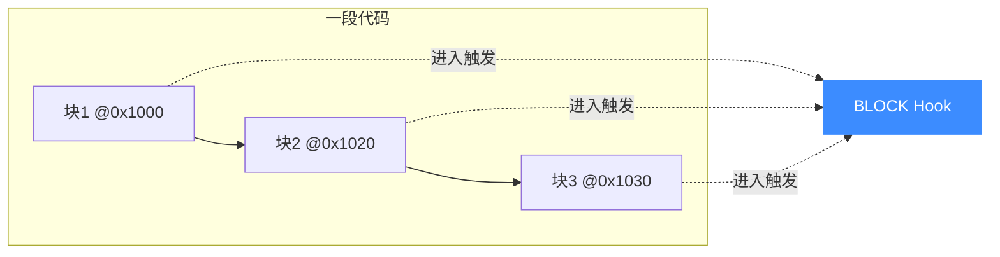
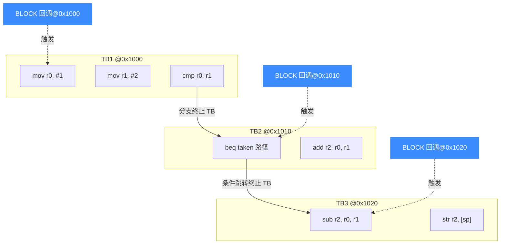
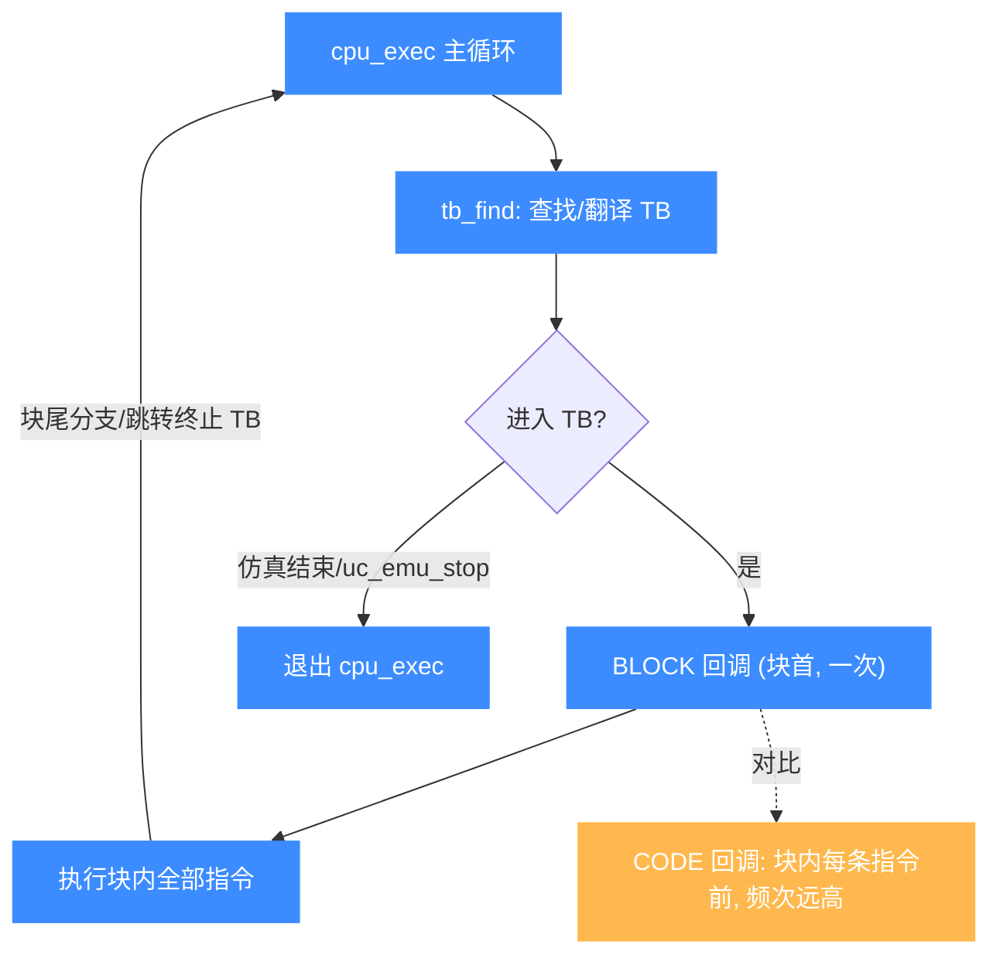

# UC_HOOK_BLOCK — 基本块 Hook

本页讲清 `UC_HOOK_BLOCK` 的触发时机、精确回调签名与典型用途。读完你能用它以最低开销追踪控制流走向、统计覆盖率、按块反汇编。

## 🪝 触发时机

`UC_HOOK_BLOCK` 在**进入每个基本块（basic block）时**触发，即块首指令执行**之前**。基本块是一段没有条件分支/特殊处理指令、可线性执行到底的连续指令序列。

因为块只在"入口"被触发一次，所以只要块被进入，就能保证其中每条指令都会被执行——即便某些指令是条件执行（如 ARM 的 `ADDEQ`，Z 标志未置位时效果为空），执行流仍然穿过它们。循环会让**同一个块反复触发** BLOCK Hook，据此可统计循环次数。



## 📥 回调原型

```c
// UC_HOOK_BLOCK 与 UC_HOOK_CODE 共用此签名
typedef void (*uc_cb_hookcode_t)(uc_engine *uc, uint64_t address,
                                 uint32_t size, void *user_data);
```

> 📄 宏：[`unicorn.h`](https://github.com/android-security-engineer/unicorn-skills/blob/master/include/unicorn/unicorn.h#L371)（`UC_HOOK_BLOCK`）· 注册：[`uc.c`](https://github.com/android-security-engineer/unicorn-skills/blob/master/uc.c#L1908)（`uc_hook_add`）

| 参数 | 类型 | 含义 |
|------|------|------|
| `uc` | `uc_engine *` | 引擎句柄 |
| `address` | `uint64_t` | 本基本块**块首地址** |
| `size` | `uint32_t` | 本基本块**总字节大小**（覆盖整块，可能含多条指令）；未知时为 0 |
| `user_data` | `void *` | 注册时传入的用户数据 |

::: tip 与 CODE 的关键区别
`UC_HOOK_BLOCK` 的 `size` 是**整块**大小；[UC_HOOK_CODE](/hooks/code) 的 `size` 只覆盖**单条指令**。
:::

## 📤 返回值语义

回调返回 `void`，**没有返回值可用于控制执行**。若要在某块中止仿真，请在回调内调用 `uc_emu_stop(uc)`。

## 🔧 begin/end 适用

支持地址区间限定。`uc_hook_add` 的 `begin/end` 只对**块首地址**做匹配：只有块首落在 `[begin, end]` 内才触发。`begin > end`（如 `1, 0`）表示全地址空间。

```c
static void on_block(uc_engine *uc, uint64_t addr, uint32_t size, void *ud) {
    uint64_t *count = (uint64_t *)ud;
    (*count)++;
    printf("[block] pc=0x%" PRIx64 " size=%u\n", addr, size);
}

uint64_t nblocks = 0;
uc_hook h;
// 全地址空间统计块数
uc_hook_add(uc, &h, UC_HOOK_BLOCK, on_block, &nblocks, 1, 0);
```

## 🎯 典型用途

- **控制流追踪**：只在关键"路口"记录，宏观看清代码走了哪条路径。
- **代码覆盖率**：记录被进入过的块地址集合。
- **按块反汇编**：一次对整块 `[address, address+size)` 反汇编，比逐指令更高效。
- **循环计数**：同一块反复触发即循环。

## ⚡ 性能代价

BLOCK 是**最粗**的代码级粒度，触发频率远低于 CODE，是"想知道走到哪"场景的首选。它仍会在块边界产生分发开销，但对连续执行的打断远小于 [UC_HOOK_CODE](/hooks/code)。

::: warning 注意
BLOCK **不能**用来做单条指令级断点——它只在块入口触发。要断在具体某条指令，请用 [UC_HOOK_CODE](/hooks/code) 配合区间。
:::

## 📊 TB 边界触发示意

下图把一段含分支的代码切成三个 TB：分支指令是 TB 的天然终点（之后控制流可能去往多处，引擎必须重新翻译）。`BLOCK` 回调只在**每个 TB 入口**触发一次（下图三个箭头），而 [CODE](/hooks/code) 会在**每条指令**触发（频次远高于 BLOCK）。这就是 BLOCK 远比 CODE 轻量的原因。



::: tip 分支即 TB 边界
任何会改变控制流的指令（条件分支、间接跳转、call/ret）都是 TB 的终点——因为之后要去哪个 TB 引擎无法在翻译时确定。BLOCK 回调就落在这些边界上，频次远低于 CODE。
:::

## 📊 BLOCK 在 cpu_exec 循环中的触发点

下图把 `BLOCK` 放进 `cpu_exec` 主循环看：循环每次 `tb_find` 找到/翻译出 TB → **进入 TB 执行前**触发 `BLOCK` 回调（块首一次）→ 执行整块指令 → 块尾分支/跳转终止本 TB → 回到主循环找下一个 TB。同一 TB 因循环被反复进入，`BLOCK` 也反复触发（统计循环次数的依据）。对比之下 [CODE](/hooks/code) 在块内**每条指令前**触发——频次高得多。BLOCK 只在"TB 入口"这一个点插桩，这就是它远轻于 CODE 的原因。



::: tip 一个 TB 一次 BLOCK
对同一个 TB，`BLOCK` 的触发次数 = 该 TB 被**进入**的次数（循环里同块反复进入 → 反复触发）。而 `CODE` 的触发次数 = TB 内指令条数 × 进入次数。粗略地，BLOCK 频次 ≈ TB 数，CODE 频次 ≈ 总指令数——量级之差就是 BLOCK 轻量的来源。
:::

## 📂 相关源码

| 文件 | 角色 |
|------|------|
| [`include/unicorn/unicorn.h`](https://github.com/android-security-engineer/unicorn-skills/blob/master/include/unicorn/unicorn.h#L371) | `UC_HOOK_BLOCK` 宏定义 |
| [`include/unicorn/unicorn.h`](https://github.com/android-security-engineer/unicorn-skills/blob/master/include/unicorn/unicorn.h#L206) | `uc_cb_hookcode_t` 回调 typedef |
| [`uc.c`](https://github.com/android-security-engineer/unicorn-skills/blob/master/uc.c#L1908) | `uc_hook_add` 注册实现 |

## 相关页面

- [UC_HOOK_CODE — 每条指令](/hooks/code)
- [UC_HOOK_EDGE_GENERATED — 新控制流边](/hooks/edge-generated)
- [uc_hook_add — 注册 Hook](/api/hook-add)
- [Hook 类型总览](/hooks/)
