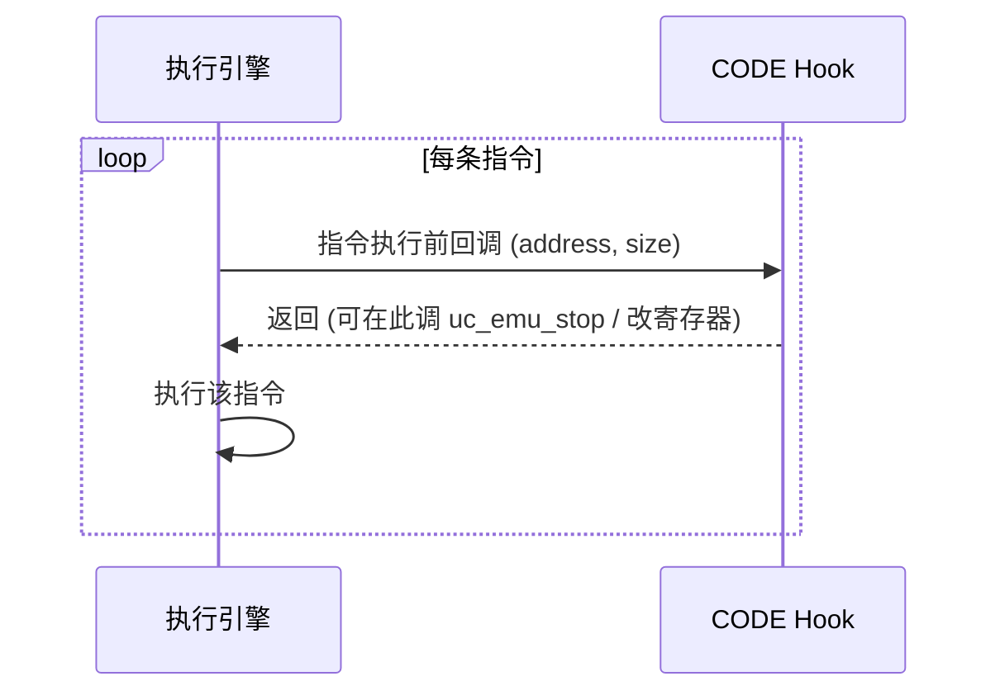
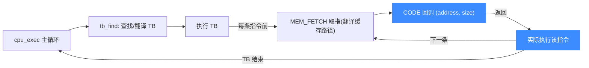

# UC_HOOK_CODE — 每条指令 Hook

本页讲清 `UC_HOOK_CODE` 的触发时机、精确签名、断点/单步用法与不可忽视的性能代价。读完你能用它实现指令级断点、单步跟踪、寄存器观察与运行时注入。

## 🪝 触发时机

`UC_HOOK_CODE` 在**每一条指令执行之前**触发。相比 [UC_HOOK_BLOCK](/hooks/block) 的"我即将运行这段代码"，CODE 是"我即将运行这一条指令"。因此在有大量指令时，回调会被**极其频繁**地调用。



## 📥 回调原型

```c
// 与 UC_HOOK_BLOCK 共用
typedef void (*uc_cb_hookcode_t)(uc_engine *uc, uint64_t address,
                                 uint32_t size, void *user_data);
```

> 📄 宏：[`unicorn.h`](https://github.com/android-security-engineer/unicorn-skills/blob/master/include/unicorn/unicorn.h#L369)（`UC_HOOK_CODE`）· 注册：[`uc.c`](https://github.com/android-security-engineer/unicorn-skills/blob/master/uc.c#L1908)（`uc_hook_add`）

| 参数 | 类型 | 含义 |
|------|------|------|
| `uc` | `uc_engine *` | 引擎句柄 |
| `address` | `uint64_t` | 即将执行的指令地址（即当前 PC） |
| `size` | `uint32_t` | **单条指令**的字节大小；未知时为 0 |
| `user_data` | `void *` | 注册时传入的用户数据 |

## 📤 返回值语义

返回 `void`。要停止仿真，在回调里调用 `uc_emu_stop(uc)`——这正是实现断点的方式。你也可以在回调里用 `uc_reg_write` 修改寄存器（包括 PC 以跳转）。

## 🔧 begin/end 适用

强烈建议限定区间。`begin/end` 对指令地址做匹配，只有落在 `[begin, end]` 内的指令才触发。这是控制 CODE 开销的**核心手段**。

```c
static void on_code(uc_engine *uc, uint64_t addr, uint32_t size, void *ud) {
    if (addr == 0x1004) {          // 命中断点地址
        printf("breakpoint hit @0x%" PRIx64 "\n", addr);
        uc_emu_stop(uc);           // 停止仿真
    }
}

uc_hook h;
// 仅在 [0x1000, 0x2000] 内逐指令触发
uc_hook_add(uc, &h, UC_HOOK_CODE, on_code, NULL, 0x1000, 0x2000);
```

**单步**：把断点条件去掉、每条都 `uc_emu_stop`，或直接用 `uc_emu_start(uc, pc, until, 0, 1)` 的 `count=1` 亦可实现单步；CODE Hook 则适合"逐条观察寄存器/内存"的跟踪器。

## 🎯 典型用途

- **断点**：命中目标地址调 `uc_emu_stop`。
- **单步 / 指令级 trace**：每条指令前读寄存器、反汇编、打印。
- **运行时注入 / 打补丁**：改寄存器或 PC，改变执行流。
- **计数与性能剖析**：统计执行了多少条指令。

## ⚡ 性能代价

::: danger 危险：CODE Hook 显著降速
CODE Hook 会在**每条指令边界打断** JIT 的连续执行，使引擎无法长块直跑，是所有代码级 Hook 中最昂贵的之一。粗略估计可让仿真慢一个数量级。
:::

::: tip 优化建议
- 能用 [UC_HOOK_BLOCK](/hooks/block) 解决就别用 CODE。
- 必须用时，用 `begin/end` 把区间收到最小——区间外指令零开销。
- 回调体保持精简，避免每条指令做重活（如 I/O）。
:::

## 📊 CODE 在执行循环中的位置

下图把 `CODE` 放进 `cpu_exec` 主循环看：主循环先 `tb_find` 找到/翻译出 TB（translation block），执行 TB；CODE Hook 是**靠在 TB 内逐条指令插桩**实现的——引擎在每条指令的执行前点插入回调入口，因此每条指令都会触发一次。这也是它昂贵的原因：它打断了 JIT 直跑。



::: warning 为什么 CODE 昂贵
`CODE` 不是"引擎空闲时顺带通知你"，而是**在每条指令边界强行打断 JIT 的连续执行**——本可整块直跑的 TB 被切成单条循环，仿真可慢一个数量级。能用 [BLOCK](/hooks/block) 就别用 CODE。
:::

## 📂 相关源码

| 文件 | 角色 |
|------|------|
| [`include/unicorn/unicorn.h`](https://github.com/android-security-engineer/unicorn-skills/blob/master/include/unicorn/unicorn.h#L369) | `UC_HOOK_CODE` 宏定义 |
| [`include/unicorn/unicorn.h`](https://github.com/android-security-engineer/unicorn-skills/blob/master/include/unicorn/unicorn.h#L199) | `uc_cb_hookcode_t` 回调 typedef |
| [`uc.c`](https://github.com/android-security-engineer/unicorn-skills/blob/master/uc.c#L1908) | `uc_hook_add` 注册实现 |

## 相关页面

- [UC_HOOK_BLOCK — 基本块](/hooks/block)
- [UC_HOOK_INSN — 特定指令](/hooks/insn)
- [uc_hook_add — 注册 Hook](/api/hook-add)
- [Hook 类型总览](/hooks/)
