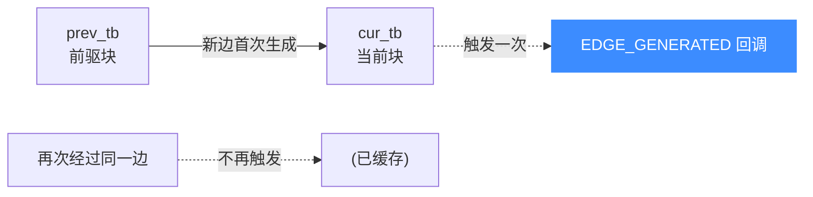
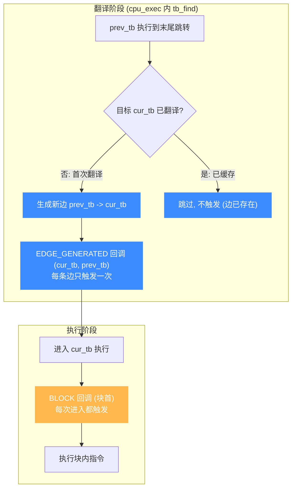

# UC_HOOK_EDGE_GENERATED — 新控制流边 Hook

本页讲清 `UC_HOOK_EDGE_GENERATED` 如何在**新控制流边首次生成**时触发，回调如何拿到前驱/当前翻译块（`uc_tb`）。读完你能增量式地构建控制流图（CFG）。

## 🪝 触发时机

当引擎在翻译期**首次生成一条新的控制流边**（从上一个翻译块跳到当前翻译块）时触发。它与 [UC_HOOK_BLOCK](/hooks/block) 有两点本质区别：

1. **在执行代码之前**调用（翻译阶段，而非执行阶段）。
2. **只在边被首次生成时**触发——已经走过、已缓存的边不会再触发。



## 📥 回调原型

```c
// 翻译块描述
typedef struct uc_tb {
    uint64_t pc;      // 块起始 PC
    uint16_t icount;  // 指令条数
    uint16_t size;    // 字节大小
} uc_tb;

/*
  @cur_tb: 即将生成的当前 TB
  @prev_tb: 前驱 TB
*/
typedef void (*uc_hook_edge_gen_t)(uc_engine *uc, uc_tb *cur_tb,
                                   uc_tb *prev_tb, void *user_data);
```

> 📄 宏：[`unicorn.h`](https://github.com/android-security-engineer/unicorn-skills/blob/master/include/unicorn/unicorn.h#L400)（`UC_HOOK_EDGE_GENERATED`）· 注册：[`uc.c`](https://github.com/android-security-engineer/unicorn-skills/blob/master/uc.c#L1908)（`uc_hook_add`）

| 参数 | 类型 | 含义 |
|------|------|------|
| `uc` | `uc_engine *` | 引擎句柄 |
| `cur_tb` | `uc_tb *` | 当前（目标）翻译块，边的终点 |
| `prev_tb` | `uc_tb *` | 前驱翻译块，边的起点 |
| `user_data` | `void *` | 注册时传入的用户数据 |

`uc_tb` 三字段：`pc`（块首）、`icount`（指令数）、`size`（字节数），足以唯一标识一个块并累积图结构。

## 📤 返回值语义

返回 `void`，无返回值，不能用于中止执行。它是纯观测型 Hook。

## 🔧 begin/end 适用

支持区间限定：按相关地址落于 `[begin, end]` 匹配。`begin > end` 表示全地址空间——构建全局 CFG 时用全空间。

```c
static void on_edge(uc_engine *uc, uc_tb *cur, uc_tb *prev, void *ud) {
    // 记录一条有向边 prev->cur，构建 CFG
    printf("edge 0x%" PRIx64 " -> 0x%" PRIx64 " (icount=%u)\n",
           prev->pc, cur->pc, cur->icount);
}

uc_hook h;
uc_hook_add(uc, &h, UC_HOOK_EDGE_GENERATED, on_edge, NULL, 1, 0);
```

## 🎯 典型用途

- **构建控制流图（CFG）**：每条新边就是图里的一条有向边，天然去重（仅首次触发）。
- **程序分析 / 反混淆**：观察运行时实际展开的控制流。
- **覆盖率增量**：新边即"新覆盖"，适合 fuzzing 语料评估。

::: tip 与 BLOCK 的取舍
统计"块执行了多少次"用 [UC_HOOK_BLOCK](/hooks/block)（每次进入都触发）；构建"块之间的连接关系"用 EDGE_GENERATED（每条边只触发一次，天然去重）。
:::

## ⚡ 性能代价

只在翻译期首次生成边时触发，随着代码被完整探索，触发会逐渐收敛趋零，总体开销很低。

## 📊 触发流程：翻译期生成边 vs 执行期进入块

下图把 `EDGE_GENERATED` 与 [BLOCK](/hooks/block) 放在同一条时间线上对比，凸显两者触发阶段的差别。`EDGE_GENERATED` 发生在**翻译阶段**：当控制流从 `prev_tb` 跳到一个尚未翻译的 `cur_tb`，引擎翻译 `cur_tb` 时首次生成这条边 → 触发回调（**每条边只一次**，已缓存的边再经过不触发）。`BLOCK` 发生在**执行阶段**：每次进入块首指令前触发（**每次进入都触发**，循环里同块反复触发）。一者在翻译期建图、一者在执行期计数——用途互补。



::: tip 建图 vs 计数
要"块之间的连接关系"（CFG 的边）→ `EDGE_GENERATED`，每边一次天然去重；要"块被执行了多少次"（热度/循环计数）→ `BLOCK`，每次进入都数。两者经常同时注册：EDGE 建图、BLOCK 在图上累加节点热度。
:::

## 📂 相关源码

| 文件 | 角色 |
|------|------|
| [`include/unicorn/unicorn.h`](https://github.com/android-security-engineer/unicorn-skills/blob/master/include/unicorn/unicorn.h#L400) | `UC_HOOK_EDGE_GENERATED` 宏定义 |
| [`include/unicorn/unicorn.h`](https://github.com/android-security-engineer/unicorn-skills/blob/master/include/unicorn/unicorn.h#L306) | `uc_hook_edge_gen_t` 回调 typedef |
| [`uc.c`](https://github.com/android-security-engineer/unicorn-skills/blob/master/uc.c#L1908) | `uc_hook_add` 注册实现 |

## 相关页面

- [UC_HOOK_BLOCK — 基本块](/hooks/block)
- [UC_HOOK_TCG_OPCODE — TCG 操作码](/hooks/tcg-opcode)
- [uc_hook_add — 注册 Hook](/api/hook-add)
- [Hook 类型总览](/hooks/)
