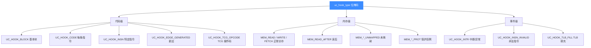
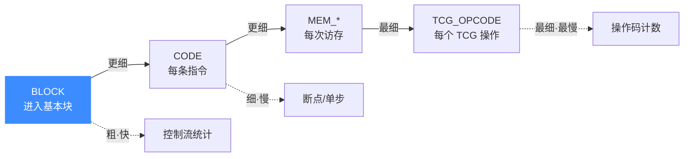

# Hook 类型总览

本页系统梳理 Unicorn 全部 Hook 类型：它们如何用位掩码组合、分成哪三大类、粒度与性能如何权衡，并给出逐类型详解页的索引。读完你能快速定位"我该用哪个 Hook"。

## 🧩 位掩码组合机制

Unicorn 的 Hook 类型定义在 `uc_hook_type` 枚举里，每个类型占一个二进制位（`1 << n`），因此可以用**按位或**同时注册多种事件到一次 `uc_hook_add` 调用中——前提是这些类型共用同一种回调签名。

```c
// 单一类型
uc_hook_add(uc, &h, UC_HOOK_CODE, cb, NULL, 1, 0);

// 组合：READ + WRITE + FETCH 一次注册（共用 uc_cb_hookmem_t）
uc_hook_add(uc, &h, UC_HOOK_MEM_READ | UC_HOOK_MEM_WRITE, cb, NULL, 1, 0);
```

头文件里预定义了若干**便捷组合宏**，本质就是相关位的相加：

| 组合宏 | 展开 | 语义 |
|--------|------|------|
| `UC_HOOK_MEM_UNMAPPED` | READ_UNMAPPED + WRITE_UNMAPPED + FETCH_UNMAPPED | 一切未映射访存 |
| `UC_HOOK_MEM_PROT` | READ_PROT + WRITE_PROT + FETCH_PROT | 一切保护违例 |
| `UC_HOOK_MEM_READ_INVALID` | READ_PROT + READ_UNMAPPED | 一切非法读 |
| `UC_HOOK_MEM_WRITE_INVALID` | WRITE_PROT + WRITE_UNMAPPED | 一切非法写 |
| `UC_HOOK_MEM_FETCH_INVALID` | FETCH_PROT + FETCH_UNMAPPED | 一切非法取指 |
| `UC_HOOK_MEM_INVALID` | UNMAPPED + PROT | 一切非法访存 |
| `UC_HOOK_MEM_VALID` | READ + WRITE + FETCH | 一切正常访存 |

::: warning 注意：组合仅限同签名
只有回调签名相同的类型才能用 `|` 合并到一次注册。例如 `UC_HOOK_CODE`（`uc_cb_hookcode_t`）不能和 `UC_HOOK_MEM_READ`（`uc_cb_hookmem_t`）合并——它们的回调参数不同，须分开注册。
:::

## 🗺️ 三大类全景

按"观测对象"可把所有 Hook 分为**代码级 / 内存级 / 事件级**三类：



## ⚡ 粒度—性能阶梯

理解 Hook 选型的关键是**触发粒度**：粒度越细，单位时间触发次数越多，对 JIT 连续执行的打断越频繁，开销越大。



::: tip 黄金法则
**用能解决问题的最粗粒度 Hook，并尽量用 `begin/end` 限定地址区间。** 需要知道控制流走到哪 → BLOCK；需要断在某条指令 → 才用 CODE。区间外的地址完全不进入分发逻辑，开销接近零。参见 [uc_hook_add](/api/hook-add)。
:::

## 📌 全部类型索引

| Hook 类型 | 类别 | 回调 typedef | 详解页 |
|-----------|------|--------------|--------|
| `UC_HOOK_BLOCK` | 代码级 | `uc_cb_hookcode_t` | [block](/hooks/block) |
| `UC_HOOK_CODE` | 代码级 | `uc_cb_hookcode_t` | [code](/hooks/code) |
| `UC_HOOK_INSN` | 代码级 | `uc_cb_insn_in/out/...` | [insn](/hooks/insn) |
| `UC_HOOK_INSN_INVALID` | 事件级 | `uc_cb_hookinsn_invalid_t` | [insn-invalid](/hooks/insn-invalid) |
| `UC_HOOK_INTR` | 事件级 | `uc_cb_hookintr_t` | [intr](/hooks/intr) |
| `UC_HOOK_EDGE_GENERATED` | 代码级 | `uc_hook_edge_gen_t` | [edge-generated](/hooks/edge-generated) |
| `UC_HOOK_TCG_OPCODE` | 代码级 | `uc_hook_tcg_op_2` | [tcg-opcode](/hooks/tcg-opcode) |
| `UC_HOOK_TLB_FILL` | 事件级 | `uc_cb_tlbevent_t` | [tlb-fill](/hooks/tlb-fill) |
| `UC_HOOK_MEM_READ` | 内存级 | `uc_cb_hookmem_t` | [mem-read](/hooks/mem-read) |
| `UC_HOOK_MEM_WRITE` | 内存级 | `uc_cb_hookmem_t` | [mem-write](/hooks/mem-write) |
| `UC_HOOK_MEM_FETCH` | 内存级 | `uc_cb_hookmem_t` | [mem-fetch](/hooks/mem-fetch) |
| `UC_HOOK_MEM_READ_AFTER` | 内存级 | `uc_cb_hookmem_t` | [mem-read-after](/hooks/mem-read-after) |
| `UC_HOOK_MEM_READ_UNMAPPED` | 内存级 | `uc_cb_eventmem_t` | [mem-read-unmapped](/hooks/mem-read-unmapped) |
| `UC_HOOK_MEM_WRITE_UNMAPPED` | 内存级 | `uc_cb_eventmem_t` | [mem-write-unmapped](/hooks/mem-write-unmapped) |
| `UC_HOOK_MEM_FETCH_UNMAPPED` | 内存级 | `uc_cb_eventmem_t` | [mem-fetch-unmapped](/hooks/mem-fetch-unmapped) |
| `UC_HOOK_MEM_READ_PROT` | 内存级 | `uc_cb_eventmem_t` | [mem-read-prot](/hooks/mem-read-prot) |
| `UC_HOOK_MEM_WRITE_PROT` | 内存级 | `uc_cb_eventmem_t` | [mem-write-prot](/hooks/mem-write-prot) |
| `UC_HOOK_MEM_FETCH_PROT` | 内存级 | `uc_cb_eventmem_t` | [mem-fetch-prot](/hooks/mem-fetch-prot) |
| `UC_HOOK_MEM_UNMAPPED` | 组合宏 | `uc_cb_eventmem_t` | [mem-unmapped](/hooks/mem-unmapped) |
| `UC_HOOK_MEM_PROT` | 组合宏 | `uc_cb_eventmem_t` | [mem-prot](/hooks/mem-prot) |
| `UC_HOOK_MEM_INVALID` | 组合宏 | `uc_cb_eventmem_t` | [mem-invalid](/hooks/mem-invalid) |
| `UC_HOOK_MEM_VALID` | 组合宏 | `uc_cb_hookmem_t` | [mem-valid](/hooks/mem-valid) |

## 🎯 回调返回值速查

| 回调 typedef | 返回类型 | 语义 |
|--------------|----------|------|
| `uc_cb_hookcode_t` | `void` | 无返回；停止请调 `uc_emu_stop` |
| `uc_cb_hookmem_t` | `void` | 无返回（正常访存观测） |
| `uc_cb_eventmem_t` | `bool` | `true`=已修复继续，`false`=中止 |
| `uc_cb_hookinsn_invalid_t` | `bool` | `true`=已处理继续，`false`=中止 |
| `uc_cb_tlbevent_t` | `bool` | `true`=命中并填充 `result`，`false`=缺页 |
| `uc_cb_hookintr_t` | `void` | 无返回 |
| `uc_hook_edge_gen_t` | `void` | 无返回 |
| `uc_hook_tcg_op_2` | `void` | 无返回 |

## 相关页面

- [uc_hook_add — 注册 Hook](/api/hook-add)
- [Hook 插桩体系（功能总览）](/features/hooks)
- [UC_HOOK_CODE 详解](/hooks/code)
- [UC_HOOK_MEM_READ 详解](/hooks/mem-read)
