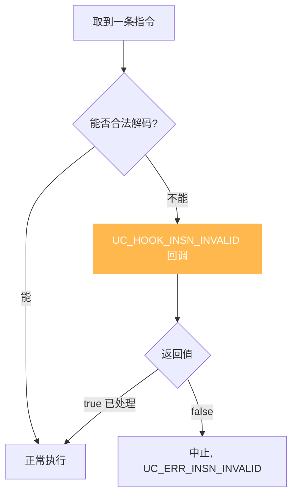
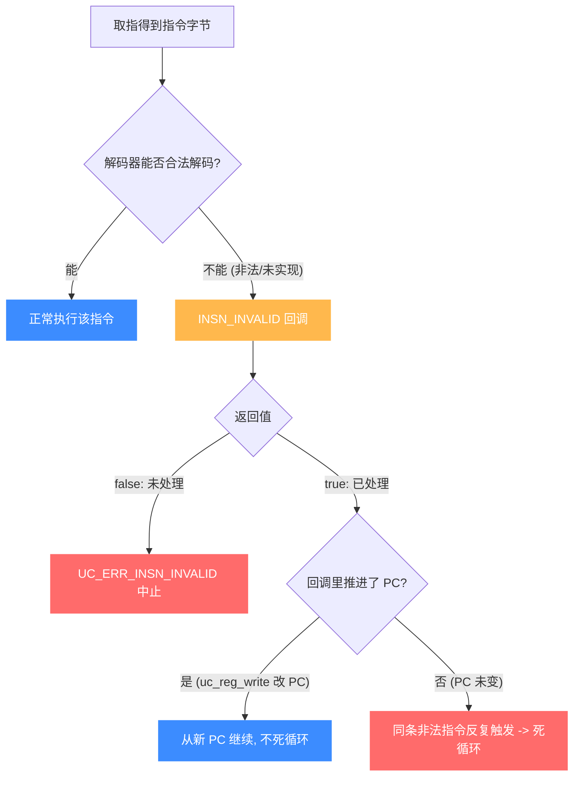

# UC_HOOK_INSN_INVALID — 非法指令 Hook

本页讲清 `UC_HOOK_INSN_INVALID` 在遇到无法解码/执行的指令时如何触发，以及回调返回的 `bool` 如何决定"继续还是中止"。读完你能优雅地诊断或修复非法指令。

## 🪝 触发时机

当引擎遇到一条**无法解码或非法**的指令时触发。默认情况下这会导致仿真以 `UC_ERR_INSN_INVALID` 终止；注册本 Hook 后，你有机会在回调里处理它并决定是否继续。



## 📥 回调原型

```c
/*
  @return: 返回 true 继续执行，false 停止（因非法指令而中止）
*/
typedef bool (*uc_cb_hookinsn_invalid_t)(uc_engine *uc, void *user_data);
```

> 📄 宏：[`unicorn.h`](https://github.com/android-security-engineer/unicorn-skills/blob/master/include/unicorn/unicorn.h#L394)（`UC_HOOK_INSN_INVALID`）· 注册：[`uc.c`](https://github.com/android-security-engineer/unicorn-skills/blob/master/uc.c#L1908)（`uc_hook_add`）

| 参数 | 类型 | 含义 |
|------|------|------|
| `uc` | `uc_engine *` | 引擎句柄 |
| `user_data` | `void *` | 注册时传入的用户数据 |

::: tip 提示
回调**不携带**地址/指令字节参数。若需要当前 PC，在回调里用 `uc_reg_read` 读取程序计数器（如 x86 的 `UC_X86_REG_RIP`）。
:::

## 📤 返回值语义（bool）

| 返回 | 含义 |
|------|------|
| `true` | 表示**你已处理**这条非法指令（例如手动模拟其效果、并把 PC 推进到下一条），引擎继续执行。 |
| `false` | 未处理，引擎以 `UC_ERR_INSN_INVALID` 中止。 |

::: warning 注意：返回 true 需自己推进 PC
若返回 `true` 却不改变 PC，引擎可能在同一条非法指令上再次触发回调，形成死循环。处理后务必用 `uc_reg_write` 把 PC 指向后续指令。
:::

## 🔧 begin/end 适用

支持区间限定：仅在非法指令地址落于 `[begin, end]` 时触发。`begin > end` 表示全地址空间。

```c
static bool on_invalid(uc_engine *uc, void *ud) {
    uint64_t pc;
    uc_reg_read(uc, UC_X86_REG_RIP, &pc);
    printf("invalid insn @0x%" PRIx64 "\n", pc);
    // 模拟一条 2 字节的自定义指令：直接跳过它
    uc_reg_write(uc, UC_X86_REG_RIP, &(uint64_t){pc + 2});
    return true;   // 已处理，继续
}

uc_hook h;
uc_hook_add(uc, &h, UC_HOOK_INSN_INVALID, on_invalid, NULL, 1, 0);
```

## 🎯 典型用途

- **错误诊断**：在中止前记录 PC、寄存器、附近字节，便于排查。
- **自定义/扩展指令**：模拟目标未实现的特权或扩展指令，跳过或替换其语义。
- **容错执行**：对可忽略的非法指令跳过，让仿真尽量走下去。

## ⚡ 性能代价

仅在实际出现非法指令时触发，正常路径零开销，非常轻量。

## 📊 解码 → 命中非法 → 修复/中止判定

下图把 `UC_HOOK_INSN_INVALID` 放进解码流水线：取指后解码器尝试解析指令字节。**能合法解码** → 正常执行；**无法解码/非法** → 触发 `INSN_INVALID` 回调。回调返回 `false` → `UC_ERR_INSN_INVALID` 中止；返回 `true` → 你须在回调里**手动模拟该指令效果并把 PC 推进到下一条**，否则引擎会在同一条非法指令上反复触发，形成死循环。



::: danger 返回 true 必须推进 PC
`INSN_INVALID` 回调**不带地址/字节参数**——你需要自己 `uc_reg_read` 读 PC。返回 `true` 表示"我已模拟这条指令"，但引擎不会替你推进 PC：你必须 `uc_reg_write` 把 PC 指到下一条指令，否则取指还在原地址，解码还是非法，回调又被触发——死循环。
:::

## 📂 相关源码

| 文件 | 角色 |
|------|------|
| [`include/unicorn/unicorn.h`](https://github.com/android-security-engineer/unicorn-skills/blob/master/include/unicorn/unicorn.h#L394) | `UC_HOOK_INSN_INVALID` 宏定义 |
| [`include/unicorn/unicorn.h`](https://github.com/android-security-engineer/unicorn-skills/blob/master/include/unicorn/unicorn.h#L226) | `uc_cb_hookinsn_invalid_t` 回调 typedef |
| [`uc.c`](https://github.com/android-security-engineer/unicorn-skills/blob/master/uc.c#L1908) | `uc_hook_add` 注册实现 |

## 相关页面

- [UC_HOOK_CODE — 每条指令](/hooks/code)
- [UC_HOOK_INSN — 特定指令](/hooks/insn)
- [uc_hook_add — 注册 Hook](/api/hook-add)
- [Hook 类型总览](/hooks/)
