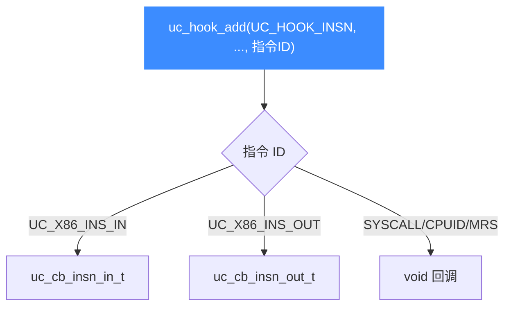
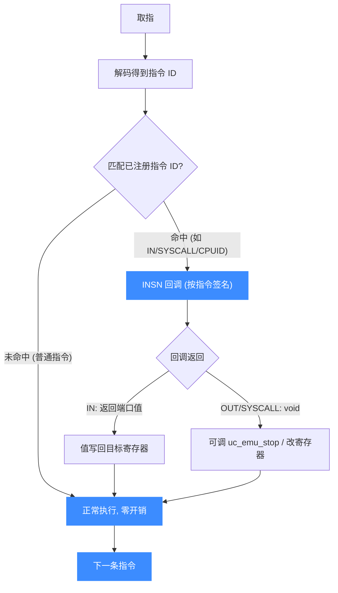

# UC_HOOK_INSN — 特定指令 Hook

本页讲清 `UC_HOOK_INSN` 如何按**指令 ID** 注册回调、每种被支持指令对应哪个回调签名。读完你能拦截 x86 的 `IN`/`OUT`/`SYSCALL` 与 arm64 的 `MRS` 等特殊指令。

## 🪝 触发时机

`UC_HOOK_INSN` 只在**某一条特定指令**即将执行时触发。与 [UC_HOOK_CODE](/hooks/code)（每条指令都触发）不同，它需要在 `uc_hook_add` 的**变长参数**里额外传一个**指令 ID**，且仅支持极少数指令。



::: warning 注意：支持的指令极其有限
头文件明确：`UC_HOOK_INSN` 当前只支持 x86 的 `in`、`out`、`syscall`、`sysenter`、`cpuid`（外加部分架构的少量指令，如 arm64 `MRS`）。对不支持的指令注册会返回错误。
:::

## 📥 回调原型（按指令而异）

不同指令使用**不同的回调签名**。注册时把指令 ID 作为 `uc_hook_add` 的第 8 个参数传入：

```c
// x86 IN：从端口读，返回读到的值
typedef uint32_t (*uc_cb_insn_in_t)(uc_engine *uc, uint32_t port, int size,
                                    void *user_data);

// x86 OUT：向端口写
typedef void (*uc_cb_insn_out_t)(uc_engine *uc, uint32_t port, int size,
                                 uint32_t value, void *user_data);

// syscall / sysenter / cpuid / arm64 MRS 等：无特殊参数
// 复用 void 型 hookcode 风格签名（uc, user_data）
```

> 📄 宏：[`unicorn.h`](https://github.com/android-security-engineer/unicorn-skills/blob/master/include/unicorn/unicorn.h#L367)（`UC_HOOK_INSN`）· 回调：[`unicorn.h`](https://github.com/android-security-engineer/unicorn-skills/blob/master/include/unicorn/unicorn.h#L235)（`uc_cb_insn_in_t`）/ [`L245`](https://github.com/android-security-engineer/unicorn-skills/blob/master/include/unicorn/unicorn.h#L245)（`uc_cb_insn_out_t`）· 注册：[`uc.c`](https://github.com/android-security-engineer/unicorn-skills/blob/master/uc.c#L1908)（`uc_hook_add`）

| 指令 | 指令 ID 常量 | 回调 typedef | 关键参数 |
|------|--------------|--------------|----------|
| x86 `IN` | `UC_X86_INS_IN` | `uc_cb_insn_in_t` | `port`, `size` → 返回值 |
| x86 `OUT` | `UC_X86_INS_OUT` | `uc_cb_insn_out_t` | `port`, `size`, `value` |
| x86 `SYSCALL` | `UC_X86_INS_SYSCALL` | `void (*)(uc_engine*, void*)` | 无 |
| x86 `SYSENTER` | `UC_X86_INS_SYSENTER` | `void (*)(uc_engine*, void*)` | 无 |
| x86 `CPUID` | `UC_X86_INS_CPUID` | `void (*)(uc_engine*, void*)` | 无 |
| arm64 `MRS` | `UC_ARM64_INS_MRS` | 见实现 | 读系统寄存器 |

## 📤 返回值语义

- `uc_cb_insn_in_t`：返回值即"从端口读到的数据"，会被写回目标寄存器。
- `uc_cb_insn_out_t` / syscall / cpuid 等：`void`，无返回。要中止仿真调 `uc_emu_stop`。

## 🔧 begin/end 适用

支持区间限定：仅当该指令地址落在 `[begin, end]` 才触发。

```c
static uint32_t on_in(uc_engine *uc, uint32_t port, int size, void *ud) {
    printf("IN port=0x%x size=%d\n", port, size);
    return 0xff;   // 模拟从该端口读到 0xff
}

static void on_syscall(uc_engine *uc, void *ud) {
    uint64_t rax; uc_reg_read(uc, UC_X86_REG_RAX, &rax);
    printf("syscall number=%" PRIu64 "\n", rax);
}

uc_hook h1, h2;
uc_hook_add(uc, &h1, UC_HOOK_INSN, on_in, NULL, 1, 0, UC_X86_INS_IN);
uc_hook_add(uc, &h2, UC_HOOK_INSN, on_syscall, NULL, 1, 0, UC_X86_INS_SYSCALL);
```

## 🎯 典型用途

- **端口 I/O 仿真**：用 `IN`/`OUT` Hook 模拟硬件端口。
- **系统调用拦截**：Hook `SYSCALL`/`SYSENTER` 实现用户态系统调用模拟（读 `rax`/`rdi`... 分派）。
- **CPUID 伪造**：返回自定义 CPU 特性。
- **系统寄存器访问**：arm64 `MRS` 观测 / 拦截系统寄存器读取。

## ⚡ 性能代价

只在目标指令处触发，比 CODE 便宜得多——引擎在翻译期即可对特定指令插桩，不影响其它指令的连续执行。

## 📊 指令解码 → 命中/非法判定

下图把 `UC_HOOK_INSN` 放进取指解码流水线：取指 → 解码出指令 ID → 与注册时传入的指令 ID 匹配。**命中**已注册的特定指令（如 `UC_X86_INS_IN`/`SYSCALL`）→ 触发对应签名的 `INSN` 回调；**未命中**（普通指令或未注册的指令）→ 走正常执行，零开销。这与 [CODE](/hooks/code)（每条都触发）形成对比：INSN 在翻译期一次性插桩，运行期只命中目标指令。



::: tip 翻译期插桩 vs 运行期每条触发
`INSN` 的便宜源于"翻译期匹配"：引擎在把 guest 指令翻成 TCG 时，识别出你注册的指令 ID 就地插入回调入口，其它指令的翻译结果不受影响。运行期只有命中那条指令才进回调——这是它远比 `CODE`（每条指令边界都打断）轻量的根本原因。
:::

## 📂 相关源码

| 文件 | 角色 |
|------|------|
| [`include/unicorn/unicorn.h`](https://github.com/android-security-engineer/unicorn-skills/blob/master/include/unicorn/unicorn.h#L367) | `UC_HOOK_INSN` 宏定义 |
| [`include/unicorn/unicorn.h`](https://github.com/android-security-engineer/unicorn-skills/blob/master/include/unicorn/unicorn.h#L235) | `uc_cb_insn_in_t` 回调 typedef |
| [`include/unicorn/unicorn.h`](https://github.com/android-security-engineer/unicorn-skills/blob/master/include/unicorn/unicorn.h#L245) | `uc_cb_insn_out_t` 回调 typedef |
| [`uc.c`](https://github.com/android-security-engineer/unicorn-skills/blob/master/uc.c#L1908) | `uc_hook_add` 注册实现 |

## 相关页面

- [x86 指令与 INSN Hook](/arch/x86/instructions)
- [UC_HOOK_INTR — 中断/异常](/hooks/intr)
- [uc_hook_add — 注册 Hook](/api/hook-add)
- [Hook 类型总览](/hooks/)
