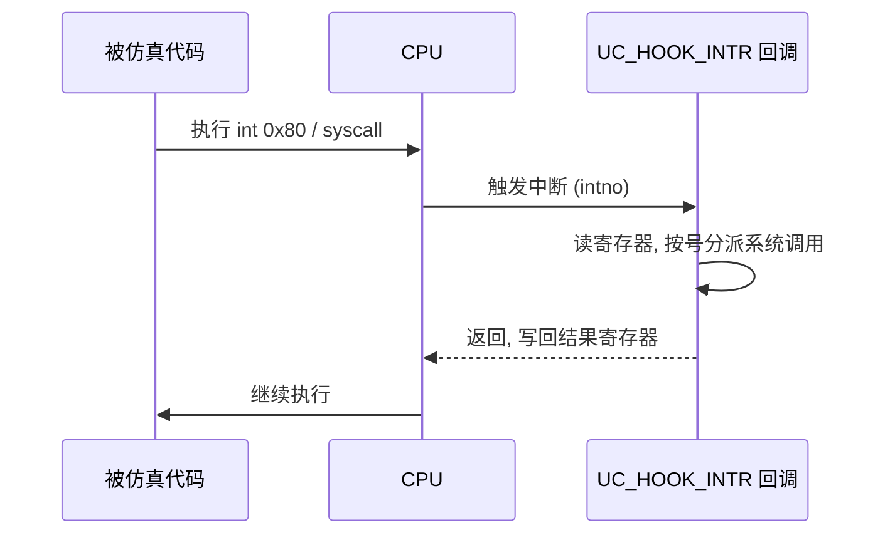
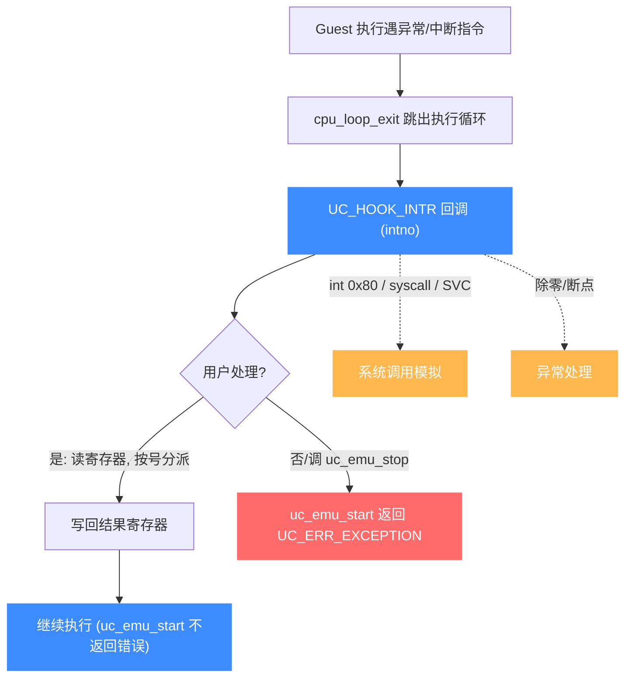

# UC_HOOK_INTR — 中断/异常 Hook

本页讲清 `UC_HOOK_INTR` 如何捕获中断、异常与系统调用事件，回调如何拿到中断号并据此分派。读完你能自己实现系统调用模拟层（如 Linux `int 0x80` / `syscall`）。

## 🪝 触发时机

当被仿真的 CPU 触发一个**中断或异常**时调用，包括软中断指令（x86 `int N`、`syscall`/`sysenter`，ARM `SVC`/`SWI`）以及 CPU 内部异常。Unicorn **不自带**操作系统内核，因此这些事件默认无人处理——你必须用本 Hook 提供语义。



## 📥 回调原型

```c
/*
  @intno: 中断号
*/
typedef void (*uc_cb_hookintr_t)(uc_engine *uc, uint32_t intno,
                                 void *user_data);
```

> 📄 宏：[`unicorn.h`](https://github.com/android-security-engineer/unicorn-skills/blob/master/include/unicorn/unicorn.h#L364)（`UC_HOOK_INTR`）· 注册：[`uc.c`](https://github.com/android-security-engineer/unicorn-skills/blob/master/uc.c#L1908)（`uc_hook_add`）

| 参数 | 类型 | 含义 |
|------|------|------|
| `uc` | `uc_engine *` | 引擎句柄 |
| `intno` | `uint32_t` | 中断/异常号（如 x86 `int 0x80` → `0x80`；`syscall` 有其专用编号，依架构而定） |
| `user_data` | `void *` | 注册时传入的用户数据 |

## 📤 返回值语义

返回 `void`，无返回值。要中止仿真调 `uc_emu_stop(uc)`。系统调用的"返回值"通过 `uc_reg_write` 写回对应寄存器（如 x86-64 的 `RAX`）。

## 🔧 begin/end 适用

支持区间限定：仅当触发中断的指令地址落于 `[begin, end]` 时才触发。`begin > end`（如 `1, 0`）表示全地址空间——中断 Hook 通常用全空间。

```c
static void on_intr(uc_engine *uc, uint32_t intno, void *ud) {
    if (intno != 0x80) return;               // 只处理 Linux 32 位系统调用
    uint32_t eax, ebx, ecx, edx;
    uc_reg_read(uc, UC_X86_REG_EAX, &eax);   // 系统调用号
    uc_reg_read(uc, UC_X86_REG_EBX, &ebx);
    uc_reg_read(uc, UC_X86_REG_ECX, &ecx);
    uc_reg_read(uc, UC_X86_REG_EDX, &edx);
    switch (eax) {
        case 4: /* write */
            fwrite(/* 依 ecx/edx 读内存 */ "", 1, 0, stdout);
            break;
        case 1: /* exit */
            uc_emu_stop(uc);
            break;
    }
}

uc_hook h;
uc_hook_add(uc, &h, UC_HOOK_INTR, on_intr, NULL, 1, 0);
```

## 🎯 典型用途

- **系统调用模拟**：拦截 `int 0x80` / `syscall` / `SVC`，读参数寄存器分派到宿主实现。
- **异常处理**：捕获除零、断点异常等，自定义响应。
- **半主机（semihosting）**：为裸机固件提供简易 I/O。

::: tip 提示
不同架构用不同指令进中断：x86 用 `int`/`syscall`，ARM 用 `SVC`。`intno` 的含义随架构变化，处理前先确认目标 ABI。
:::

## ⚡ 性能代价

只在中断/异常发生时触发，正常执行零开销，非常轻量。

## 📊 中断/异常分发流程

下图展示一次中断/异常的分发：guest 执行遇异常（软中断指令或 CPU 内部异常）→ 引擎 `cpu_loop_exit` 跳出正常执行循环 → 触发 `INTR` 回调拿到 `intno` → 用户在回调里按号分派（系统调用模拟、异常处理）→ 若已处理则写回结果寄存器继续；若未处理或主动中止，则 `uc_emu_start` 返回 `UC_ERR_EXCEPTION`。



::: warning Unicorn 不带内核
Unicorn 只仿真 CPU，**不含操作系统内核**。任何中断/异常默认无人处理——你必须用 `INTR` Hook 给出语义（系统调用号分派、异常响应），否则仿真会以 `UC_ERR_EXCEPTION` 终止。
:::

## 📂 相关源码

| 文件 | 角色 |
|------|------|
| [`include/unicorn/unicorn.h`](https://github.com/android-security-engineer/unicorn-skills/blob/master/include/unicorn/unicorn.h#L364) | `UC_HOOK_INTR` 宏定义 |
| [`include/unicorn/unicorn.h`](https://github.com/android-security-engineer/unicorn-skills/blob/master/include/unicorn/unicorn.h#L215) | `uc_cb_hookintr_t` 回调 typedef |
| [`uc.c`](https://github.com/android-security-engineer/unicorn-skills/blob/master/uc.c#L1908) | `uc_hook_add` 注册实现 |

## 相关页面

- [中断与系统调用](/features/interrupts)
- [UC_HOOK_INSN — 拦截 syscall 指令](/hooks/insn)
- [uc_hook_add — 注册 Hook](/api/hook-add)
- [Hook 类型总览](/hooks/)
