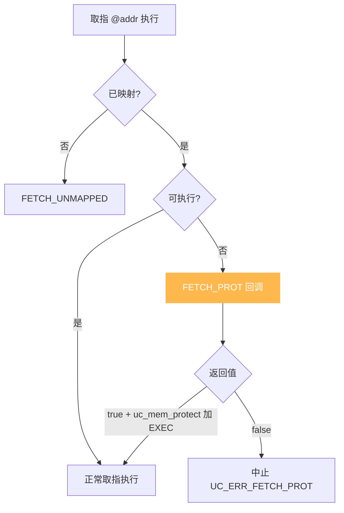
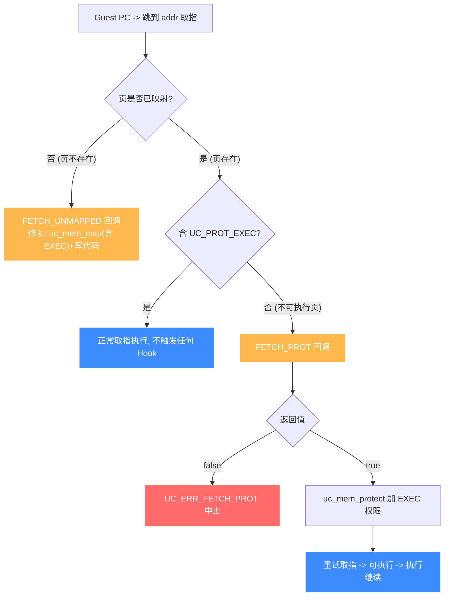

# UC_HOOK_MEM_FETCH_PROT — 取指保护违例 Hook

本页讲清 `UC_HOOK_MEM_FETCH_PROT` 在引擎从**已映射但不可执行**内存取指时如何触发，回调返回的 `bool` 如何决定"改权限后继续"还是"中止"。读完你能实现 W^X（不可执行栈/堆）与 shellcode 检测。

## 🪝 触发时机

当引擎试图从一处**已映射、但不含 `UC_PROT_EXEC` 权限**的内存取指令执行时触发——典型是控制流跳进了数据段（不可执行区）。页存在，只是不允许执行。默认以 `UC_ERR_FETCH_PROT` 中止。



## 📥 回调原型

```c
/*
  @type: UC_MEM_FETCH_PROT
  @return: true=继续（须已授予执行权限），false=中止
*/
typedef bool (*uc_cb_eventmem_t)(uc_engine *uc, uc_mem_type type,
                                 uint64_t address, int size, int64_t value,
                                 void *user_data);
```

> 📄 宏：[`unicorn.h`](https://github.com/android-security-engineer/unicorn-skills/blob/master/include/unicorn/unicorn.h#L383)（`UC_HOOK_MEM_FETCH_PROT`）· 注册：[`uc.c`](https://github.com/android-security-engineer/unicorn-skills/blob/master/uc.c#L1908)（`uc_hook_add`）

| 参数 | 含义 |
|------|------|
| `type` | `UC_MEM_FETCH_PROT` |
| `address` | 待取指的不可执行地址 |
| `size` | 取指字节数 |
| `value` | 无意义 |

## 📤 返回值语义（bool）

| 返回 | 含义 |
|------|------|
| `true` | 已处理。通常用 `uc_mem_protect` 给该页加 `UC_PROT_EXEC` 后继续。也可改写 PC 改变恢复点。 |
| `false` | 未处理，以 `UC_ERR_FETCH_PROT` 中止。 |

## 🔧 begin/end 适用

支持区间限定：仅当取指地址落于 `[begin, end]` 触发。

```c
static bool on_fetch_prot(uc_engine *uc, uc_mem_type type, uint64_t addr,
                          int size, int64_t value, void *ud) {
    // 检测：代码试图在不可执行区执行（可能是 shellcode / ROP 落地）
    fprintf(stderr, "NX violation: exec @0x%" PRIx64 "\n", addr);
    uc_emu_stop(uc);   // 直接判为攻击并停机
    return false;      // 中止
}

uc_hook h;
uc_hook_add(uc, &h, UC_HOOK_MEM_FETCH_PROT, on_fetch_prot, NULL, 1, 0);
```

## 🎯 典型用途

- **W^X / NX 强制**：把栈、堆映射为不可执行，取指即拦截。
- **Shellcode / 漏洞利用检测**：在数据区执行往往是攻击信号。
- **动态放权**：确属合法的动态代码，加 `EXEC` 权限后放行。

## ⚡ 性能代价

只在取指保护违例时触发，正常路径零开销。可与读、写保护变体合并为 [UC_HOOK_MEM_PROT](/hooks/mem-prot)。

## 📊 保护违例判定：mapped+不可执行 vs unmapped

下图把"一次取指为何走 PROT 而非 UNMAPPED"讲清：控制流跳到某地址取指，先看页**是否已映射**——未映射走 [FETCH_UNMAPPED](/hooks/mem-fetch-unmapped)（页不存在，要 `uc_mem_map` 为可执行并写入代码）；已映射但缺 `UC_PROT_EXEC`（如数据段/栈/堆）才走 `FETCH_PROT`（页存在，只是不可执行，要 `uc_mem_protect` 加 EXEC）。PROT 返回 `true` 后引擎重试取指，可执行则继续——这是 W^X / NX 强制的拦截点。



::: tip W^X 的拦截点
把栈、堆映射为不可执行（不带 `UC_PROT_EXEC`）后，任何试图在这些区域取指的控制流（shellcode 落地、ROP 链跳进数据）都会在 `FETCH_PROT` 被拦下。`false` 分支即"判定为攻击并停机"，是漏洞利用检测的常用闸门。
:::

## 📂 相关源码

| 文件 | 角色 |
|------|------|
| [`include/unicorn/unicorn.h`](https://github.com/android-security-engineer/unicorn-skills/blob/master/include/unicorn/unicorn.h#L383) | `UC_HOOK_MEM_FETCH_PROT` 宏定义 |
| [`include/unicorn/unicorn.h`](https://github.com/android-security-engineer/unicorn-skills/blob/master/include/unicorn/unicorn.h#L479) | `uc_cb_eventmem_t` 回调 typedef |
| [`uc.c`](https://github.com/android-security-engineer/unicorn-skills/blob/master/uc.c#L1908) | `uc_hook_add` 注册实现 |

## 相关页面

- [UC_HOOK_MEM_FETCH_UNMAPPED — 取指未映射](/hooks/mem-fetch-unmapped)
- [UC_HOOK_MEM_PROT — 三种保护违例合集](/hooks/mem-prot)
- [uc_hook_add — 注册 Hook](/api/hook-add)
- [Hook 类型总览](/hooks/)
