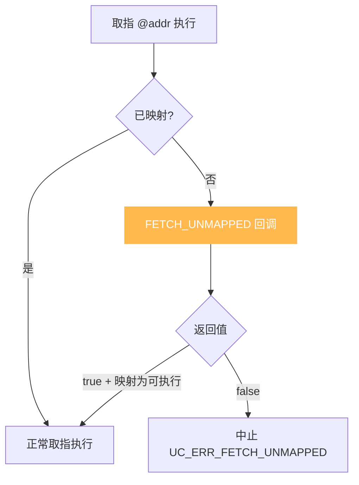
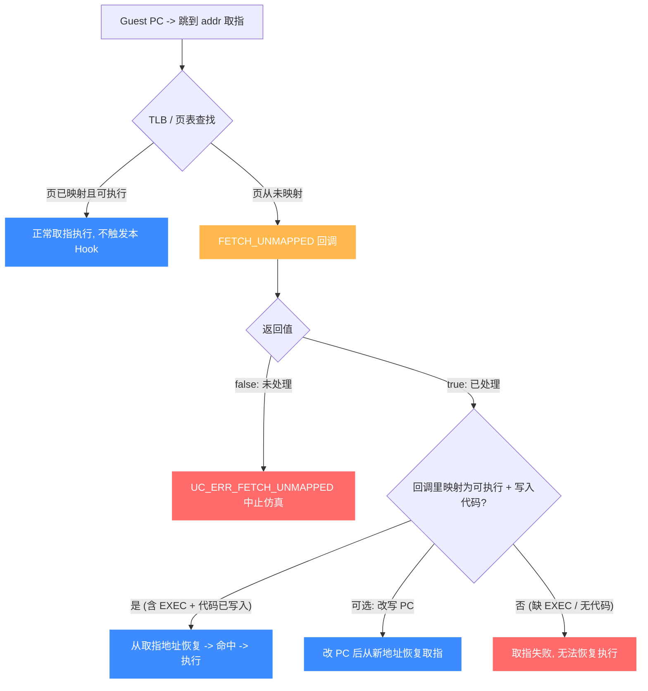

# UC_HOOK_MEM_FETCH_UNMAPPED — 取指未映射 Hook

本页讲清 `UC_HOOK_MEM_FETCH_UNMAPPED` 在引擎从**未映射**内存取指令执行时如何触发，回调返回的 `bool` 如何决定"补映射为可执行后继续"还是"中止"。读完你能实现代码的按需加载与跳转控制。

## 🪝 触发时机

当引擎需要**从一处没有映射的内存取指令执行**时触发——典型场景是控制流跳到了尚未映射代码的地址。默认以 `UC_ERR_FETCH_UNMAPPED` 中止；本 Hook 允许你把代码映射进来并继续执行。



## 📥 回调原型

```c
/*
  @type: UC_MEM_FETCH_UNMAPPED
  @return: true=继续（须映射为可执行），false=中止
*/
typedef bool (*uc_cb_eventmem_t)(uc_engine *uc, uc_mem_type type,
                                 uint64_t address, int size, int64_t value,
                                 void *user_data);
```

> 📄 宏：[`unicorn.h`](https://github.com/android-security-engineer/unicorn-skills/blob/master/include/unicorn/unicorn.h#L377)（`UC_HOOK_MEM_FETCH_UNMAPPED`）· 注册：[`uc.c`](https://github.com/android-security-engineer/unicorn-skills/blob/master/uc.c#L1908)（`uc_hook_add`）

| 参数 | 含义 |
|------|------|
| `type` | `UC_MEM_FETCH_UNMAPPED` |
| `address` | 待取指的未映射地址 |
| `size` | 取指字节数 |
| `value` | 无意义 |

## 📤 返回值语义（bool）

| 返回 | 含义 |
|------|------|
| `true` | 已处理。**须把该页映射为可执行（含 `UC_PROT_EXEC`）**，执行将从该取指地址恢复。你也可以改写 PC 以改变执行恢复点，但取指本身必须能成功。 |
| `false` | 未处理，以 `UC_ERR_FETCH_UNMAPPED` 中止。 |

::: warning 注意：必须可执行且取指成功
按头文件说明，取指未映射修复后执行会从取到的地址恢复；映射必须含 `UC_PROT_EXEC`，且取指必须成功，否则无法恢复执行。可用 `uc_reg_write` 改写 PC 来改变恢复位置。
:::

## 🔧 begin/end 适用

支持区间限定：仅当取指地址落于 `[begin, end]` 触发。

```c
static bool on_fetch_unmapped(uc_engine *uc, uc_mem_type type, uint64_t addr,
                              int size, int64_t value, void *ud) {
    uint64_t page = addr & ~0xfffULL;
    if (uc_mem_map(uc, page, 0x1000, UC_PROT_READ | UC_PROT_EXEC) != UC_ERR_OK)
        return false;
    // 从磁盘/缓存把该页代码写入
    uc_mem_write(uc, page, load_code_page(page), 0x1000);
    return true;
}

uc_hook h;
uc_hook_add(uc, &h, UC_HOOK_MEM_FETCH_UNMAPPED, on_fetch_unmapped, NULL, 1, 0);
```

## 🎯 典型用途

- **代码按需加载**：像加载器一样，跳转到某模块时才把其代码页映射进来。
- **跳转越界诊断**：抓"跳飞了"的控制流（跳到未映射地址）。
- **动态代码/自修改**：为运行中生成的代码提供可执行页。

## ⚡ 性能代价

只在取指落到未映射地址时触发，正常路径零开销。可与读、写的未映射变体合并为 [UC_HOOK_MEM_UNMAPPED](/hooks/mem-unmapped)。

## 📊 未映射取指的判定与处理流程

下图展开一次取指未映射的完整路径：控制流跳到某地址，取指经 TLB 查找发现该页**从未映射** → 触发 `FETCH_UNMAPPED` 回调。返回 `false` → `UC_ERR_FETCH_UNMAPPED` 中止；返回 `true` → 要求回调里已 `uc_mem_map` 且**含 `UC_PROT_EXEC`**，并把代码字节写进该页，引擎从取指地址恢复执行。也可在回调里改写 PC，把恢复点移到别处。



::: warning 取指恢复的特殊性
取指未映射修复后，执行会**从取到的地址恢复**——所以你不仅要映射为可执行，还得把代码字节写进该页（用 `uc_mem_write`）。否则取指虽命中页，却读到未初始化字节，仍是失败。改写 PC 是另一条出路，可把恢复点移到别处。
:::

## 📂 相关源码

| 文件 | 角色 |
|------|------|
| [`include/unicorn/unicorn.h`](https://github.com/android-security-engineer/unicorn-skills/blob/master/include/unicorn/unicorn.h#L377) | `UC_HOOK_MEM_FETCH_UNMAPPED` 宏定义 |
| [`include/unicorn/unicorn.h`](https://github.com/android-security-engineer/unicorn-skills/blob/master/include/unicorn/unicorn.h#L479) | `uc_cb_eventmem_t` 回调 typedef |
| [`uc.c`](https://github.com/android-security-engineer/unicorn-skills/blob/master/uc.c#L1908) | `uc_hook_add` 注册实现 |

## 相关页面

- [UC_HOOK_MEM_FETCH_PROT — 取指保护违例](/hooks/mem-fetch-prot)
- [UC_HOOK_MEM_UNMAPPED — 三种未映射合集](/hooks/mem-unmapped)
- [uc_hook_add — 注册 Hook](/api/hook-add)
- [Hook 类型总览](/hooks/)
