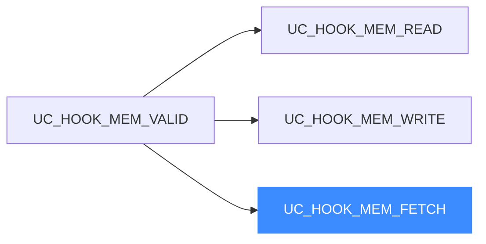
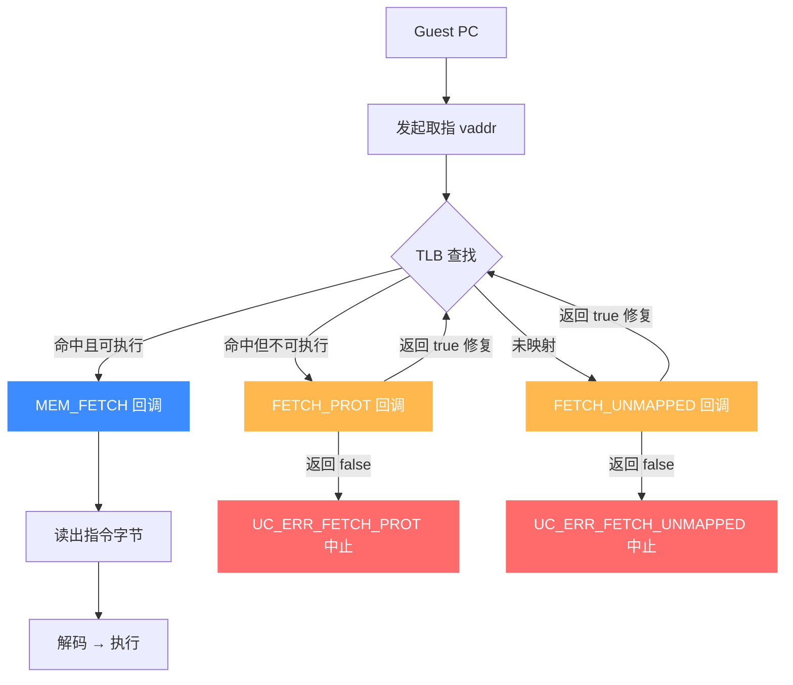
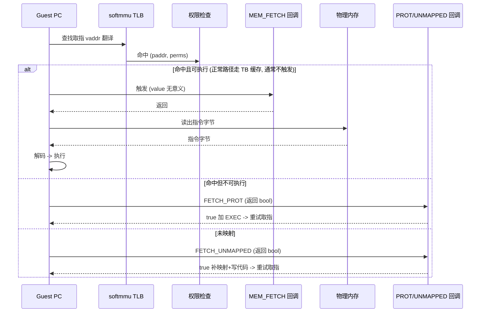

# UC_HOOK_MEM_FETCH — 取指 Hook

本页讲清 `UC_HOOK_MEM_FETCH` 的定位：它面向"从已映射内存取指令执行"这一访问类型，与读、写并列构成 `UC_HOOK_MEM_VALID` 三件套。读完你能理解取指访存的语义与取舍。

## 🪝 触发时机

`UC_HOOK_MEM_FETCH` 面向**从已映射内存取指令用于执行**（fetch）这一访存类型，是内存访问三类（读 / 写 / 取指）之一，回调 `type` 为 `UC_MEM_FETCH`。

::: warning 注意：正常路径通常不使用 FETCH
Unicorn 官方文档明确指出：`UC_HOOK_MEM_FETCH`（针对已映射内存的取指）在正常执行路径上一般**不会被触发**——引擎对取指走的是翻译缓存路径，而非逐次访存回调。若你要"在执行到某地址前介入"，应使用 [UC_HOOK_CODE](/hooks/code) 或 [UC_HOOK_BLOCK](/hooks/block)。真正常用的是它的**未映射/保护**变体：[FETCH_UNMAPPED](/hooks/mem-fetch-unmapped) 与 [FETCH_PROT](/hooks/mem-fetch-prot)。
:::

## 📥 回调原型

```c
/*
  @type: 访问类型（UC_MEM_FETCH）
  @address: 取指地址
  @size: 取指字节数
  @value: 取指时无意义
*/
typedef void (*uc_cb_hookmem_t)(uc_engine *uc, uc_mem_type type,
                                uint64_t address, int size, int64_t value,
                                void *user_data);
```

> 📄 宏：[`unicorn.h`](https://github.com/android-security-engineer/unicorn-skills/blob/master/include/unicorn/unicorn.h#L389)（`UC_HOOK_MEM_FETCH`）· 注册：[`uc.c`](https://github.com/android-security-engineer/unicorn-skills/blob/master/uc.c#L1908)（`uc_hook_add`）

| 参数 | 含义 |
|------|------|
| `type` | `UC_MEM_FETCH` |
| `address` | 取指地址 |
| `size` | 取指字节数 |
| `value` | 无意义 |

## 📤 返回值语义

返回 `void`。要中止仿真调 `uc_emu_stop`。

## 🔧 begin/end 适用

支持区间限定，仅当取指地址落于 `[begin, end]` 触发。它是 `UC_HOOK_MEM_VALID` 组合宏（READ+WRITE+FETCH）的成员之一。



```c
uc_hook h;
// 与 READ/WRITE 一起注册观测所有正常访存（含取指类型）
uc_hook_add(uc, &h, UC_HOOK_MEM_VALID, on_mem, NULL, 1, 0);
```

## 🎯 典型用途

- 语义上标识"取指"这一访存类别，主要作为 `UC_HOOK_MEM_VALID` 的组成部分被合并注册。
- 需要"代码即将执行"语义时，改用 [UC_HOOK_CODE](/hooks/code) / [UC_HOOK_BLOCK](/hooks/block) 更可靠。

## ⚡ 性能代价

正常路径基本不触发，实际开销极低；但请勿依赖它做指令级追踪。

## 📊 取指流水线

下图把取指（fetch）放进访存流水线：PC 指向的虚拟地址经 TLB 查找，命中且可执行 → 触发 `MEM_FETCH` → 读出指令字节 → 解码执行；若页不可执行或未映射，则走 `FETCH_PROT` / `FETCH_UNMAPPED`。注意正常路径下 Unicorn 取指走翻译缓存（TB），`MEM_FETCH` 通常不触发；真正常被命中的是它的非法变体。



::: warning 取指保护语义
`FETCH_PROT` 是实现 W^X / 代码段防改的关键：把代码页标为不可执行后，任何取指都会在此回调里被拦下。它与读/写的 `PROT` 是同形不同向——方向是"执行"。
:::

## 📊 取指流水线时序

下图把一次取指放进 softmmu 访存流水线的时间线上看：PC → TLB 查找 → 权限检查。三条分支在权限检查处分叉：**命中且可执行** → `MEM_FETCH` 回调 → 读出指令字节 → 解码执行（注意正常路径走翻译缓存，此回调通常不触发）；**命中但不可执行** → `FETCH_PROT`（W^X 拦截点）；**未映射** → `FETCH_UNMAPPED`（跳飞到未映射区）。后两者返回 `true` 修复则重试取指。



::: tip 取指的三条分支
取指的分叉点同样在**权限检查**：页在且可执行走 `MEM_FETCH`（正常路径基本不触发）；页在但不可执行走 `FETCH_PROT`（NX/W^X 拦截）；页不在走 `FETCH_UNMAPPED`（跳飞诊断/按需加载代码）。三者方向都是"执行"，与读/写的"数据访问"同形不同向。
:::

## 📂 相关源码

| 文件 | 角色 |
|------|------|
| [`include/unicorn/unicorn.h`](https://github.com/android-security-engineer/unicorn-skills/blob/master/include/unicorn/unicorn.h#L389) | `UC_HOOK_MEM_FETCH` 宏定义 |
| [`include/unicorn/unicorn.h`](https://github.com/android-security-engineer/unicorn-skills/blob/master/include/unicorn/unicorn.h#L447) | `uc_cb_hookmem_t` 回调 typedef |
| [`uc.c`](https://github.com/android-security-engineer/unicorn-skills/blob/master/uc.c#L1908) | `uc_hook_add` 注册实现 |

## 相关页面

- [UC_HOOK_MEM_FETCH_UNMAPPED — 取指未映射](/hooks/mem-fetch-unmapped)
- [UC_HOOK_MEM_VALID — 正常访存合集](/hooks/mem-valid)
- [uc_hook_add — 注册 Hook](/api/hook-add)
- [Hook 类型总览](/hooks/)
