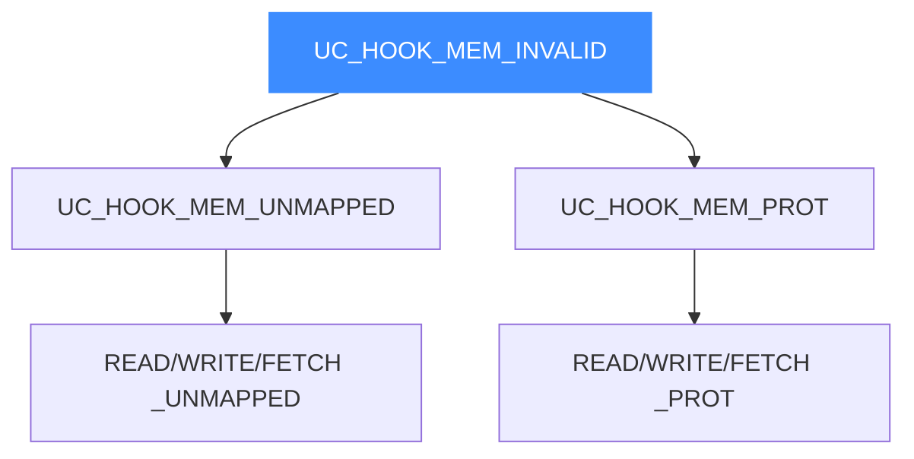
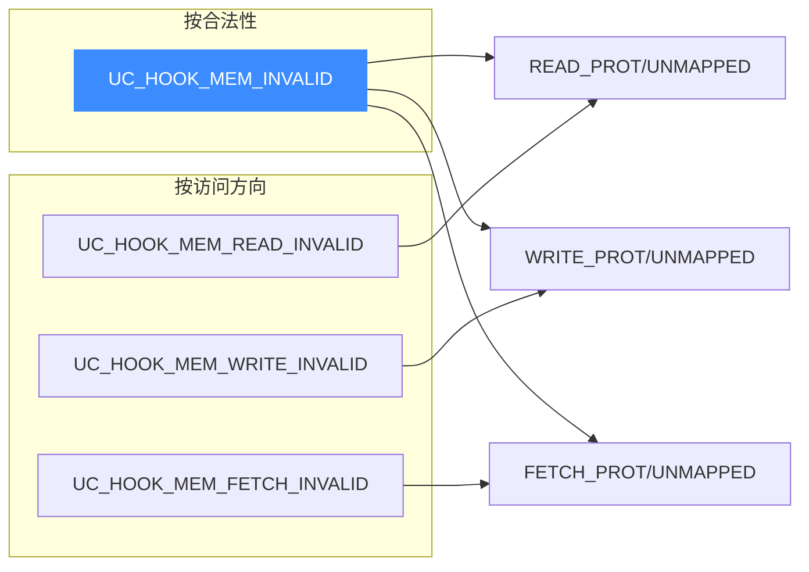

# UC_HOOK_MEM_INVALID — 非法访存合集

本页讲清组合宏 `UC_HOOK_MEM_INVALID` 如何用一次注册捕获**所有非法内存访问**（未映射 + 保护违例，共六种）。读完你能用单个 `uc_cb_eventmem_t` 回调统一处理内存错误。

## 🧩 它是什么

`UC_HOOK_MEM_INVALID` 是"未映射合集"与"保护违例合集"之和，覆盖全部六种非法访存：

```c
#define UC_HOOK_MEM_INVALID (UC_HOOK_MEM_UNMAPPED + UC_HOOK_MEM_PROT)
// 即 READ/WRITE/FETCH 的 UNMAPPED + READ/WRITE/FETCH 的 PROT
```



六种事件全部共用 `uc_cb_eventmem_t`，可合并到一次注册，回调用 `type` 区分。

## 🪝 触发时机

任何一次**非法**内存访问——无论是访问未映射地址，还是访问已映射但权限不允许的地址——都会触发。

## 📥 回调原型

```c
/*
  @type: 六种 UC_MEM_*_UNMAPPED / UC_MEM_*_PROT 之一
  @return: true=已修复，继续；false=中止
*/
typedef bool (*uc_cb_eventmem_t)(uc_engine *uc, uc_mem_type type,
                                 uint64_t address, int size, int64_t value,
                                 void *user_data);
```

> 📄 宏：[`unicorn.h`](https://github.com/android-security-engineer/unicorn-skills/blob/master/include/unicorn/unicorn.h#L427)（`UC_HOOK_MEM_INVALID` 聚合宏）· 注册：[`uc.c`](https://github.com/android-security-engineer/unicorn-skills/blob/master/uc.c#L1908)（`uc_hook_add`）

| `type` 取值 | 含义 |
|-------------|------|
| `UC_MEM_READ_UNMAPPED` / `WRITE_UNMAPPED` / `FETCH_UNMAPPED` | 访问未映射地址 |
| `UC_MEM_READ_PROT` / `WRITE_PROT` / `FETCH_PROT` | 权限不允许 |

## 📤 返回值语义（bool）

| 返回 | 含义 |
|------|------|
| `true` | 已处理：未映射用 `uc_mem_map`、保护违例用 `uc_mem_protect` 修复后继续。 |
| `false` | 中止仿真，返回对应 `UC_ERR_*`。 |

## 🔧 begin/end 适用与示例

支持区间限定。适合做"统一内存错误处理器"。

```c
static bool on_invalid(uc_engine *uc, uc_mem_type type, uint64_t addr,
                       int size, int64_t value, void *ud) {
    switch (type) {
        case UC_MEM_READ_UNMAPPED:
        case UC_MEM_WRITE_UNMAPPED:
        case UC_MEM_FETCH_UNMAPPED:
            // 缺页：按需映射
            return uc_mem_map(uc, addr & ~0xfffULL, 0x1000,
                              UC_PROT_ALL) == UC_ERR_OK;
        default:
            // 保护违例：记录后中止
            fprintf(stderr, "prot fault @0x%" PRIx64 "\n", addr);
            return false;
    }
}

uc_hook h;
uc_hook_add(uc, &h, UC_HOOK_MEM_INVALID, on_invalid, NULL, 1, 0);
```

::: warning 注意：修复方式随 type 而异
未映射要 `uc_mem_map`，保护违例要 `uc_mem_protect`——两者不可混用。务必先按 `type` 分派再修复。
:::

## 🔀 正交切片：按访问方向汇总

`UC_HOOK_MEM_INVALID` 是按**合法性**汇总（未映射 + 保护违例，全部六种）。Unicorn 还提供三个按**访问方向**汇总的组合宏，当你只关心某一类操作的非法访问时更精准：

| 组合宏 | 展开 | 捕获 |
|--------|------|------|
| `UC_HOOK_MEM_READ_INVALID` | `READ_PROT + READ_UNMAPPED` | 所有非法**读** |
| `UC_HOOK_MEM_WRITE_INVALID` | `WRITE_PROT + WRITE_UNMAPPED` | 所有非法**写** |
| `UC_HOOK_MEM_FETCH_INVALID` | `FETCH_PROT + FETCH_UNMAPPED` | 所有非法**取指** |



::: tip 何时用方向切片
- 只想拦截**写**违例（如只读监控写穿改）：用 `UC_HOOK_MEM_WRITE_INVALID`，避免读/取指的合法访问也进回调。
- 实现取指保护（W^X、代码段防改）：用 `UC_HOOK_MEM_FETCH_INVALID`。
- 三个方向都要：直接用 `UC_HOOK_MEM_INVALID` 一次注册即可，等价于三者之和。
:::

## 🎯 典型用途

- **统一内存错误处理器**：一处回调兜住所有非法访存。
- **崩溃诊断 / 沙箱**：记录并决定是修复还是判死。
- **按需分页 + 保护策略**并存的复杂内存模型。

## ⚡ 性能代价

仅在非法访存时触发，正常路径零开销。

## 📂 相关源码

| 文件 | 角色 |
|------|------|
| [`include/unicorn/unicorn.h`](https://github.com/android-security-engineer/unicorn-skills/blob/master/include/unicorn/unicorn.h#L427) | `UC_HOOK_MEM_INVALID` 聚合宏定义 |
| [`include/unicorn/unicorn.h`](https://github.com/android-security-engineer/unicorn-skills/blob/master/include/unicorn/unicorn.h#L479) | `uc_cb_eventmem_t` 回调 typedef |
| [`uc.c`](https://github.com/android-security-engineer/unicorn-skills/blob/master/uc.c#L1908) | `uc_hook_add` 注册实现 |

## 相关页面

- [UC_HOOK_MEM_UNMAPPED — 未映射合集](/hooks/mem-unmapped)
- [UC_HOOK_MEM_PROT — 保护违例合集](/hooks/mem-prot)
- [uc_hook_add — 注册 Hook](/api/hook-add)
- [Hook 类型总览](/hooks/)
