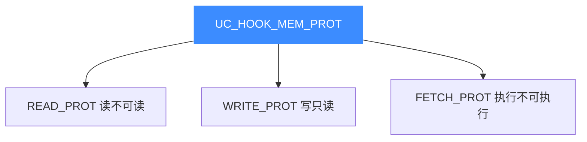

# UC_HOOK_MEM_PROT — 保护违例访存合集

本页讲清组合宏 `UC_HOOK_MEM_PROT` 如何用一次注册覆盖读、写、取指三种**保护违例**访存。读完你能用单个回调统一处理所有权限违规、实现自定义内存保护策略。

## 🧩 它是什么

`UC_HOOK_MEM_PROT` 是三种保护违例事件的**按位或**：

```c
#define UC_HOOK_MEM_PROT                                    \
    (UC_HOOK_MEM_READ_PROT + UC_HOOK_MEM_WRITE_PROT         \
     + UC_HOOK_MEM_FETCH_PROT)
```



三者共用 `uc_cb_eventmem_t`，可合并到一次 `uc_hook_add`；回调用 `type` 区分具体违例类型。区别于未映射：这里页**已映射**，只是**权限**不允许该操作。

## 🪝 触发时机

任何一次对已映射内存、但**权限不允许**的读/写/取指都会触发本合集。

## 📥 回调原型

```c
/*
  @type: UC_MEM_READ_PROT / WRITE_PROT / FETCH_PROT 之一
  @return: true=已处理（改权限），继续；false=中止
*/
typedef bool (*uc_cb_eventmem_t)(uc_engine *uc, uc_mem_type type,
                                 uint64_t address, int size, int64_t value,
                                 void *user_data);
```

> 📄 宏：[`unicorn.h`](https://github.com/android-security-engineer/unicorn-skills/blob/master/include/unicorn/unicorn.h#L415)（`UC_HOOK_MEM_PROT` 聚合宏）· 注册：[`uc.c`](https://github.com/android-security-engineer/unicorn-skills/blob/master/uc.c#L1908)（`uc_hook_add`）

| 参数 | 含义 |
|------|------|
| `type` | 区分读/写/取指保护违例 |
| `address` | 受保护地址 |
| `size` | 访问字节数 |
| `value` | 写事件时为将写入值，其余无意义 |

## 📤 返回值语义（bool）

| 返回 | 含义 |
|------|------|
| `true` | 已处理，通常用 `uc_mem_protect` 调整权限后继续。 |
| `false` | 中止仿真（`UC_ERR_*_PROT`）。 |

## 🔧 begin/end 适用与示例

支持区间限定。

```c
static bool on_prot(uc_engine *uc, uc_mem_type type, uint64_t addr,
                    int size, int64_t value, void *ud) {
    const char *k = type == UC_MEM_WRITE_PROT ? "W" :
                    type == UC_MEM_FETCH_PROT ? "X" : "R";
    printf("prot violation[%s] @0x%" PRIx64 "\n", k, addr);
    uc_emu_stop(uc);   // 策略：一律视为非法并停机
    return false;
}

uc_hook h;
uc_hook_add(uc, &h, UC_HOOK_MEM_PROT, on_prot, NULL, 1, 0);
```

::: tip 一处观测三类违例
安全场景常把敏感区映射为最小权限，然后用本合集集中捕获任何越权访问（读私密、写代码、执行数据）。
:::

## 🎯 典型用途

- **自定义保护模型**：集中判断是否放权（`uc_mem_protect`）或拒绝。
- **W^X 强制 + 篡改检测**：写代码段、执行数据段一并拦截。
- **越权审计**：统一记录所有权限违规。

## ⚡ 性能代价

仅在保护违例时触发，正常路径零开销。

## 📂 相关源码

| 文件 | 角色 |
|------|------|
| [`include/unicorn/unicorn.h`](https://github.com/android-security-engineer/unicorn-skills/blob/master/include/unicorn/unicorn.h#L415) | `UC_HOOK_MEM_PROT` 聚合宏定义 |
| [`include/unicorn/unicorn.h`](https://github.com/android-security-engineer/unicorn-skills/blob/master/include/unicorn/unicorn.h#L479) | `uc_cb_eventmem_t` 回调 typedef |
| [`uc.c`](https://github.com/android-security-engineer/unicorn-skills/blob/master/uc.c#L1908) | `uc_hook_add` 注册实现 |

## 相关页面

- [UC_HOOK_MEM_WRITE_PROT — 写保护违例](/hooks/mem-write-prot)
- [UC_HOOK_MEM_INVALID — 未映射+保护合集](/hooks/mem-invalid)
- [uc_hook_add — 注册 Hook](/api/hook-add)
- [Hook 类型总览](/hooks/)
