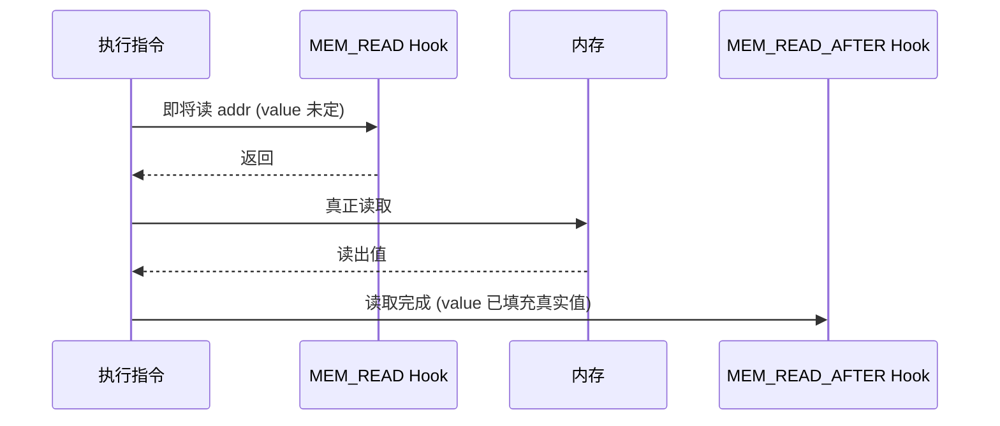
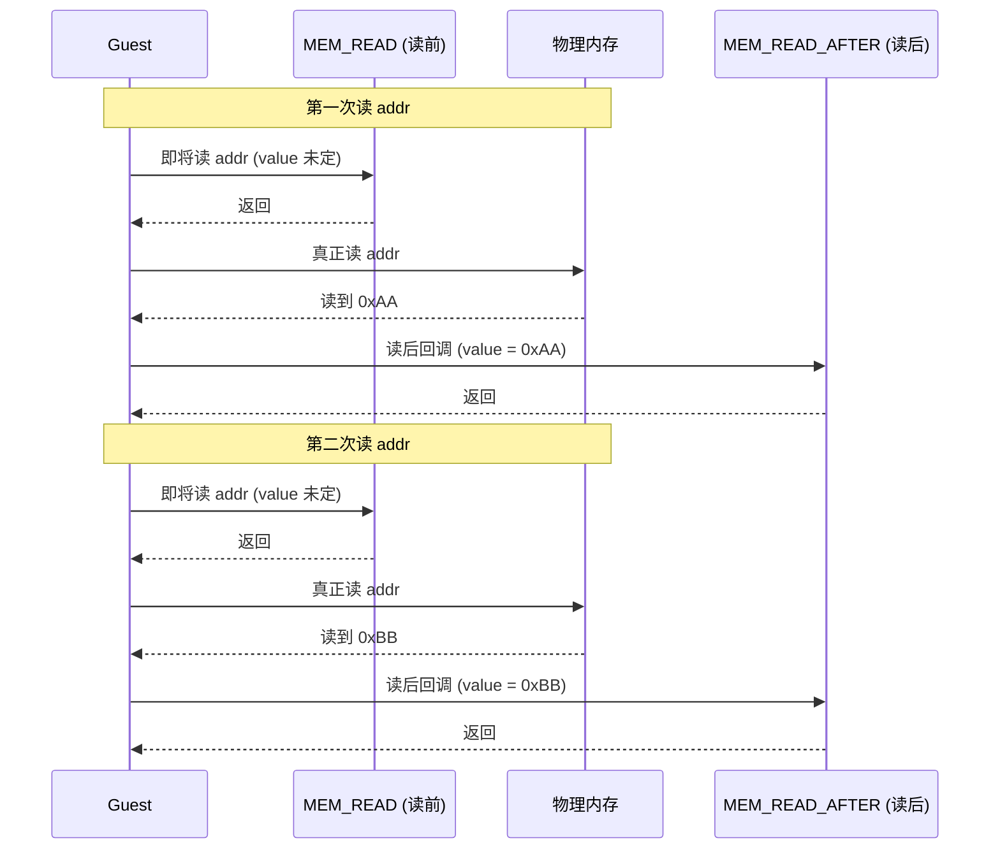

# UC_HOOK_MEM_READ_AFTER — 读后 Hook

本页讲清 `UC_HOOK_MEM_READ_AFTER` 与 [UC_HOOK_MEM_READ](/hooks/mem-read) 的唯一区别：它在读**完成之后**触发，因此 `value` 里是**真实读出的值**。读完你能在观测到实际内存值后再做逻辑。

## 🪝 触发时机

与 `UC_HOOK_MEM_READ` 相同的访问点，但触发在**读操作成功完成之后**。因此回调 `value` 参数**已被填充为真实读出的数据**，而不是读前那个未定值。



## 📥 回调原型

```c
/*
  @type: UC_MEM_READ_AFTER
  @address: 被读地址
  @size: 字节数
  @value: 真实读出的值（已填充）
*/
typedef void (*uc_cb_hookmem_t)(uc_engine *uc, uc_mem_type type,
                                uint64_t address, int size, int64_t value,
                                void *user_data);
```

> 📄 宏：[`unicorn.h`](https://github.com/android-security-engineer/unicorn-skills/blob/master/include/unicorn/unicorn.h#L392)（`UC_HOOK_MEM_READ_AFTER`）· 注册：[`uc.c`](https://github.com/android-security-engineer/unicorn-skills/blob/master/uc.c#L1908)（`uc_hook_add`）

| 参数 | 含义 |
|------|------|
| `type` | `UC_MEM_READ_AFTER` |
| `address` | 被读地址 |
| `size` | 读取字节数 |
| `value` | **真实读出的值（有效）** |

## 📤 返回值语义

返回 `void`。要中止仿真调 `uc_emu_stop`。

## 🔧 begin/end 适用

支持区间限定：仅当被读地址落于 `[begin, end]` 触发。

```c
static void on_read_after(uc_engine *uc, uc_mem_type type, uint64_t addr,
                          int size, int64_t value, void *ud) {
    // 此处 value 是真实读出的字节
    printf("[read-after] addr=0x%" PRIx64 " size=%d -> 0x%" PRIx64 "\n",
           addr, size, (uint64_t)value);
}

uc_hook h;
uc_hook_add(uc, &h, UC_HOOK_MEM_READ_AFTER, on_read_after, NULL, 1, 0);
```

## 🎯 典型用途

- **观测真实读值**：日志/追踪里需要"读到了什么"，而不仅是"读了哪里"。
- **污点/数据流分析**：以读出的值作为传播源。
- **读值校验**：对读回的数据做断言或对比。

::: tip 与 MEM_READ 的选择
需要"读什么值"→ 用 READ_AFTER；只需"读了哪个地址"或想在读前用 MMIO 提供值 → 用 [MEM_READ](/hooks/mem-read)。两者可同时注册以覆盖读前/读后两个时点。
:::

## ⚡ 性能代价

与 `MEM_READ` 同量级，按读访存触发；读密集代码开销大，用 `begin/end` 收窄。

## 📊 READ vs READ_AFTER 时序对比

下图对**同一地址连续读两次**，把 `MEM_READ`（读前）与 `MEM_READ_AFTER`（读后）放在同一条时间线上对比：`MEM_READ` 在真正读之前触发，`value` 未定；`MEM_READ_AFTER` 在真正读之后触发，`value` 已是真实读出值。第一次读到的 `0xAA` 与第二次读到的 `0xBB` 都只在 `READ_AFTER` 回调里可见。



::: tip 选哪个
要"读到什么值"做追踪/校验 → `READ_AFTER`；要"在读前注入值"做 MMIO → `READ`。两者可同注册，覆盖一次读的前后两个时点。
:::

## 📂 相关源码

| 文件 | 角色 |
|------|------|
| [`include/unicorn/unicorn.h`](https://github.com/android-security-engineer/unicorn-skills/blob/master/include/unicorn/unicorn.h#L392) | `UC_HOOK_MEM_READ_AFTER` 宏定义 |
| [`include/unicorn/unicorn.h`](https://github.com/android-security-engineer/unicorn-skills/blob/master/include/unicorn/unicorn.h#L447) | `uc_cb_hookmem_t` 回调 typedef |
| [`uc.c`](https://github.com/android-security-engineer/unicorn-skills/blob/master/uc.c#L1908) | `uc_hook_add` 注册实现 |

## 相关页面

- [UC_HOOK_MEM_READ — 内存读（读前）](/hooks/mem-read)
- [UC_HOOK_MEM_WRITE — 内存写](/hooks/mem-write)
- [uc_hook_add — 注册 Hook](/api/hook-add)
- [Hook 类型总览](/hooks/)
