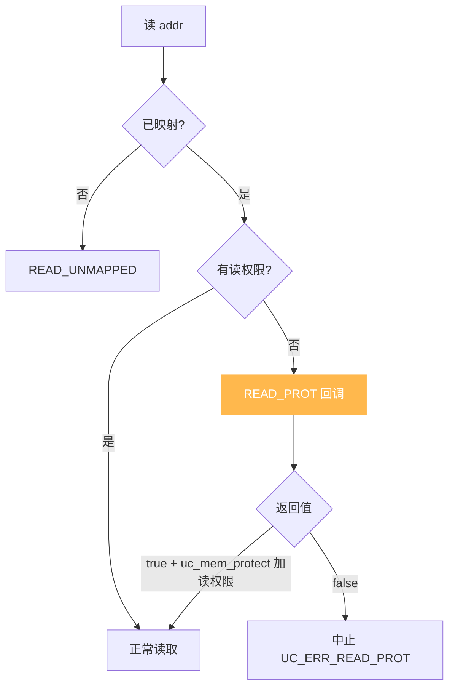
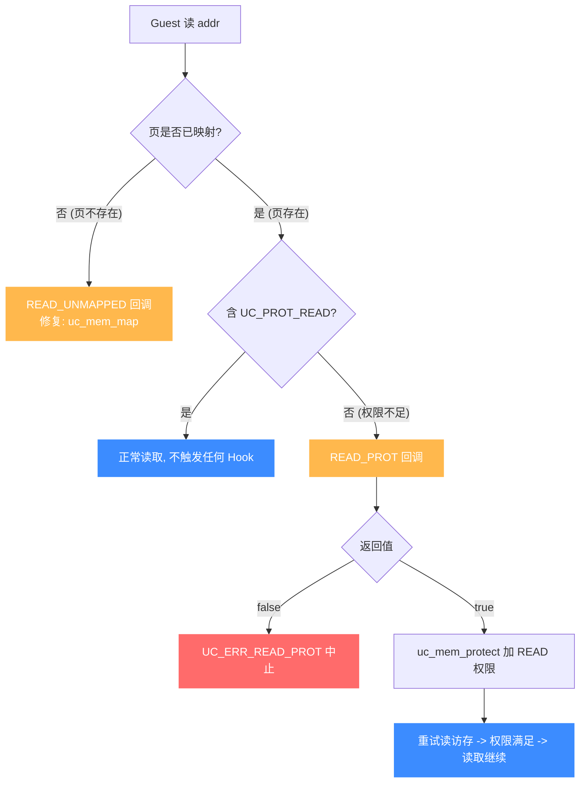

# UC_HOOK_MEM_READ_PROT — 读保护违例 Hook

本页讲清 `UC_HOOK_MEM_READ_PROT` 在代码读取**已映射但不可读**内存时如何触发，回调返回的 `bool` 如何决定"改权限后继续"还是"中止"。读完你能实现读保护策略与访问审计。

## 🪝 触发时机

当被仿真代码读取一处**已映射、但映射时未授予读权限**（缺少 `UC_PROT_READ`）的内存时触发。区别于未映射：这里页是存在的，只是**权限**不允许读。默认以 `UC_ERR_READ_PROT` 中止。



## 📥 回调原型

```c
/*
  @type: UC_MEM_READ_PROT
  @return: true=继续（须已授予读权限），false=中止
*/
typedef bool (*uc_cb_eventmem_t)(uc_engine *uc, uc_mem_type type,
                                 uint64_t address, int size, int64_t value,
                                 void *user_data);
```

> 📄 宏：[`unicorn.h`](https://github.com/android-security-engineer/unicorn-skills/blob/master/include/unicorn/unicorn.h#L379)（`UC_HOOK_MEM_READ_PROT`）· 注册：[`uc.c`](https://github.com/android-security-engineer/unicorn-skills/blob/master/uc.c#L1908)（`uc_hook_add`）

| 参数 | 含义 |
|------|------|
| `type` | `UC_MEM_READ_PROT` |
| `address` | 被读的受保护地址 |
| `size` | 访问字节数 |
| `value` | 读操作，无意义 |

## 📤 返回值语义（bool）

| 返回 | 含义 |
|------|------|
| `true` | 已处理。通常在回调里用 `uc_mem_protect` 给该页加上 `UC_PROT_READ`，之后读取继续。 |
| `false` | 未处理，以 `UC_ERR_READ_PROT` 中止。 |

## 🔧 begin/end 适用

支持区间限定：仅当受保护读地址落于 `[begin, end]` 触发。

```c
static bool on_read_prot(uc_engine *uc, uc_mem_type type, uint64_t addr,
                         int size, int64_t value, void *ud) {
    printf("read-prot violation @0x%" PRIx64 "\n", addr);
    // 策略：临时放开读权限并继续
    uint64_t page = addr & ~0xfffULL;
    if (uc_mem_protect(uc, page, 0x1000, UC_PROT_READ | UC_PROT_EXEC) != UC_ERR_OK)
        return false;
    return true;
}

uc_hook h;
uc_hook_add(uc, &h, UC_HOOK_MEM_READ_PROT, on_read_prot, NULL, 1, 0);
```

## 🎯 典型用途

- **软件读保护 / 陷阱页**：把某页设为不可读，在被读时拦截（如敏感数据 canary）。
- **自定义权限模型**：按 CPU 模式决定是否放行。
- **访问审计**：记录对受保护区的读尝试。

## ⚡ 性能代价

只在发生读保护违例时触发，正常路径零开销。可与写、取指保护变体合并为 [UC_HOOK_MEM_PROT](/hooks/mem-prot)。

## 📊 保护违例判定：mapped+权限不足 vs unmapped

下图把"一次读访问为何走 PROT 而非 UNMAPPED"讲清：先判定页**是否已映射**——未映射走 [READ_UNMAPPED](/hooks/mem-read-unmapped)（页不存在，要用 `uc_mem_map` 补映射）；已映射但缺 `UC_PROT_READ` 才走 `READ_PROT`（页存在，只是权限不够，要用 `uc_mem_protect` 加权限）。两条修复路径的工具不同：PROT 改权限、UNMAPPED 建映射。PROT 返回 `true` 后引擎重试读访存，这次权限满足，读取继续。



::: tip PROT 与 UNMAPPED 的本质差别
两者都让读访问失败，但根因不同：`PROT` 是"页在，权限不够"——修复手段是 `uc_mem_protect` 调权限；`UNMAPPED` 是"页根本不在"——修复手段是 `uc_mem_map` 建映射。判定顺序永远是先看映射、再看权限。
:::

## 📂 相关源码

| 文件 | 角色 |
|------|------|
| [`include/unicorn/unicorn.h`](https://github.com/android-security-engineer/unicorn-skills/blob/master/include/unicorn/unicorn.h#L379) | `UC_HOOK_MEM_READ_PROT` 宏定义 |
| [`include/unicorn/unicorn.h`](https://github.com/android-security-engineer/unicorn-skills/blob/master/include/unicorn/unicorn.h#L479) | `uc_cb_eventmem_t` 回调 typedef |
| [`uc.c`](https://github.com/android-security-engineer/unicorn-skills/blob/master/uc.c#L1908) | `uc_hook_add` 注册实现 |

## 相关页面

- [UC_HOOK_MEM_WRITE_PROT — 写保护违例](/hooks/mem-write-prot)
- [UC_HOOK_MEM_PROT — 三种保护违例合集](/hooks/mem-prot)
- [uc_hook_add — 注册 Hook](/api/hook-add)
- [Hook 类型总览](/hooks/)
