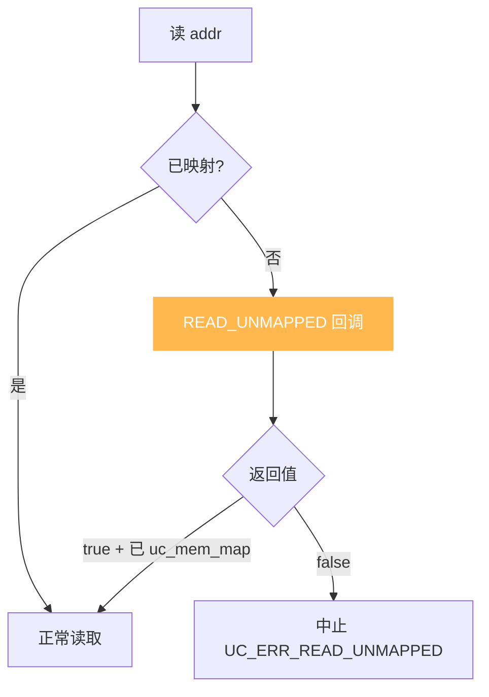
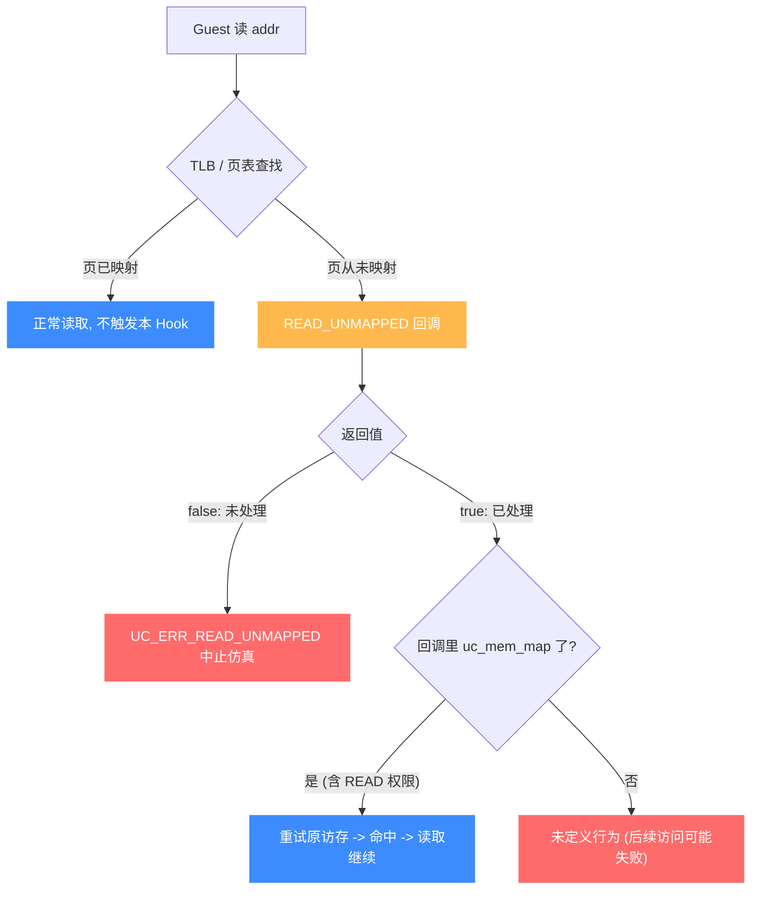

# UC_HOOK_MEM_READ_UNMAPPED — 读未映射内存 Hook

本页讲清 `UC_HOOK_MEM_READ_UNMAPPED` 在代码读取**未映射**地址时如何触发，回调返回的 `bool` 如何决定"补映射后继续"还是"中止"。读完你能实现按需分页与优雅的越界诊断。

## 🪝 触发时机

当被仿真代码试图**读取一处没有内存映射的地址**时触发。这是访问非法内存的一种：地址所在页从未被 `uc_mem_map`。默认行为是以 `UC_ERR_READ_UNMAPPED` 中止；本 Hook 给你补救的机会。



## 📥 回调原型

```c
/*
  @type: UC_MEM_READ_UNMAPPED
  @return: true=继续（须已把内存映射好），false=中止
*/
typedef bool (*uc_cb_eventmem_t)(uc_engine *uc, uc_mem_type type,
                                 uint64_t address, int size, int64_t value,
                                 void *user_data);
```

> 📄 宏：[`unicorn.h`](https://github.com/android-security-engineer/unicorn-skills/blob/master/include/unicorn/unicorn.h#L373)（`UC_HOOK_MEM_READ_UNMAPPED`）· 注册：[`uc.c`](https://github.com/android-security-engineer/unicorn-skills/blob/master/uc.c#L1908)（`uc_hook_add`）

| 参数 | 含义 |
|------|------|
| `type` | `UC_MEM_READ_UNMAPPED` |
| `address` | 被读的未映射地址 |
| `size` | 访问字节数 |
| `value` | 读操作，无意义 |

## 📤 返回值语义（bool）

| 返回 | 含义 |
|------|------|
| `true` | 表示已处理。**必须先用 `uc_mem_map` 把对应页以正确权限映射好**，随后指令会照常完成这次读取。 |
| `false` | 未处理，引擎以 `UC_ERR_READ_UNMAPPED` 中止。 |

::: danger 危险：返回 true 但没映射 = 未定义行为
返回 `true` 却没有真正把 `address` 所在页映射进来，会导致后续访问失败或行为未定义。修复路径必须"先 map，再 return true"。
:::

## 🔧 begin/end 适用

支持区间限定：仅当未映射地址落于 `[begin, end]` 触发。缺页处理通常用全地址空间（`1, 0`）。

```c
static bool on_read_unmapped(uc_engine *uc, uc_mem_type type, uint64_t addr,
                             int size, int64_t value, void *ud) {
    uint64_t page = addr & ~0xfffULL;              // 页对齐
    printf("map-on-demand read @0x%" PRIx64 "\n", addr);
    if (uc_mem_map(uc, page, 0x1000, UC_PROT_READ) != UC_ERR_OK)
        return false;                               // 映射失败 -> 中止
    return true;                                     // 已映射, 继续
}

uc_hook h;
uc_hook_add(uc, &h, UC_HOOK_MEM_READ_UNMAPPED, on_read_unmapped, NULL, 1, 0);
```

## 🎯 典型用途

- **按需分页**：只有真正被访问时才映射内存，模拟虚拟内存/惰性加载。
- **越界诊断**：在中止前记录 PC、寄存器、访问地址，定位 bug。
- **稀疏地址空间**：无需预映射巨大区域。

## ⚡ 性能代价

只在读到未映射地址时触发，正常路径零开销。可与写、取指的未映射变体用 `|` 合并为 [UC_HOOK_MEM_UNMAPPED](/hooks/mem-unmapped)（同为 `uc_cb_eventmem_t`）。

## 📊 未映射访问的判定与处理流程

下图把一次读未映射访问展开成完整处理路径：访存经 TLB 查找发现地址所在页**从未被 `uc_mem_map** → 触发 `READ_UNMAPPED` 回调。回调返回 `false` 则引擎以 `UC_ERR_READ_UNMAPPED` 中止；返回 `true` 则要求你**已在回调里把该页映射好**，随后引擎重试原访存——这次命中，读取继续。两条分支的差别就在"是否补映射 + 重试"。



::: danger 两条分支的关键约束
`true` 分支不是"返回 true 就万事大吉"——你必须**先 `uc_mem_map` 把页以读权限映射好，再返回 true**，引擎才会重试并命中。只返回 true 不映射，属于未定义行为。`false` 分支则直接以 `UC_ERR_READ_UNMAPPED` 终止 `uc_emu_start`。
:::

## 📂 相关源码

| 文件 | 角色 |
|------|------|
| [`include/unicorn/unicorn.h`](https://github.com/android-security-engineer/unicorn-skills/blob/master/include/unicorn/unicorn.h#L373) | `UC_HOOK_MEM_READ_UNMAPPED` 宏定义 |
| [`include/unicorn/unicorn.h`](https://github.com/android-security-engineer/unicorn-skills/blob/master/include/unicorn/unicorn.h#L479) | `uc_cb_eventmem_t` 回调 typedef |
| [`uc.c`](https://github.com/android-security-engineer/unicorn-skills/blob/master/uc.c#L1908) | `uc_hook_add` 注册实现 |

## 相关页面

- [错误：读未映射内存](/errors/read-unmapped)
- [UC_HOOK_MEM_UNMAPPED — 三种未映射合集](/hooks/mem-unmapped)
- [uc_hook_add — 注册 Hook](/api/hook-add)
- [Hook 类型总览](/hooks/)
