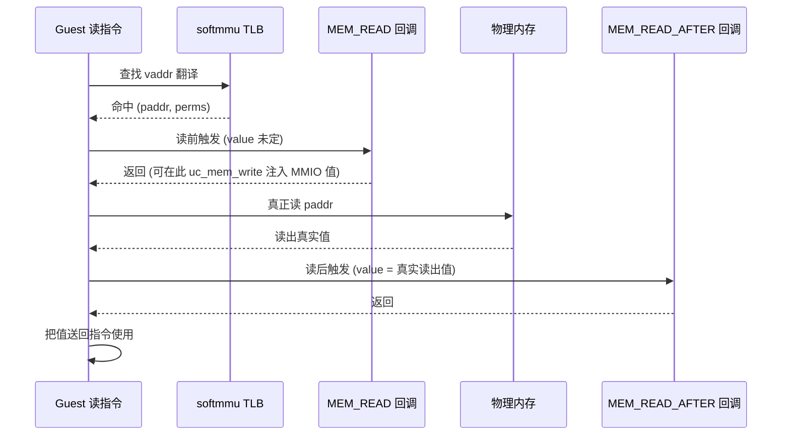

# UC_HOOK_MEM_READ — 内存读 Hook

本页讲清 `UC_HOOK_MEM_READ` 在代码读取（已映射）内存时的触发时机、精确回调签名，以及为何此时 `value` 尚无意义。读完你能实现读 watchpoint 与内存映射 I/O（MMIO）仿真。

## 🪝 触发时机

当被仿真代码**读取一处已映射内存**时，在**真正读出之前**触发。因此回调里拿到的 `value` 内容是**未定的**（还没读到）。若要拿真实读出值，请用 [UC_HOOK_MEM_READ_AFTER](/hooks/mem-read-after)。


::: warning 注意
用 Unicorn 的 `uc_mem_read` / `uc_mem_write` 等 API 直接访问内存**不会**触发这些 Hook——它们只在被仿真代码执行访存指令时触发。
:::

## 📥 回调原型

```c
/*
  @type: 访问类型（此处为 UC_MEM_READ）
  @address: 被读取的地址
  @size: 本次访问的字节数
  @value: 读操作时无意义（尚未读出）
*/
typedef void (*uc_cb_hookmem_t)(uc_engine *uc, uc_mem_type type,
                                uint64_t address, int size, int64_t value,
                                void *user_data);
```

> 📄 宏：[`unicorn.h`](https://github.com/android-security-engineer/unicorn-skills/blob/master/include/unicorn/unicorn.h#L385)（`UC_HOOK_MEM_READ`）· 注册：[`uc.c`](https://github.com/android-security-engineer/unicorn-skills/blob/master/uc.c#L1908)（`uc_hook_add`）

| 参数 | 类型 | 含义 |
|------|------|------|
| `type` | `uc_mem_type` | `UC_MEM_READ` |
| `address` | `uint64_t` | 被读地址 |
| `size` | `int` | 访问字节数（1/2/4/8…） |
| `value` | `int64_t` | **读前触发，无意义** |
| `user_data` | `void *` | 用户数据 |

## 📤 返回值语义

返回 `void`，无返回值。要中止仿真调 `uc_emu_stop`。你可以在回调里用 `uc_mem_write` 向 `address` 写入一个值——这样紧接着的读指令就会取到你写入的值，从而实现 MMIO。

## 🔧 begin/end 适用

支持区间限定：仅当被读地址落于 `[begin, end]` 时触发，用于把 watchpoint 收窄到关心的地址。

```c
static void on_read(uc_engine *uc, uc_mem_type type, uint64_t addr,
                    int size, int64_t value, void *ud) {
    // MMIO：当代码读设备寄存器时，先写入我们要提供的值
    if (addr == 0x40000000) {
        uint32_t reg = 0xdeadbeef;
        uc_mem_write(uc, addr, &reg, sizeof(reg));
    }
    printf("[read] addr=0x%" PRIx64 " size=%d\n", addr, size);
}

uc_hook h;
uc_hook_add(uc, &h, UC_HOOK_MEM_READ, on_read, NULL, 0x40000000, 0x40000fff);
```

## 🎯 典型用途

- **读 watchpoint**：监控某地址被读，打印寄存器 / 调用栈 / PC。
- **MMIO 仿真**：在读设备寄存器前写入"设备当前值"，让读指令取到它。
- **访问审计**：记录敏感区域的读访问。

## ⚡ 性能代价

按访存触发，比 [UC_HOOK_CODE](/hooks/code) 更细，读密集代码会大量触发。务必用 `begin/end` 收窄区间。可与 `UC_HOOK_MEM_WRITE` 用 `|` 合并注册（同为 `uc_cb_hookmem_t`）。

## 📊 访存流水线时序

下图把一次 guest 读指令放进 softmmu 访存流水线里看：`MEM_READ` 在 TLB 查找之后、真正读内存**之前**触发（此时 `value` 未定）；`MEM_READ_AFTER` 则在读内存**之后**触发，拿到真实值。两者位置严格相邻于真正的物理读，但分踞读操作两侧。



::: tip 两段式读的妙用
`MEM_READ` 适合在读取发生前**注入**值（MMIO 设备寄存器）；`MEM_READ_AFTER` 适合在读取完成后**观测**真实值（追踪/校验）。两者可同时注册，分踞一次读的前后。
:::

## 📊 读访存各 Hook 的触发阶段

下图把读相关的全部 Hook 放进同一条访存流水线里定位：guest 读指令 → TLB 查找 → 权限检查。`MEM_READ` 在**读前**触发（`value` 未定，可注入 MMIO 值）；真正读内存后 `MEM_READ_AFTER` 在**读后**触发（`value` 已是真实值）。两条非法分支在权限检查处分叉：页在但不可读 → `READ_PROT`；页不在 → `READ_UNMAPPED`（均返回 `bool`，修复后重试）。`MEM_READ` / `MEM_READ_AFTER` 与 `READ_PROT` / `READ_UNMAPPED` 互斥——合法读走前两者，非法读走后两者。

```mermaid
graph TD
    A["Guest 读 addr"] --> T{"TLB 查找"}
    T -->|"命中"| P{"权限检查: 含 READ?"}
    T -->|"未映射"| U["READ_UNMAPPED 回调 (bool)"]
    P -->|"是 (可读)"| BR["MEM_READ 回调 (读前, value 未定)"]
    P -->|"否 (只读页)"| RP["READ_PROT 回调 (bool)"]
    BR --> M["真正读物理内存"]
    M --> AR["MEM_READ_AFTER 回调 (读后, value = 真实值)"]
    AR --> DONE["值送回指令"]
    U -->|"true 补映射"| T
    RP -->|"true 加读权限"| T
    style BR fill:#3c8cff,color:#fff,stroke:none
    style AR fill:#3c8cff,color:#fff,stroke:none
    style DONE fill:#3c8cff,color:#fff,stroke:none
    style U fill:#ffb84d,color:#fff,stroke:none
    style RP fill:#ffb84d,color:#fff,stroke:none
```



::: tip 合法 vs 非法：互斥不重叠
`MEM_READ` 与 `MEM_READ_AFTER` 只在**合法读**（页已映射且可读）时触发，分踞真正读的前后；一旦页不可读或未映射，路径切到 `READ_PROT` / `READ_UNMAPPED`，回调类型也从 `uc_cb_hookmem_t`（无返回值）换成 `uc_cb_eventmem_t`（返回 `bool`）。合法与非法两族 Hook 永不共存于同一次访问。
:::

## 📂 相关源码

| 文件 | 角色 |
|------|------|
| [`include/unicorn/unicorn.h`](https://github.com/android-security-engineer/unicorn-skills/blob/master/include/unicorn/unicorn.h#L385) | `UC_HOOK_MEM_READ` 宏定义 |
| [`include/unicorn/unicorn.h`](https://github.com/android-security-engineer/unicorn-skills/blob/master/include/unicorn/unicorn.h#L447) | `uc_cb_hookmem_t` 回调 typedef |
| [`uc.c`](https://github.com/android-security-engineer/unicorn-skills/blob/master/uc.c#L1908) | `uc_hook_add` 注册实现 |

## 相关页面

- [UC_HOOK_MEM_READ_AFTER — 读后拿真实值](/hooks/mem-read-after)
- [UC_HOOK_MEM_WRITE — 内存写](/hooks/mem-write)
- [uc_hook_add — 注册 Hook](/api/hook-add)
- [Hook 类型总览](/hooks/)
