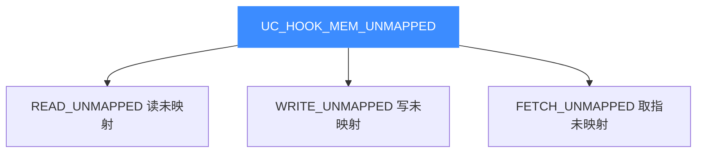

# UC_HOOK_MEM_UNMAPPED — 未映射访存合集

本页讲清组合宏 `UC_HOOK_MEM_UNMAPPED` 如何用一次注册覆盖读、写、取指三种**未映射**访存。读完你能用单个回调统一处理所有缺页事件、实现全局按需分页。

## 🧩 它是什么

`UC_HOOK_MEM_UNMAPPED` 不是独立事件，而是三种未映射事件的**按位或**：

```c
#define UC_HOOK_MEM_UNMAPPED                                \
    (UC_HOOK_MEM_READ_UNMAPPED + UC_HOOK_MEM_WRITE_UNMAPPED \
     + UC_HOOK_MEM_FETCH_UNMAPPED)
```



三者共用 `uc_cb_eventmem_t` 回调，因此可合并到一次 `uc_hook_add`。回调用 `type` 参数区分具体是哪种。

## 🪝 触发时机

任何一次对**未映射地址**的读、写或取指都会触发本合集，回调在访问因缺页失败时被调用。

## 📥 回调原型

```c
/*
  @type: UC_MEM_READ_UNMAPPED / WRITE_UNMAPPED / FETCH_UNMAPPED 之一
  @return: true=已映射，继续；false=中止
*/
typedef bool (*uc_cb_eventmem_t)(uc_engine *uc, uc_mem_type type,
                                 uint64_t address, int size, int64_t value,
                                 void *user_data);
```

> 📄 宏：[`unicorn.h`](https://github.com/android-security-engineer/unicorn-skills/blob/master/include/unicorn/unicorn.h#L411)（`UC_HOOK_MEM_UNMAPPED` 聚合宏）· 注册：[`uc.c`](https://github.com/android-security-engineer/unicorn-skills/blob/master/uc.c#L1908)（`uc_hook_add`）

| 参数 | 含义 |
|------|------|
| `type` | 用于区分读/写/取指未映射 |
| `address` | 未映射地址 |
| `size` | 访问字节数 |
| `value` | 写事件时为将写入值，其余无意义 |

## 📤 返回值语义（bool）

| 返回 | 含义 |
|------|------|
| `true` | 已在回调里用 `uc_mem_map` 映射好对应页（权限须匹配访问类型），继续执行。 |
| `false` | 中止仿真（`UC_ERR_*_UNMAPPED`）。 |

## 🔧 begin/end 适用与示例

支持区间限定；缺页处理通常用全地址空间。

```c
static bool on_unmapped(uc_engine *uc, uc_mem_type type, uint64_t addr,
                        int size, int64_t value, void *ud) {
    uint64_t page = addr & ~0xfffULL;
    uint32_t perms = UC_PROT_READ | UC_PROT_WRITE;
    if (type == UC_MEM_FETCH_UNMAPPED) perms = UC_PROT_READ | UC_PROT_EXEC;
    if (uc_mem_map(uc, page, 0x1000, perms) != UC_ERR_OK) return false;
    return true;
}

uc_hook h;
// 一次注册覆盖读/写/取指三种未映射
uc_hook_add(uc, &h, UC_HOOK_MEM_UNMAPPED, on_unmapped, NULL, 1, 0);
```

::: tip 用 type 分派权限
取指未映射要映射为可执行（`UC_PROT_EXEC`），读写则用读写权限。用 `type` 判定即可在一个回调里统一处理。
:::

## 🎯 典型用途

- **全局按需分页**：一处回调处理所有缺页，惰性分配整个地址空间。
- **稀疏内存模型**：无需预映射，用到才映。
- **统一越界诊断**：所有非法（未映射）访问集中记录。

## ⚡ 性能代价

仅在缺页时触发，正常路径零开销。

## 📂 相关源码

| 文件 | 角色 |
|------|------|
| [`include/unicorn/unicorn.h`](https://github.com/android-security-engineer/unicorn-skills/blob/master/include/unicorn/unicorn.h#L411) | `UC_HOOK_MEM_UNMAPPED` 聚合宏定义 |
| [`include/unicorn/unicorn.h`](https://github.com/android-security-engineer/unicorn-skills/blob/master/include/unicorn/unicorn.h#L479) | `uc_cb_eventmem_t` 回调 typedef |
| [`uc.c`](https://github.com/android-security-engineer/unicorn-skills/blob/master/uc.c#L1908) | `uc_hook_add` 注册实现 |

## 相关页面

- [UC_HOOK_MEM_READ_UNMAPPED — 读未映射](/hooks/mem-read-unmapped)
- [UC_HOOK_MEM_INVALID — 未映射+保护合集](/hooks/mem-invalid)
- [uc_hook_add — 注册 Hook](/api/hook-add)
- [Hook 类型总览](/hooks/)
