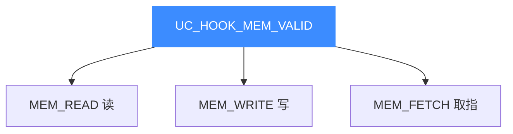

# UC_HOOK_MEM_VALID — 正常访存合集

本页讲清组合宏 `UC_HOOK_MEM_VALID` 如何用一次注册覆盖读、写、取指三种**正常（成功）访存**。读完你能用单个 `uc_cb_hookmem_t` 回调统一观测所有合法内存访问。

## 🧩 它是什么

`UC_HOOK_MEM_VALID` 是三种正常访存事件的**按位或**：

```c
#define UC_HOOK_MEM_VALID                                  \
    (UC_HOOK_MEM_READ + UC_HOOK_MEM_WRITE + UC_HOOK_MEM_FETCH)
```



三者共用 `uc_cb_hookmem_t`（返回 `void`，**非** eventmem），可合并到一次注册，回调用 `type` 区分。

::: warning 注意：可能触发在部分非法读上
头文件说明：`UC_HOOK_MEM_READ` 在 `UC_HOOK_MEM_READ_PROT` 与 `UC_HOOK_MEM_READ_UNMAPPED` **之前**触发，因此 `UC_HOOK_MEM_VALID` 在技术上可能对某些随后被判定为非法的读也触发一次。做统计时需知晓这一点。
:::

## 🪝 触发时机

对已映射内存的读、写或取指访问时触发。这是"观测所有正常访存"的便捷开关。

## 📥 回调原型

```c
/*
  @type: UC_MEM_READ / UC_MEM_WRITE / UC_MEM_FETCH 之一
  @value: 写时为写入值；读/取指时无意义
*/
typedef void (*uc_cb_hookmem_t)(uc_engine *uc, uc_mem_type type,
                                uint64_t address, int size, int64_t value,
                                void *user_data);
```

> 📄 宏：[`unicorn.h`](https://github.com/android-security-engineer/unicorn-skills/blob/master/include/unicorn/unicorn.h#L432)（`UC_HOOK_MEM_VALID` 聚合宏）· 注册：[`uc.c`](https://github.com/android-security-engineer/unicorn-skills/blob/master/uc.c#L1908)（`uc_hook_add`）

| 参数 | 含义 |
|------|------|
| `type` | 区分读/写/取指 |
| `address` | 访问地址 |
| `size` | 字节数 |
| `value` | 写时有效，读/取指无意义 |

## 📤 返回值语义

返回 `void`，纯观测。要中止调 `uc_emu_stop`。

## 🔧 begin/end 适用与示例

支持区间限定；观测热点区时务必收窄区间。

```c
static void on_mem(uc_engine *uc, uc_mem_type type, uint64_t addr,
                   int size, int64_t value, void *ud) {
    const char *k = type == UC_MEM_WRITE ? "W" :
                    type == UC_MEM_FETCH ? "X" : "R";
    printf("[%s] addr=0x%" PRIx64 " size=%d\n", k, addr, size);
}

uc_hook h;
uc_hook_add(uc, &h, UC_HOOK_MEM_VALID, on_mem, NULL, 1, 0);
```

## 🎯 典型用途

- **全量内存 trace**：一处回调记录所有访存流水。
- **数据流/污点分析**的采集侧。
- **访问模式画像**：统计读写比、热点地址。

## ⚡ 性能代价

::: danger 危险：极高频触发
访存远比指令更频繁，`UC_HOOK_MEM_VALID` 会在几乎每次内存操作时触发，开销很大。务必用 `begin/end` 收窄到关心区间，回调保持精简。
:::

## 📂 相关源码

| 文件 | 角色 |
|------|------|
| [`include/unicorn/unicorn.h`](https://github.com/android-security-engineer/unicorn-skills/blob/master/include/unicorn/unicorn.h#L432) | `UC_HOOK_MEM_VALID` 聚合宏定义 |
| [`include/unicorn/unicorn.h`](https://github.com/android-security-engineer/unicorn-skills/blob/master/include/unicorn/unicorn.h#L447) | `uc_cb_hookmem_t` 回调 typedef |
| [`uc.c`](https://github.com/android-security-engineer/unicorn-skills/blob/master/uc.c#L1908) | `uc_hook_add` 注册实现 |

## 相关页面

- [UC_HOOK_MEM_READ — 内存读](/hooks/mem-read)
- [UC_HOOK_MEM_WRITE — 内存写](/hooks/mem-write)
- [UC_HOOK_MEM_INVALID — 非法访存合集](/hooks/mem-invalid)
- [uc_hook_add — 注册 Hook](/api/hook-add)
