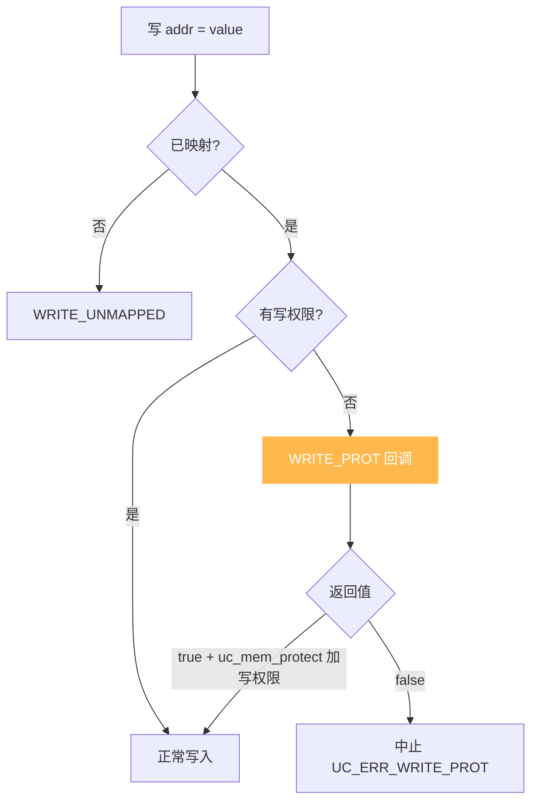
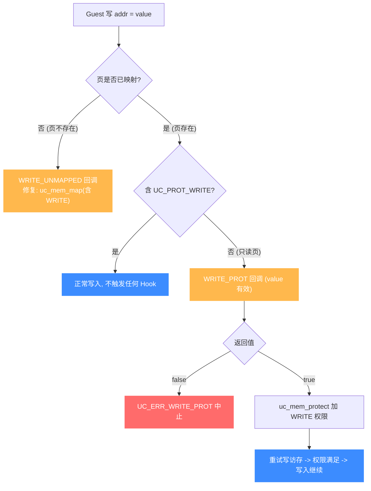

# UC_HOOK_MEM_WRITE_PROT — 写保护违例 Hook

本页讲清 `UC_HOOK_MEM_WRITE_PROT` 在代码写入**已映射但只读**内存时如何触发，回调返回的 `bool` 如何决定"改权限后继续"还是"中止"。读完你能实现写保护、写时复制（COW）与篡改检测。

## 🪝 触发时机

当被仿真代码写入一处**已映射、但不含 `UC_PROT_WRITE` 权限**（如只读段）的内存时触发。页存在，只是不允许写。默认以 `UC_ERR_WRITE_PROT` 中止。此处 `value` 是**试图写入的值**。



## 📥 回调原型

```c
/*
  @type: UC_MEM_WRITE_PROT
  @value: 试图写入的值（有效）
  @return: true=继续（须已授予写权限），false=中止
*/
typedef bool (*uc_cb_eventmem_t)(uc_engine *uc, uc_mem_type type,
                                 uint64_t address, int size, int64_t value,
                                 void *user_data);
```

> 📄 宏：[`unicorn.h`](https://github.com/android-security-engineer/unicorn-skills/blob/master/include/unicorn/unicorn.h#L381)（`UC_HOOK_MEM_WRITE_PROT`）· 注册：[`uc.c`](https://github.com/android-security-engineer/unicorn-skills/blob/master/uc.c#L1908)（`uc_hook_add`）

| 参数 | 含义 |
|------|------|
| `type` | `UC_MEM_WRITE_PROT` |
| `address` | 被写的只读地址 |
| `size` | 写入字节数 |
| `value` | **试图写入的值（有效）** |

## 📤 返回值语义（bool）

| 返回 | 含义 |
|------|------|
| `true` | 已处理。通常用 `uc_mem_protect` 给该页加 `UC_PROT_WRITE`，之后写入继续。 |
| `false` | 未处理，以 `UC_ERR_WRITE_PROT` 中止。 |

## 🔧 begin/end 适用

支持区间限定：仅当只读写地址落于 `[begin, end]` 触发。

```c
static bool on_write_prot(uc_engine *uc, uc_mem_type type, uint64_t addr,
                          int size, int64_t value, void *ud) {
    printf("write-prot @0x%" PRIx64 " val=0x%" PRIx64 "\n",
           addr, (uint64_t)value);
    // 写时复制：放开该页写权限后放行
    uint64_t page = addr & ~0xfffULL;
    if (uc_mem_protect(uc, page, 0x1000, UC_PROT_ALL) != UC_ERR_OK)
        return false;
    return true;
}

uc_hook h;
uc_hook_add(uc, &h, UC_HOOK_MEM_WRITE_PROT, on_write_prot, NULL, 1, 0);
```

## 🎯 典型用途

- **篡改/自修改检测**：把代码段设为只读，被写时报警。
- **写时复制（COW）**：首次写触发时才复制页并放权。
- **脏页追踪**：记录哪些只读页被尝试写。

## ⚡ 性能代价

只在写保护违例时触发，正常路径零开销。可与读、取指保护变体合并为 [UC_HOOK_MEM_PROT](/hooks/mem-prot)。

## 📊 保护违例判定：mapped+只读 vs unmapped

下图把"一次写访问为何走 PROT 而非 UNMAPPED"讲清：先看页**是否已映射**——未映射走 [WRITE_UNMAPPED](/hooks/mem-write-unmapped)（页不存在，要 `uc_mem_map` 补映射且含 WRITE）；已映射但缺 `UC_PROT_WRITE`（如只读段）才走 `WRITE_PROT`（页存在，只是只读，要 `uc_mem_protect` 加写权限）。PROT 返回 `true` 后引擎重试写访存，权限满足则写入继续——这正是 COW（写时复制）的挂载点。



::: tip COW 的挂载点
`WRITE_PROT` 的 `true` 分支正是**写时复制**的天然挂载点：捕获到对只读页的写 → 复制页内容到新物理页 → `uc_mem_protect` 给新页加写权限 → 返回 `true` 让写入重试成功。`value` 参数让你知道"想写什么"，便于做脏页追踪。
:::

## 📂 相关源码

| 文件 | 角色 |
|------|------|
| [`include/unicorn/unicorn.h`](https://github.com/android-security-engineer/unicorn-skills/blob/master/include/unicorn/unicorn.h#L381) | `UC_HOOK_MEM_WRITE_PROT` 宏定义 |
| [`include/unicorn/unicorn.h`](https://github.com/android-security-engineer/unicorn-skills/blob/master/include/unicorn/unicorn.h#L479) | `uc_cb_eventmem_t` 回调 typedef |
| [`uc.c`](https://github.com/android-security-engineer/unicorn-skills/blob/master/uc.c#L1908) | `uc_hook_add` 注册实现 |

## 相关页面

- [UC_HOOK_MEM_READ_PROT — 读保护违例](/hooks/mem-read-prot)
- [UC_HOOK_MEM_PROT — 三种保护违例合集](/hooks/mem-prot)
- [uc_hook_add — 注册 Hook](/api/hook-add)
- [Hook 类型总览](/hooks/)
