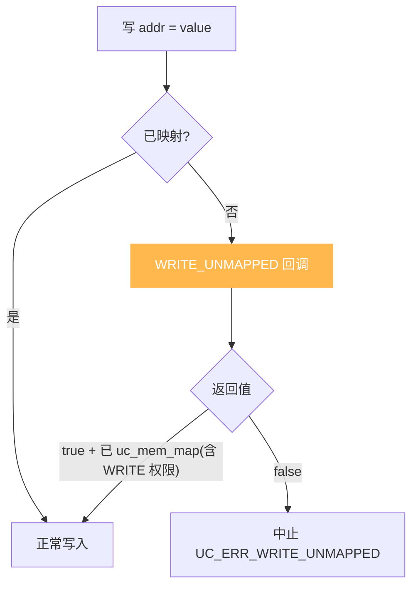
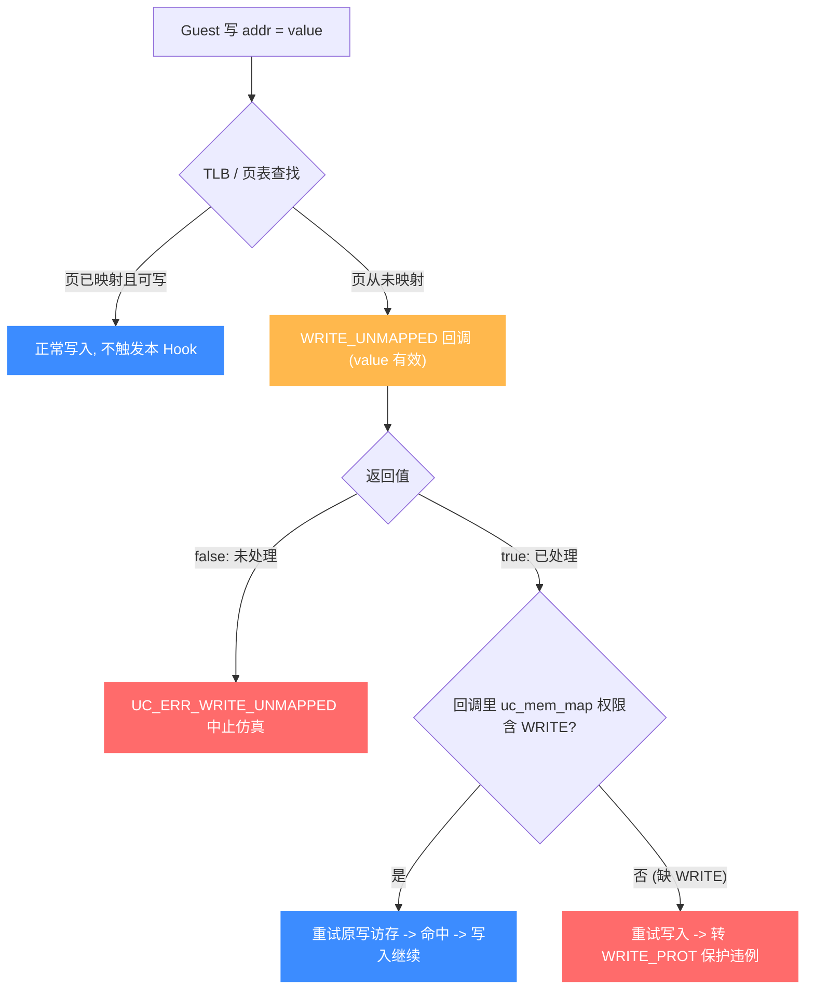

# UC_HOOK_MEM_WRITE_UNMAPPED — 写未映射内存 Hook

本页讲清 `UC_HOOK_MEM_WRITE_UNMAPPED` 在代码写入**未映射**地址时如何触发，回调返回的 `bool` 如何决定"补映射后继续写"还是"中止"。读完你能实现写触发的按需分页。

## 🪝 触发时机

当被仿真代码试图**向一处没有内存映射的地址写入**时触发。默认以 `UC_ERR_WRITE_UNMAPPED` 中止；注册本 Hook 后可在回调里补映射并继续。与读未映射不同的是：这里 `value` 是**即将写入的值**，你可据此决定如何映射。



## 📥 回调原型

```c
/*
  @type: UC_MEM_WRITE_UNMAPPED
  @value: 即将写入的值（有效）
  @return: true=继续（须已映射且含写权限），false=中止
*/
typedef bool (*uc_cb_eventmem_t)(uc_engine *uc, uc_mem_type type,
                                 uint64_t address, int size, int64_t value,
                                 void *user_data);
```

> 📄 宏：[`unicorn.h`](https://github.com/android-security-engineer/unicorn-skills/blob/master/include/unicorn/unicorn.h#L375)（`UC_HOOK_MEM_WRITE_UNMAPPED`）· 注册：[`uc.c`](https://github.com/android-security-engineer/unicorn-skills/blob/master/uc.c#L1908)（`uc_hook_add`）

| 参数 | 含义 |
|------|------|
| `type` | `UC_MEM_WRITE_UNMAPPED` |
| `address` | 被写的未映射地址 |
| `size` | 写入字节数 |
| `value` | **即将写入的值（有效）** |

## 📤 返回值语义（bool）

| 返回 | 含义 |
|------|------|
| `true` | 已处理。**必须先 `uc_mem_map` 映射该页且带 `UC_PROT_WRITE` 权限**，随后写入照常完成。 |
| `false` | 未处理，以 `UC_ERR_WRITE_UNMAPPED` 中止。 |

::: warning 注意：权限要含写
补映射时权限须包含 `UC_PROT_WRITE`（如 `UC_PROT_READ | UC_PROT_WRITE`），否则接下来的写入会转成保护违例。
:::

## 🔧 begin/end 适用

支持区间限定：仅当未映射写地址落于 `[begin, end]` 触发。

```c
static bool on_write_unmapped(uc_engine *uc, uc_mem_type type, uint64_t addr,
                              int size, int64_t value, void *ud) {
    uint64_t page = addr & ~0xfffULL;
    printf("map-on-write @0x%" PRIx64 " val=0x%" PRIx64 "\n",
           addr, (uint64_t)value);
    if (uc_mem_map(uc, page, 0x1000, UC_PROT_READ | UC_PROT_WRITE) != UC_ERR_OK)
        return false;
    return true;   // 已映射（可写），写入继续
}

uc_hook h;
uc_hook_add(uc, &h, UC_HOOK_MEM_WRITE_UNMAPPED, on_write_unmapped, NULL, 1, 0);
```

## 🎯 典型用途

- **写触发的按需分页**：栈/堆增长时惰性映射。
- **越界写诊断**：抓非法写的来源与目标。
- **稀疏内存**：巨大地址空间只在被写到时才分配。

## ⚡ 性能代价

只在写未映射地址时触发，正常路径零开销。可与读、取指的未映射变体合并为 [UC_HOOK_MEM_UNMAPPED](/hooks/mem-unmapped)。

## 📊 未映射访问的判定与处理流程

下图展开一次写未映射访问的完整路径：写指令经 TLB 查找发现目标页**从未被映射** → 触发 `WRITE_UNMAPPED` 回调（此时 `value` 是即将写入的值，可据此决定如何映射）。返回 `false` → `UC_ERR_WRITE_UNMAPPED` 中止；返回 `true` → 要求回调里已 `uc_mem_map` 且**含 `UC_PROT_WRITE`**，引擎重试原写访存并命中。若补映射时漏掉写权限，重试的写入会转成保护违例（`WRITE_PROT`）。



::: warning 别忘了写权限
`true` 分支的隐性要求：补映射的权限**必须包含 `UC_PROT_WRITE`**（如 `UC_PROT_READ | UC_PROT_WRITE`）。否则重试的写入会落进 [WRITE_PROT](/hooks/mem-write-prot) 而非完成——这是写未映射与读未映射最大的语义差别。
:::

## 📂 相关源码

| 文件 | 角色 |
|------|------|
| [`include/unicorn/unicorn.h`](https://github.com/android-security-engineer/unicorn-skills/blob/master/include/unicorn/unicorn.h#L375) | `UC_HOOK_MEM_WRITE_UNMAPPED` 宏定义 |
| [`include/unicorn/unicorn.h`](https://github.com/android-security-engineer/unicorn-skills/blob/master/include/unicorn/unicorn.h#L479) | `uc_cb_eventmem_t` 回调 typedef |
| [`uc.c`](https://github.com/android-security-engineer/unicorn-skills/blob/master/uc.c#L1908) | `uc_hook_add` 注册实现 |

## 相关页面

- [UC_HOOK_MEM_READ_UNMAPPED — 读未映射](/hooks/mem-read-unmapped)
- [UC_HOOK_MEM_UNMAPPED — 三种未映射合集](/hooks/mem-unmapped)
- [uc_hook_add — 注册 Hook](/api/hook-add)
- [Hook 类型总览](/hooks/)
