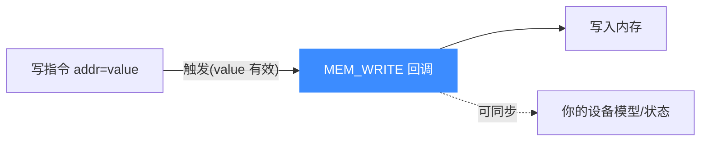
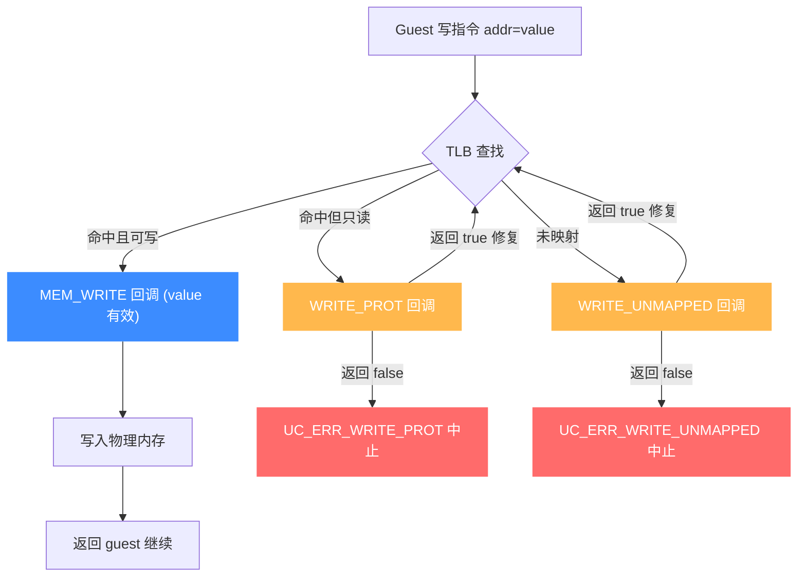
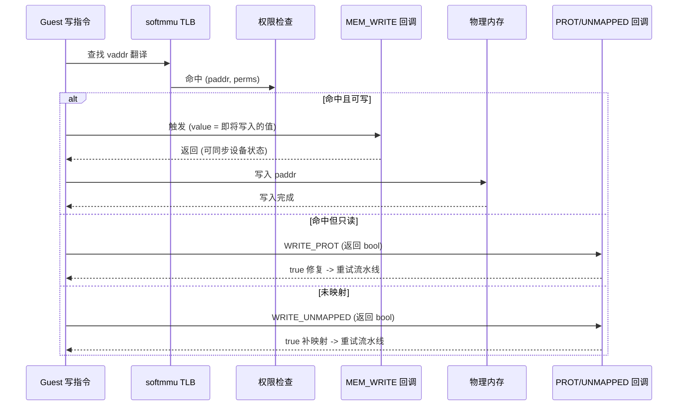

# UC_HOOK_MEM_WRITE — 内存写 Hook

本页讲清 `UC_HOOK_MEM_WRITE` 在代码写入（已映射）内存时的触发时机、精确回调签名，以及为何写 Hook 的 `value` 就是被写入的值。读完你能实现写 watchpoint 与设备状态同步。

## 🪝 触发时机

当被仿真代码**向一处已映射内存写入**时触发。与读不同，写 Hook 的 `value` 参数**就是即将/正在写入的值**，是有意义的。



::: warning 注意
用 `uc_mem_read` / `uc_mem_write` 等宿主 API 直接访问内存**不会**触发本 Hook。只有被仿真代码执行写指令时才触发。
:::

## 📥 回调原型

```c
/*
  @type: 访问类型（此处为 UC_MEM_WRITE）
  @address: 被写入的地址
  @size: 本次写入的字节数
  @value: 被写入的值（有效）
*/
typedef void (*uc_cb_hookmem_t)(uc_engine *uc, uc_mem_type type,
                                uint64_t address, int size, int64_t value,
                                void *user_data);
```

> 📄 宏：[`unicorn.h`](https://github.com/android-security-engineer/unicorn-skills/blob/master/include/unicorn/unicorn.h#L387)（`UC_HOOK_MEM_WRITE`）· 注册：[`uc.c`](https://github.com/android-security-engineer/unicorn-skills/blob/master/uc.c#L1908)（`uc_hook_add`）

| 参数 | 类型 | 含义 |
|------|------|------|
| `type` | `uc_mem_type` | `UC_MEM_WRITE` |
| `address` | `uint64_t` | 被写地址 |
| `size` | `int` | 写入字节数 |
| `value` | `int64_t` | **被写入的值（有效）** |
| `user_data` | `void *` | 用户数据 |

## 📤 返回值语义

返回 `void`。要中止仿真调 `uc_emu_stop`。注意本 Hook 在写入语义发生的时机被调用，你据 `value` 观测/同步即可。

## 🔧 begin/end 适用

支持区间限定：仅当被写地址落于 `[begin, end]` 时触发。

```c
static void on_write(uc_engine *uc, uc_mem_type type, uint64_t addr,
                     int size, int64_t value, void *ud) {
    printf("[write] addr=0x%" PRIx64 " size=%d value=0x%" PRIx64 "\n",
           addr, size, (uint64_t)value);
    // MMIO：把写到设备寄存器的值同步进我们的设备模型
    if (addr == 0x40000004) device_control_register = (uint32_t)value;
}

uc_hook h;
uc_hook_add(uc, &h, UC_HOOK_MEM_WRITE, on_write, NULL, 1, 0);
```

## 🎯 典型用途

- **写 watchpoint**：监控某地址被写，抓改动来源。
- **MMIO 仿真**：把写到设备寄存器的值同步到你的设备状态机。
- **完整性/篡改检测**：监控只读逻辑区域被意外写入。

## ⚡ 性能代价

按访存触发，写密集代码会大量触发；用 `begin/end` 收窄。可与 `UC_HOOK_MEM_READ` 用 `|` 合并注册（同为 `uc_cb_hookmem_t`）。

::: tip 读写配对
MMIO 设备常同时需要读、写两侧：读侧提供寄存器值（[MEM_READ](/hooks/mem-read)），写侧更新设备状态（本页）。
:::

## 📊 写访存决策流程

下图展示一次 guest 写指令在 softmmu 中的决策路径：先查 TLB，命中且页表权限允许写 → 触发 `MEM_WRITE`（`value` 即将写入的值有效）→ 真正写入；若页不可写或未映射，则走 `WRITE_PROT` / `WRITE_UNMAPPED`（属于 [UC_HOOK_MEM_INVALID](/hooks/mem-invalid) 家族，由 `uc_cb_eventmem_t` 处理）。



::: warning 合法写 vs 非法写
`MEM_WRITE` 只在**合法写**（已映射且可写）时触发；一旦命中只读页或未映射，路径切到 `WRITE_PROT` / `WRITE_UNMAPPED`，回调类型也从 `uc_cb_hookmem_t` 换成 `uc_cb_eventmem_t`（返回 `bool` 决定是否修复继续）。
:::

## 📊 写访存流水线时序

下图把一次 guest 写指令放进 softmmu 访存流水线的时间线上看：写指令 → TLB 查找 → 权限检查。三条分支在权限检查处分叉：**命中且可写** → `MEM_WRITE` 回调（`value` 有效，读前/读后无所谓，写就是即将写入的值）→ 真正写入；**命中但只读** → `WRITE_PROT` 回调（`uc_cb_eventmem_t`，返回 `bool`）；**未映射** → `WRITE_UNMAPPED` 回调。后两者若返回 `true` 修复，则重试整个流水线。



::: tip 三条分支的分叉点
写访存的分叉点在**权限检查**：页在且可写走 `MEM_WRITE`（`uc_cb_hookmem_t`，无返回值）；页在但只读走 `WRITE_PROT`；页不在走 `WRITE_UNMAPPED`（后两者是 `uc_cb_eventmem_t`，返回 `bool` 决定是否重试）。`value` 在三条分支里都有效——它是"想写的值"。
:::

## 📂 相关源码

| 文件 | 角色 |
|------|------|
| [`include/unicorn/unicorn.h`](https://github.com/android-security-engineer/unicorn-skills/blob/master/include/unicorn/unicorn.h#L387) | `UC_HOOK_MEM_WRITE` 宏定义 |
| [`include/unicorn/unicorn.h`](https://github.com/android-security-engineer/unicorn-skills/blob/master/include/unicorn/unicorn.h#L447) | `uc_cb_hookmem_t` 回调 typedef |
| [`uc.c`](https://github.com/android-security-engineer/unicorn-skills/blob/master/uc.c#L1908) | `uc_hook_add` 注册实现 |

## 相关页面

- [UC_HOOK_MEM_READ — 内存读](/hooks/mem-read)
- [UC_HOOK_MEM_WRITE_UNMAPPED — 写未映射](/hooks/mem-write-unmapped)
- [uc_hook_add — 注册 Hook](/api/hook-add)
- [Hook 类型总览](/hooks/)
