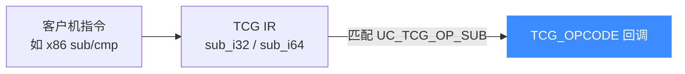
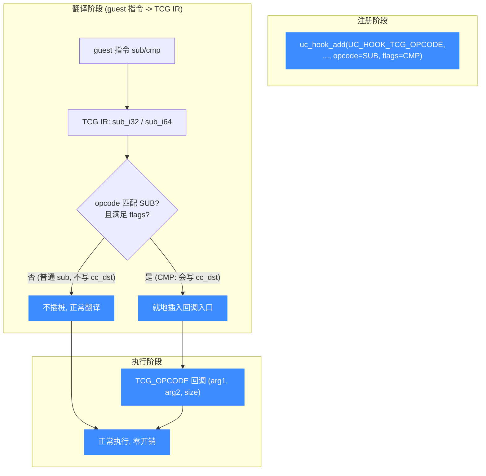

# UC_HOOK_TCG_OPCODE — TCG 操作码 Hook

本页讲清 `UC_HOOK_TCG_OPCODE` 如何在 QEMU/TCG 中间表示（IR）层面对**特定操作码**插桩，回调如何拿到操作数。读完你能在比指令更底层的粒度做分析，例如统计 `SUB`/比较操作。

## 🪝 触发时机

`UC_HOOK_TCG_OPCODE` 让你 Hook 一个**特定的 TCG 操作码**（TCG 是 Unicorn 底层 QEMU 的可移植中间表示）。用法类似 [UC_HOOK_INSN](/hooks/insn)：注册时通过变长参数传入 `opcode` 与 `flags`。当被翻译的代码里出现该操作码时，回调在执行到它时被调用。



## 📥 回调原型

```c
/*
  @address: 当前 PC
  @arg1: 第一个操作数
  @arg2: 第二个操作数
  @size: 数据宽度
*/
typedef void (*uc_hook_tcg_op_2)(uc_engine *uc, uint64_t address,
                                 uint64_t arg1, uint64_t arg2,
                                 uint32_t size, void *user_data);
```

> 📄 宏：[`unicorn.h`](https://github.com/android-security-engineer/unicorn-skills/blob/master/include/unicorn/unicorn.h#L403)（`UC_HOOK_TCG_OPCODE`）· 回调：[`unicorn.h`](https://github.com/android-security-engineer/unicorn-skills/blob/master/include/unicorn/unicorn.h#L316)（`uc_hook_tcg_op_2`）· 注册：[`uc.c`](https://github.com/android-security-engineer/unicorn-skills/blob/master/uc.c#L1908)（`uc_hook_add`）

支持的操作码与配对标志：

```c
typedef enum uc_tcg_op_code {
    UC_TCG_OP_SUB = 0,   // 同时覆盖 sub_i32 与 sub_i64
} uc_tcg_op_code;

typedef enum uc_tcg_op_flag {
    UC_TCG_OP_FLAG_CMP = 1 << 0,    // 仅当会写 cc_dst 时插桩，即 cmp 指令
    UC_TCG_OP_FLAG_DIRECT = 1 << 1, // 仅当由客户机指令直接翻译而来时插桩
} uc_tcg_op_flag;
```

| 参数 | 含义 |
|------|------|
| `address` | 产生该操作码的指令 PC |
| `arg1` / `arg2` | 操作码的两个输入操作数值 |
| `size` | 操作宽度（如 32 / 64 位） |

## 📤 返回值语义

返回 `void`，纯观测。要中止调 `uc_emu_stop`。

## 🔧 begin/end 适用与注册

支持区间限定。注册时**第 8、9 个变长参数**分别是 `opcode` 和 `flags`：

```c
static void on_sub(uc_engine *uc, uint64_t pc, uint64_t a, uint64_t b,
                   uint32_t size, void *ud) {
    uint64_t *cnt = (uint64_t *)ud;
    (*cnt)++;
    // a - b 即将发生；配合 CMP flag 时这是一次比较
    printf("SUB @0x%" PRIx64 ": %" PRIu64 " - %" PRIu64 "\n", pc, a, b);
}

uint64_t sub_count = 0;
uc_hook h;
// 统计所有 SUB；若只关心比较，把 flags 换成 UC_TCG_OP_FLAG_CMP
uc_hook_add(uc, &h, UC_HOOK_TCG_OPCODE, on_sub, &sub_count, 1, 0,
            UC_TCG_OP_SUB, 0);
```

::: tip CMP 与 CALL
用 `UC_TCG_OP_FLAG_CMP` 可只在**比较**（会设置条件标志的 `sub`）时触发，非常适合追踪分支条件——这是符号执行/污点分析里定位比较点的常用手段。头文件注释还提到未来计划支持追踪 `UC_TCG_OP_CALL`（调用计数）。
:::

## 🎯 典型用途

- **算术/比较计数**：统计 `SUB`、比较操作的次数与操作数分布。
- **约束提取**：结合 `CMP` flag 捕获每次比较的两个操作数，供符号求解。
- **底层剖析**：观察某指令展开成哪些 IR 操作。

## ⚡ 性能代价

::: danger 危险：可能比 CODE 更慢
头文件明确警告：**在没有恰当 flags 收窄的情况下，TCG 操作码 Hook 带来的开销可能远大于 [UC_HOOK_CODE](/hooks/code)**。务必用 `flags`（如 `CMP`/`DIRECT`）和 `begin/end` 尽量收窄触发面。
:::

## 📊 触发流程：注册 → 翻译期插桩 → 执行期命中

下图把 `UC_HOOK_TCG_OPCODE` 的两阶段触发讲清。注册时传入 `opcode`（如 `UC_TCG_OP_SUB`）与 `flags`（`CMP`/`DIRECT`）。**翻译阶段**：guest 指令被翻成 TCG IR，引擎识别出匹配的操作码且满足 flags 约束时，就地插入回调入口（不满足 flags 的同操作码不插桩）。**执行阶段**：运行到插桩点才进回调，拿到 `arg1/arg2/size`。`flags` 在翻译期就过滤掉了大量不感兴趣的实例——这是收窄开销的关键。



::: tip flags 在翻译期就过滤
`UC_TCG_OP_FLAG_CMP` 让回调只在"会写 `cc_dst` 的 sub"（即 `cmp` 指令）时插桩，普通 `sub` 不插；`UC_TCG_OP_FLAG_DIRECT` 只插"由 guest 指令直接翻译而来"的操作码，跳过内部生成的中间计算。这些过滤发生在**翻译期**，运行期根本不会进不感兴趣的回调——这就是 flags 能把开销压下来的原因。
:::

## 📂 相关源码

| 文件 | 角色 |
|------|------|
| [`include/unicorn/unicorn.h`](https://github.com/android-security-engineer/unicorn-skills/blob/master/include/unicorn/unicorn.h#L403) | `UC_HOOK_TCG_OPCODE` 宏定义 |
| [`include/unicorn/unicorn.h`](https://github.com/android-security-engineer/unicorn-skills/blob/master/include/unicorn/unicorn.h#L316) | `uc_hook_tcg_op_2` 回调 typedef |
| [`uc.c`](https://github.com/android-security-engineer/unicorn-skills/blob/master/uc.c#L1908) | `uc_hook_add` 注册实现 |

## 相关页面

- [TCG 翻译管线](/internals/tcg-pipeline)
- [UC_HOOK_CODE — 每条指令](/hooks/code)
- [uc_hook_add — 注册 Hook](/api/hook-add)
- [Hook 类型总览](/hooks/)
