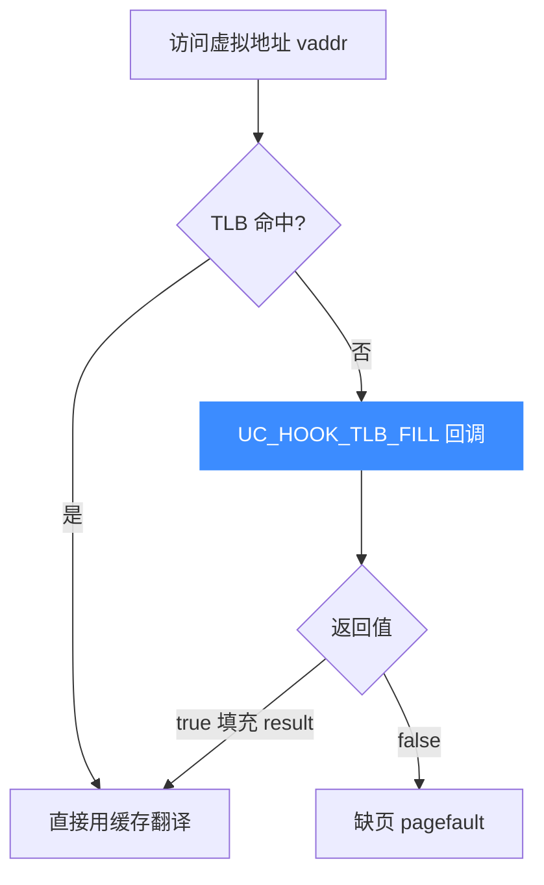
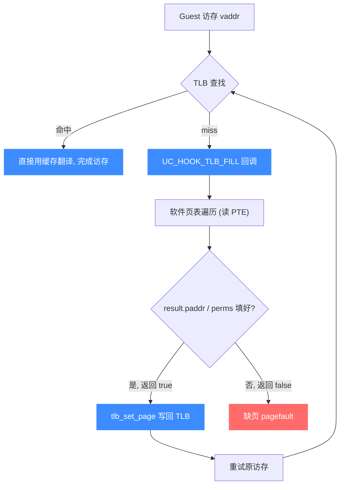
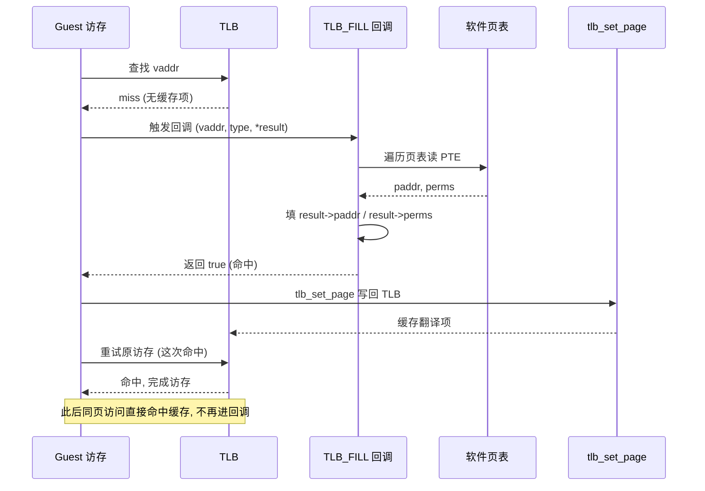

# UC_HOOK_TLB_FILL — TLB 填充 Hook

本页讲清 `UC_HOOK_TLB_FILL` 如何接管虚拟地址到物理地址的翻译，回调如何填充 `uc_tlb_entry` 并用 `bool` 返回值表示命中或缺页。读完你能实现自定义 MMU/分页策略。

## 🪝 触发时机

在 `UC_TLB_VIRTUAL` 模式下，当 TLB 缓存中**没有**某个虚拟地址的翻译项时触发。回调负责给出该虚拟地址对应的物理地址与权限；若无回调或回调都不返回命中，则产生缺页（pagefault）。



## 📥 回调原型

```c
typedef enum uc_prot {
    UC_PROT_NONE = 0, UC_PROT_READ = 1, UC_PROT_WRITE = 2,
    UC_PROT_EXEC = 4, UC_PROT_ALL = 7,
} uc_prot;

struct uc_tlb_entry {
    uint64_t paddr;   // 翻译得到的物理地址
    uc_prot  perms;   // 该项允许的访问权限
};
typedef struct uc_tlb_entry uc_tlb_entry;

/*
  @vaddr: 待翻译的虚拟地址
  @type:  访问模式（读/写/取指）
  @result: 输出项，填 paddr 与 perms
  @return: 找到返回 true；若有回调但无人返回 true 则触发缺页
*/
typedef bool (*uc_cb_tlbevent_t)(uc_engine *uc, uint64_t vaddr,
                                 uc_mem_type type, uc_tlb_entry *result,
                                 void *user_data);
```

> 📄 宏：[`unicorn.h`](https://github.com/android-security-engineer/unicorn-skills/blob/master/include/unicorn/unicorn.h#L407)（`UC_HOOK_TLB_FILL`）· 回调：[`unicorn.h`](https://github.com/android-security-engineer/unicorn-skills/blob/master/include/unicorn/unicorn.h#L289)（`uc_cb_tlbevent_t`）· 注册：[`uc.c`](https://github.com/android-security-engineer/unicorn-skills/blob/master/uc.c#L1908)（`uc_hook_add`）

| 参数 | 含义 |
|------|------|
| `vaddr` | 需要翻译的客户机虚拟地址 |
| `type` | 本次访问类型：`UC_MEM_READ` / `UC_MEM_WRITE` / `UC_MEM_FETCH` |
| `result` | **输出参数**：填入 `paddr`（物理地址）与 `perms`（权限） |

## 📤 返回值语义（bool）

| 返回 | 含义 |
|------|------|
| `true` | 翻译成功，`*result` 已填好 `paddr`/`perms`，引擎用之继续。 |
| `false` | 未能翻译；若没有任何回调返回 `true`，则产生缺页。 |

::: warning 注意：先切到 UC_TLB_VIRTUAL
本 Hook 仅在虚拟 TLB 模式下有意义。注册前需 `uc_ctl_tlb_mode(uc, UC_TLB_VIRTUAL)` 切换 TLB 实现；默认的 `UC_TLB_CPU` 模式不使用此回调。
:::

## 🔧 begin/end 适用

按虚拟地址落于 `[begin, end]` 匹配触发，可只接管部分地址范围的翻译。

```c
static bool on_tlb(uc_engine *uc, uint64_t vaddr, uc_mem_type type,
                   uc_tlb_entry *result, void *ud) {
    // 简单恒等映射：vaddr -> paddr，全权限
    result->paddr = vaddr & ~0xfffULL;   // 页对齐物理地址
    result->perms = UC_PROT_ALL;
    return true;                          // 命中
}

uc_ctl_tlb_mode(uc, UC_TLB_VIRTUAL);
uc_hook h;
uc_hook_add(uc, &h, UC_HOOK_TLB_FILL, on_tlb, NULL, 1, 0);
```

## 🎯 典型用途

- **自定义分页**：实现自己的页表遍历逻辑（如从客户机页表读 PTE）。
- **地址空间隔离 / 影子内存**：把不同虚拟区间映射到不同物理后端。
- **权限精细控制**：按访问类型返回不同 `perms`，实现细粒度保护。

## ⚡ 性能代价

仅在 TLB 未命中时触发；命中项被缓存后不再回调，稳态开销低。回调体应尽量精简，因为冷启动阶段可能被密集调用。

## 📊 TLB miss 填充流程

下图聚焦 miss 路径：guest 访存 → TLB 查找 **miss** → 触发 `TLB_FILL` 回调 → 回调内做软件页表遍历得到物理地址与权限 → 调用 `tlb_set_page` 把翻译写回 TLB → 重试原访存，这次命中。此后对该页的访问直接走 TLB 缓存，不再进回调。



::: tip 命中后被缓存
`TLB_FILL` 只在 miss 时触发一次；`tlb_set_page` 把翻译写回后，同一页的后续访问直接命中缓存，回调不再被调用——这就是稳态零开销的来源。
:::

## 📊 TLB miss → tlb_fill → 回调时序

下图以时序视角展示一次 TLB miss 的完整往返：guest 访存 → TLB 查找 miss → 触发 `TLB_FILL` 回调（拿到 `vaddr` 与访问 `type`）→ 回调内做软件页表遍历得到 `paddr`/`perms`，填入 `result` 并返回 `true` → 引擎 `tlb_set_page` 把翻译写回 TLB → **重试原访存**，这次命中，访存完成。此后同页访问直接走缓存，不再进回调。若回调返回 `false`（无人能翻译），则产生缺页。



::: tip miss → fill → set → retry 的往返
`TLB_FILL` 的精髓是"miss 一次，换来之后整页的命中"：回调把翻译结果交给引擎，引擎 `tlb_set_page` 写回 TLB 后**自动重试**原访存——你不需要自己完成那次访存，只需给出翻译。返回 `false` 则表示你也翻译不了，引擎只能缺页。
:::

## 📂 相关源码

| 文件 | 角色 |
|------|------|
| [`include/unicorn/unicorn.h`](https://github.com/android-security-engineer/unicorn-skills/blob/master/include/unicorn/unicorn.h#L407) | `UC_HOOK_TLB_FILL` 宏定义 |
| [`include/unicorn/unicorn.h`](https://github.com/android-security-engineer/unicorn-skills/blob/master/include/unicorn/unicorn.h#L289) | `uc_cb_tlbevent_t` 回调 typedef |
| [`uc.c`](https://github.com/android-security-engineer/unicorn-skills/blob/master/uc.c#L1908) | `uc_hook_add` 注册实现 |

## 相关页面

- [MMU 与虚拟内存](/features/mmu)
- [TLB 模式（CPU / VIRTUAL）](/features/tlb-modes)
- [uc_hook_add — 注册 Hook](/api/hook-add)
- [Hook 类型总览](/hooks/)
