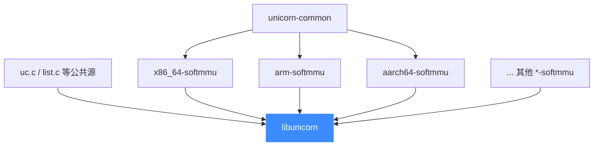

# CMake 构建系统

> 🔧 Unicorn 的主构建系统是 CMake。本页讲 `UNICORN_ARCH` 如何按架构裁剪编译、每个架构如何被编成独立的 `*-softmmu` 静态库再链进单个 `libunicorn`、以及几个关键 CMake 选项。基于仓库根 [`CMakeLists.txt`](https://github.com/android-security-engineer/unicorn-skills/blob/master/CMakeLists.txt)。

## 🎯 UNICORN_ARCH：按架构裁剪

顶层 [`CMakeLists.txt`](https://github.com/android-security-engineer/unicorn-skills/blob/master/CMakeLists.txt#L89) 用一个列表变量决定构建哪些架构，默认全开（[L89](https://github.com/android-security-engineer/unicorn-skills/blob/master/CMakeLists.txt#L89)）：

```cmake
# CMakeLists.txt
set(UNICORN_ARCH "x86;arm;aarch64;riscv;mips;sparc;m68k;ppc;s390x;tricore"
    CACHE STRING "Enabled unicorn architectures")

foreach(ARCH_LOOP ${UNICORN_ARCH})
    string(TOUPPER "${ARCH_LOOP}" ARCH_LOOP)
    set(UNICORN_HAS_${ARCH_LOOP} TRUE)    # 生成 UNICORN_HAS_X86 等
endforeach()
```

每个架构名会派生出 `UNICORN_HAS_<ARCH>` 变量，再转成编译宏 `-DUNICORN_HAS_X86` 等——这正是 [uc.c 分发层](/internals/uc-dispatch) 里 `#ifdef UNICORN_HAS_*` 判定某 `case` 是否存在的来源。

::: tip 只编一个架构可大幅提速
调试单架构时把它裁到最小，例如 `cmake .. -DUNICORN_ARCH="x86"`，可显著缩短编译时间。
:::

## 🧱 每架构一个独立目标

每种架构（含 MIPS 的四个端序/位宽变体）被编成一个独立的 `*-softmmu` **静态库**，带自己的 target 定义与头文件强制包含（[`x86_64-softmmu`](https://github.com/android-security-engineer/unicorn-skills/blob/master/CMakeLists.txt#L523) 目标在 [L523](https://github.com/android-security-engineer/unicorn-skills/blob/master/CMakeLists.txt#L523)）：

```cmake
# CMakeLists.txt: x86 后端目标（节选）
add_library(x86_64-softmmu STATIC
    qemu/target/i386/translate.c
    qemu/target/i386/unicorn.c
    ...)
target_compile_options(x86_64-softmmu PRIVATE
    -DNEED_CPU_H
    -include x86_64.h                        # 强制包含该架构配置头
    -I${CMAKE_CURRENT_SOURCE_DIR}/qemu/target/i386)
target_link_libraries(x86_64-softmmu PRIVATE unicorn-common)
```

然后按 `UNICORN_HAS_*` 把这些库拼进最终链接列表：

```cmake
if(UNICORN_HAS_X86)
    set(UNICORN_LINK_LIBRARIES ${UNICORN_LINK_LIBRARIES} x86_64-softmmu)
endif()
if(UNICORN_HAS_MIPS)
    # 一个 MIPS 开关拉进四个变体
    set(UNICORN_LINK_LIBRARIES ${UNICORN_LINK_LIBRARIES}
        mips-softmmu mipsel-softmmu mips64-softmmu mips64el-softmmu)
endif()
```



`unicorn-common` 是各架构共享的公共静态库（含内存、TCG 公共代码），每个 `*-softmmu` 都 `PRIVATE` 链接它；`add_library(unicorn ${UNICORN_SRCS})` 再把所有 `*-softmmu` + 公共源合成对外的 `libunicorn`。

## 🔧 关键 CMake 选项

| 选项 | 默认 | 作用 |
| --- | --- | --- |
| `UNICORN_ARCH` | 全部十架构 | 启用哪些架构（分号分隔列表） |
| `BUILD_SHARED_LIBS` | 顶层项目时 ON | 编共享库还是静态库；作为子目录默认静态 |
| `UNICORN_BUILD_TESTS` | 顶层项目时 ON | 编单元测试与 samples |
| `UNICORN_INSTALL` | 顶层项目时 ON | 是否安装 |
| `UNICORN_LEGACY_STATIC_ARCHIVE` | 顶层项目时 ON | v1 风格 all-in-one `libunicorn.a` |
| `UNICORN_FUZZ` | OFF | 编 OSS-Fuzz 驱动 |
| `UNICORN_LOGGING` | OFF | 启用 QEMU 日志设施 |
| `UNICORN_TRACER` | OFF | 追踪执行（`-DUNICORN_TRACER`） |

::: warning 符号存在性由裁剪决定
没被编进来的架构，其 `uc_init_<arch>` 符号与 `case UC_ARCH_*` 都不存在，`uc_open()` 会返回 `UC_ERR_ARCH`。所以 `UNICORN_ARCH` 同时决定「编译时间」和「运行时支持哪些架构」。
:::

## 📂 相关源码

| 文件 | 角色 |
|------|------|
| [`CMakeLists.txt`](https://github.com/android-security-engineer/unicorn-skills/blob/master/CMakeLists.txt) | 顶层构建定义：`UNICORN_ARCH` 裁剪、各 `*-softmmu` 目标、关键选项 |
| [`uc.c`](https://github.com/android-security-engineer/unicorn-skills/blob/master/uc.c) | `uc_open` 的 `#ifdef UNICORN_HAS_*` 分支，由 CMake 宏决定是否存在 |
| [`qemu/target/<arch>/unicorn.c`](https://github.com/android-security-engineer/unicorn-skills/blob/master/qemu/target/i386/unicorn.c) | 各架构 `uc_init_<arch>`，按 `UNICORN_HAS_*` 条件编译进对应 `*-softmmu` |
| [`include/unicorn/unicorn.h`](https://github.com/android-security-engineer/unicorn-skills/blob/master/include/unicorn/unicorn.h) | `UC_ARCH_*` / `UC_ERR_ARCH` 等公共枚举 |

## 相关页面

- [编译安装](/guide/compile)
- [uc.c 分发层](/internals/uc-dispatch)
- [内置 QEMU Fork](/internals/qemu-fork)
- [架构总览](/guide/architecture)
