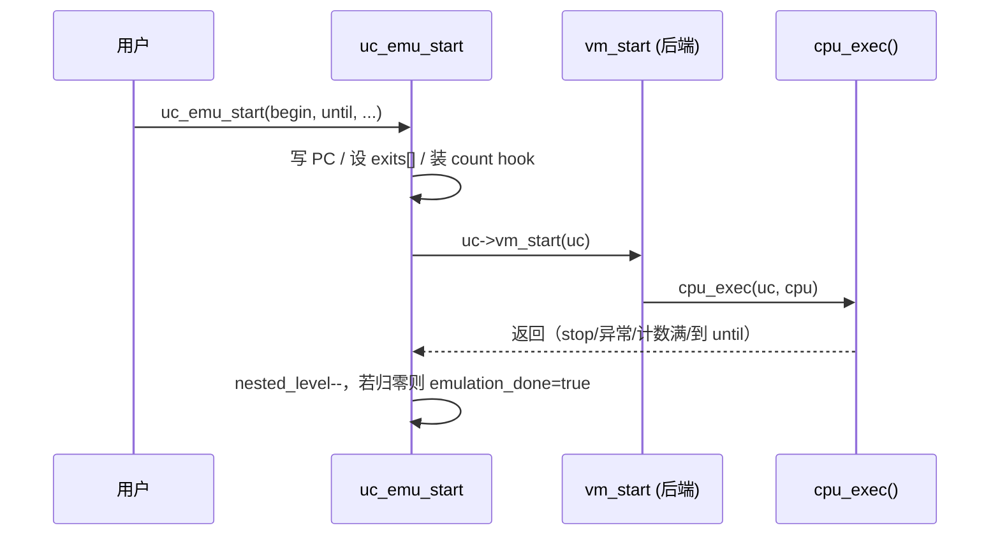
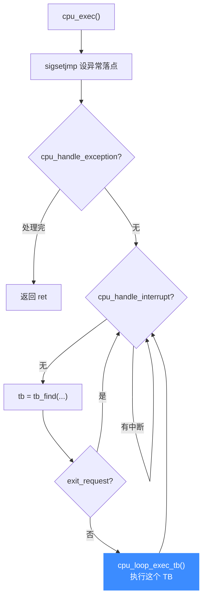

# cpu-exec.c 执行循环

> 🔁 [`qemu/accel/tcg/cpu-exec.c`](https://github.com/android-security-engineer/unicorn-skills/blob/master/qemu/accel/tcg/cpu-exec.c) 是 Unicorn 的主执行循环：不断「找 TB → 执行 TB → 处理跳转/异常/中断」。本页讲从 `uc_emu_start()` 到这个循环的路径，以及 Hook 如何嵌在循环里。

## 🛣️ 从 uc_emu_start 到主循环

[`uc_emu_start()`](https://github.com/android-security-engineer/unicorn-skills/blob/master/uc.c#L1076)（[uc.c:1076](https://github.com/android-security-engineer/unicorn-skills/blob/master/uc.c#L1076)）本身很薄：写好起始 PC、装好 count/exit hook，最后调 `uc->vm_start(uc)`（[uc.c:1228](https://github.com/android-security-engineer/unicorn-skills/blob/master/uc.c#L1228)），由它进入 QEMU 的 [`cpu_exec()`](https://github.com/android-security-engineer/unicorn-skills/blob/master/qemu/accel/tcg/cpu-exec.c#L553)（[cpu-exec.c:553](https://github.com/android-security-engineer/unicorn-skills/blob/master/qemu/accel/tcg/cpu-exec.c#L553)）。



`uc_emu_start` 通过 `uc->exits[uc->nested_level - 1] = until`（[uc.c:1221](https://github.com/android-security-engineer/unicorn-skills/blob/master/uc.c#L1221)）把停止地址交给循环；支持嵌套调用，故用 `nested_level` 索引 [`jmp_bufs[]`](https://github.com/android-security-engineer/unicorn-skills/blob/master/include/uc_priv.h#L417)（`UC_MAX_NESTED_LEVEL` 为 64，见 [uc_priv.h:17](https://github.com/android-security-engineer/unicorn-skills/blob/master/include/uc_priv.h#L17)）。

## 🔂 cpu_exec 的双层 while



真实骨架（[`cpu_exec`](https://github.com/android-security-engineer/unicorn-skills/blob/master/qemu/accel/tcg/cpu-exec.c#L553)，cpu-exec.c:553）：

```c
int cpu_exec(struct uc_struct *uc, CPUState *cpu) {
    if (sigsetjmp(uc->jmp_bufs[uc->nested_level - 1], 0) != 0) {
        assert_no_pages_locked();          // 异常/longjmp 回落点
    }
    while (!cpu_handle_exception(cpu, &ret)) {
        TranslationBlock *last_tb = NULL;
        int tb_exit = 0;
        while (!cpu_handle_interrupt(cpu, &last_tb)) {
            tb = tb_find(cpu, last_tb, tb_exit, cflags);
            if (unlikely(cpu->exit_request)) continue;
            cpu_loop_exec_tb(cpu, tb, &last_tb, &tb_exit);
        }
    }
    uc->cpu->tcg_exit_req = 0;
    return ret;
}
```

注意 `sigsetjmp` 用的是 `uc->jmp_bufs[uc->nested_level - 1]`——Unicorn 把 QEMU 原来的单个 `cpu->jmp_env` 换成按嵌套层级索引的数组，以支持在 Hook 里再次 `uc_emu_start`。

## 🪝 Hook 如何嵌入循环

[`tb_find()`](https://github.com/android-security-engineer/unicorn-skills/blob/master/qemu/accel/tcg/cpu-exec.c#L247)（[cpu-exec.c:247](https://github.com/android-security-engineer/unicorn-skills/blob/master/qemu/accel/tcg/cpu-exec.c#L247)）在**新翻译一个 TB 时**会触发边生成 Hook：把当前 TB 与上一个 TB 组成 `cur_tb` / `prev_tb`，遍历 `UC_HOOK_EDGE_GENERATED` 链表回调用户。

```c
// cpu-exec.c: tb_find()，仅在 tb == NULL 新翻译时
if (uc->last_tb) {
    UC_TB_COPY(&cur_tb, tb);
    UC_TB_COPY(&prev_tb, uc->last_tb);
    for (cur = uc->hook[UC_HOOK_EDGE_GENERATED_IDX].head; ...) {
        if (HOOK_BOUND_CHECK(hook, (uint64_t)tb->pc))
            ((uc_hook_edge_gen_t)hook->callback)(uc, &cur_tb, &prev_tb, ...);
    }
}
```

- **块/指令 Hook**（`UC_HOOK_BLOCK` / `UC_HOOK_CODE`）在翻译阶段被 emit 成 TCG 调用，执行 TB 时触发。
- **中断 Hook** 走 [`cpu_handle_interrupt`](https://github.com/android-security-engineer/unicorn-skills/blob/master/qemu/accel/tcg/cpu-exec.c#L433)（[L433](https://github.com/android-security-engineer/unicorn-skills/blob/master/qemu/accel/tcg/cpu-exec.c#L433)）一侧。
- **停止**：[`uc_emu_stop()`](https://github.com/android-security-engineer/unicorn-skills/blob/master/uc.c#L1257)（[uc.c:1257](https://github.com/android-security-engineer/unicorn-skills/blob/master/uc.c#L1257)）置 `stop_request` 并经 `break_translation_loop` 打断当前 TB，使 `exit_request` 生效、跳出内层 while。

::: tip 计数与 until
`count` 通过一个插在链表最前的 `count_hook`（`UC_HOOK_CODE`）实现逐指令计数；`until` 地址通过 [`uc_addr_is_exit()`](https://github.com/android-security-engineer/unicorn-skills/blob/master/include/uc_priv.h#L459)（[uc_priv.h:459](https://github.com/android-security-engineer/unicorn-skills/blob/master/include/uc_priv.h#L459)）检查 `exits[]` / `ctl_exits`。
:::

## 📂 相关源码

| 文件 | 角色 |
|------|------|
| [`qemu/accel/tcg/cpu-exec.c`](https://github.com/android-security-engineer/unicorn-skills/blob/master/qemu/accel/tcg/cpu-exec.c) | `cpu_exec` 主循环、`tb_find`、`cpu_handle_exception/interrupt` |
| [`uc.c`](https://github.com/android-security-engineer/unicorn-skills/blob/master/uc.c) | `uc_emu_start` / `uc_emu_stop`，写 `exits[]`、调 `vm_start` |
| [`include/uc_priv.h`](https://github.com/android-security-engineer/unicorn-skills/blob/master/include/uc_priv.h) | `jmp_bufs[]` / `nested_level` / `exits[]` / `uc_addr_is_exit` |
| [`qemu/accel/tcg/translate-all.c`](https://github.com/android-security-engineer/unicorn-skills/blob/master/qemu/accel/tcg/translate-all.c) | `tb_gen_code` 真正翻译 TB（被 `tb_find` 触发） |

## 相关页面

- [uc_emu_start 启动模拟](/api/emu-start)
- [translate-all 翻译块](/internals/translate-all)
- [边生成 Hook](/hooks/edge-generated)
- [Hook 体系](/features/hooks)
