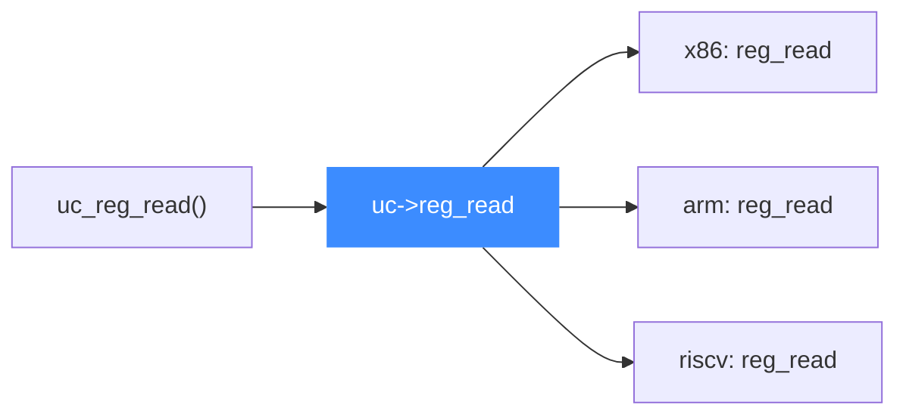

# 函数指针后端模型

> 🧩 本页讲 Unicorn 最核心的设计模式：把「架构相关」的一切都做成函数指针 typedef（[`include/uc_priv.h`](https://github.com/android-security-engineer/unicorn-skills/blob/master/include/uc_priv.h)），每个 target 后端在 `uc_init_<arch>` 时填充它们。于是架构中立的 API 得以在**热路径上零分支**地分发到具体后端。

## 🎯 为什么用函数指针而不是 switch

如果每次寄存器读写、每次访存、每次生成 TB 都要 `switch (uc->arch)`，热路径会布满分支且难以扩展。Unicorn 的做法是：`uc_struct` 里放一组函数指针，[`uc_open()`](https://github.com/android-security-engineer/unicorn-skills/blob/master/uc.c#L310) 选定后端后由后端一次性赋值，之后 API 只做「取指针、调用」。新增架构 = 新增一个 `uc_init_<arch>` 填表，无需改动任何 API 实现。



## 📇 核心 typedef 一览

这些 typedef 全部定义在 [`include/uc_priv.h`](https://github.com/android-security-engineer/unicorn-skills/blob/master/include/uc_priv.h)，是「后端契约」：

| 字段（uc_struct） | typedef | 用途 |
| --- | --- | --- |
| `reg_read` | `reg_read_t` | 读寄存器：`(env, mode, regid, value, *size)` |
| `reg_write` | `reg_write_t` | 写寄存器：多一个 `int *setpc` 输出，指示是否改了 PC |
| `reg_reset` | `reg_reset_t` | 复位寄存器组 |
| `memory_map` | `uc_args_uc_ram_size_t` | 映射一段 RAM，返回 `MemoryRegion*` |
| `memory_map_ptr` | `uc_args_uc_ram_size_ptr_t` | 映射到用户提供的宿主指针 |
| `memory_map_io` | `uc_memory_map_io_t` | 映射 MMIO 区并绑定读写回调 |
| `memory_unmap` | `uc_mem_unmap_t` | 解除映射 |
| `memory_cow` | `uc_mem_cow_t` | 写时复制（快照用） |
| `read_mem` / `write_mem` | `uc_read_mem_t` / `uc_write_mem_t` | 物理地址空间访存 |
| `read_mem_virtual` | `uc_read_mem_virtual_t` | 按虚拟地址访存 |
| `virtual_to_physical` | `uc_virtual_to_physical_t` | 地址翻译查询 |
| `uc_gen_tb` | `uc_gen_tb_t` | 在给定 PC 生成翻译块，输出 `uc_tb` |
| `uc_invalidate_tb` | `uc_invalidate_tb_t` | 失效某地址范围的 TB |
| `tb_flush` | `uc_tb_flush_t` | 清空全部翻译缓存 |
| `set_tlb` | `uc_set_tlb_t` | 切换 TLB 实现（`UC_TLB_CPU` / `VIRTUAL`） |
| `tcg_flush_tlb` | `uc_tcg_flush_tlb` | 刷新 softmmu TLB |
| `set_pc` / `get_pc` | `uc_args_uc_u64_t` / `uc_get_pc_t` | 设置 / 获取 PC |
| `stop_interrupt` | `uc_args_int_t` | 判断某中断是否应停止模拟 |
| `context_size/save/restore` | `uc_context_*_t` | CPU 上下文序列化 |
| `add_inline_hook` / `del_inline_hook` | `uc_add/del_inline_hook_t` | 内联 Hook 注入 helper 表 |

## 🔬 真实签名示例

```c
// include/uc_priv.h
typedef uc_err (*reg_read_t)(void *env, int mode, unsigned int regid,
                             void *value, size_t *size);
typedef uc_err (*reg_write_t)(void *env, int mode, unsigned int regid,
                              const void *value, size_t *size, int *setpc);

// Request generating TB at given address
typedef uc_err (*uc_gen_tb_t)(struct uc_struct *uc, uint64_t pc, uc_tb *out_tb);

typedef uc_err (*uc_set_tlb_t)(struct uc_struct *uc, int mode);
```

[`reg_read_t`](https://github.com/android-security-engineer/unicorn-skills/blob/master/include/uc_priv.h#L65) / [`reg_write_t`](https://github.com/android-security-engineer/unicorn-skills/blob/master/include/uc_priv.h#L67) / [`uc_gen_tb_t`](https://github.com/android-security-engineer/unicorn-skills/blob/master/include/uc_priv.h#L153) / [`uc_set_tlb_t`](https://github.com/android-security-engineer/unicorn-skills/blob/master/include/uc_priv.h#L158) 分别定义于 [uc_priv.h:65](https://github.com/android-security-engineer/unicorn-skills/blob/master/include/uc_priv.h#L65)、[L67](https://github.com/android-security-engineer/unicorn-skills/blob/master/include/uc_priv.h#L67)、[L153](https://github.com/android-security-engineer/unicorn-skills/blob/master/include/uc_priv.h#L153)、[L158](https://github.com/android-security-engineer/unicorn-skills/blob/master/include/uc_priv.h#L158)。

注意 `reg_read_t` 的第一个参数是 `void *env`——即 QEMU 的 `CPUArchState`，对不同架构类型不同，所以统一成 `void*`，由后端内部强转。

::: tip 未初始化前的默认值
[`uc_open()`](https://github.com/android-security-engineer/unicorn-skills/blob/master/uc.c#L326) 会先把 `reg_read` / `reg_write` 设为 `default_reg_read` / `default_reg_write`（[uc.c:126](https://github.com/android-security-engineer/unicorn-skills/blob/master/uc.c#L126) 与 [uc.c:132](https://github.com/android-security-engineer/unicorn-skills/blob/master/uc.c#L132)），真正的后端实现要等 `uc_init_<arch>` 才填入。
:::

## 📂 相关源码

| 文件 | 角色 |
|------|------|
| [`include/uc_priv.h`](https://github.com/android-security-engineer/unicorn-skills/blob/master/include/uc_priv.h) | 所有函数指针 typedef 与 `uc_struct` 字段声明 |
| [`uc.c`](https://github.com/android-security-engineer/unicorn-skills/blob/master/uc.c) | `uc_open` 设默认函数指针；`default_reg_read`/`default_reg_write` |
| [`qemu/target/<arch>/unicorn.c`](https://github.com/android-security-engineer/unicorn-skills/blob/master/qemu/target/i386/unicorn.c) | 各架构 `uc_init_<arch>` 填表入口（i386 示例） |

## 相关页面

- [uc_struct 结构](/internals/uc-struct)
- [uc.c 分发层](/internals/uc-dispatch)
- [TLB 与地址翻译](/internals/tlb)
- [内置 QEMU Fork](/internals/qemu-fork)
