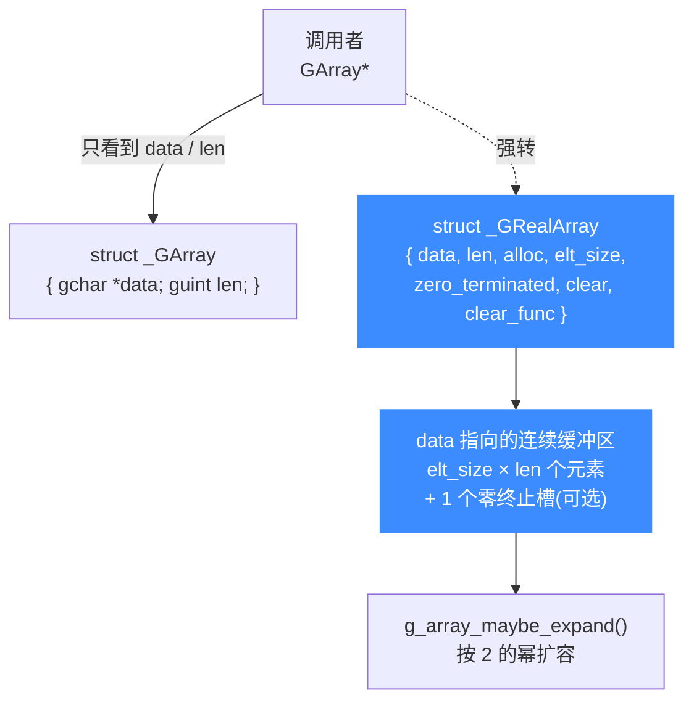

# GArray 动态数组

> 📌 本页讲 `glib_compat/garray.c` 提供的 `GArray` 动态数组：它替代了 glib 的哪些数组能力、内部 `GRealArray` 长什么样、各个增删改查 API 的语义，读完你能直接对照源码理解引擎里那些 `g_array_*` 调用。

## 📖 概述

`GArray` 是一个「元素大小固定、容量自动增长」的连续数组，等价于 glib 的 `GArray` / `GByteArray` / `GPtrArray` 三件套。在 Unicorn 内置的 QEMU Fork 里，凡是要装「同类型对象序列、长度事先未知」的地方都用它，例如 `uc->unmapped_regions` 这类需要按需追加的动态列表。

它由公开结构 `struct _GArray`（只暴露 `data` 与 `len`）加上内部结构 `GRealArray`（多出 `alloc`、`elt_size`、`zero_terminated`、`clear`、`clear_func` 等管理字段）共同实现。调用者拿到的是 `GArray*`，库内部把它强转成 `GRealArray*` 取额外字段。



## 🔧 内部结构

公开结构体（`garray.h`，调用者可见）：

```c
// glib_compat/garray.h
struct _GArray {
    gchar *data;   // 指向元素数据，元素增长时可能整体搬迁
    guint  len;    // 元素个数（不含可选的零终止槽）
};
```

内部真实结构（`garray.c`，库私有）：

```c
// glib_compat/garray.c
struct _GRealArray {
    guint8 *data;
    guint   len;             // 当前元素数
    guint   alloc;           // 已分配容量（元素数）
    guint   elt_size;        // 每个元素的字节数
    guint   zero_terminated : 1; // 末尾留一个全零槽
    guint   clear            : 1; // 新分配元素自动清零
    GDestroyNotify clear_func;   // 元素被移除/释放时的清理回调
};
```

::: details 为什么对外只露两个字段？
glib 的设计哲学是「对外稳定 ABI，对内自由演进」。调用者只需要 `data` 和 `len` 就能遍历/索引数组；而 `alloc`、`elt_size`、`clear_func` 这些是实现细节，藏进 `GRealArray` 后即使将来改布局也不破坏二进制兼容。Unicorn 裁剪时保留了这套结构，但**注释掉了引用计数**（`g_atomic_ref_count` 相关代码全被 `//` 掉），因为 Unicorn 单线程使用，不需要 glib 的多线程安全语义。
:::

## 🧮 容量与扩容

容量由静态函数 `g_array_maybe_expand()` 管理，扩容策略与 glib 一致：取「大于所需长度的最小 2 的幂」，且下限是 `MIN_ARRAY_SIZE = 16`。

```c
// 返回大于 num 的最小 2 的幂（num 本身是 2 的幂时返回自身×2 风格）
static guint g_nearest_pow(guint num) {
    guint n = num - 1;
    n |= n >> 1; n |= n >> 2; n |= n >> 4;
    n |= n >> 8; n |= n >> 16;
    return n + 1;
}
```

这种「按 2 的幂倍增」的分摊复杂度为 O(1) 均摊每次追加，和 C++ `std::vector` 的扩容思路完全一致。

## 💻 用法示例

下面这个例子贴近源码注释里的演示，展示创建、追加、索引、释放的完整生命周期：

```c
#include "glib_compat.h"

GArray *garray;
gint i;

/* 创建一个存 gint 的数组：不要零终止、不要自动清零 */
garray = g_array_new(FALSE, FALSE, sizeof(gint));

for (i = 0; i < 10000; i++)
    g_array_append_val(garray, i);   // 宏，等价 g_array_append_vals(garray, &i, 1)

for (i = 0; i < 10000; i++) {
    /* g_array_index 是宏，直接按下标取元素 */
    if (g_array_index(garray, gint, i) != i)
        g_print("ERROR: got %d instead of %d\n",
                g_array_index(garray, gint, i), i);
}

g_array_free(garray, TRUE);   /* TRUE: 连元素缓冲区一起释放 */
```

::: warning g_array_append_val 不能传字面量
`g_array_append_val(a, v)` 展开成 `g_array_append_vals(a, &(v), 1)`，它取 `v` 的地址。所以 `v` 必须是左值，写 `g_array_append_val(arr, 27)` 会编译报错——先 `gint x = 27; g_array_append_val(arr, x);`。
:::

## 📋 关键函数

`garray.c` 导出的 `g_array_*`（`GArray` 通用动态数组）函数如下：

| 函数 | 签名 | 语义 |
| --- | --- | --- |
| `g_array_new` | `GArray* g_array_new(gboolean zero_terminated, gboolean clear, guint elt_size)` | 创建空数组；等价于 `g_array_sized_new(..., 0)` |
| `g_array_sized_new` | `GArray* g_array_sized_new(gboolean zero_terminated, gboolean clear, guint elt_size, guint reserved_size)` | 创建并预分配 `reserved_size` 个元素，避免频繁 realloc（`len` 仍为 0） |
| `g_array_set_clear_func` | `void g_array_set_clear_func(GArray *array, GDestroyNotify clear_func)` | 设置元素清理回调；删除/释放元素时会对每个元素调用 |
| `g_array_ref` | `GArray* g_array_ref(GArray *array)` | 引用计数 +1（Unicorn 裁剪版为空操作，直接返回） |
| `g_array_unref` | `void g_array_unref(GArray *array)` | 引用计数 -1；降到 0 时释放（裁剪版直接 `array_free`） |
| `g_array_get_element_size` | `guint g_array_get_element_size(GArray *array)` | 返回每个元素的字节数 |
| `g_array_free` | `gchar* g_array_free(GArray *array, gboolean free_segment)` | 释放数组；`free_segment=TRUE` 连数据一起释放，`FALSE` 只释放包装并返回数据指针 |
| `g_array_append_vals` | `GArray* g_array_append_vals(GArray *array, gconstpointer data, guint len)` | 在尾部追加 `len` 个元素（`g_array_append_val` 宏即调它） |
| `g_array_prepend_vals` | `GArray* g_array_prepend_vals(GArray *array, gconstpointer data, guint len)` | 在头部插入，需 `memmove` 后移原有元素，比 append 慢 |
| `g_array_insert_vals` | `GArray* g_array_insert_vals(GArray *array, guint index_, gconstpointer data, guint len)` | 在 `index_` 处插入；`index_ >= len` 时先扩容补零再 append |
| `g_array_set_size` | `GArray* g_array_set_size(GArray *array, guint length)` | 直接设定长度；扩大时按 `clear` 决定是否清零，缩小时走 `g_array_remove_range` |
| `g_array_remove_index` | `GArray* g_array_remove_index(GArray *array, guint index_)` | 删除下标元素并后移保序 |
| `g_array_remove_index_fast` | `GArray* g_array_remove_index_fast(GArray *array, guint index_)` | 用末尾元素填补被删位置，不保序但 O(1) |
| `g_array_remove_range` | `GArray* g_array_remove_range(GArray *array, guint index_, guint length)` | 删除从 `index_` 起的 `length` 个元素并后移闭合 |
| `g_array_copy` | `GArray* g_array_copy(GArray *array)` | 浅拷贝整个数组（指针被复制，指向的对象不复制） |

此外 `garray.c` 还一并实现了 `GByteArray`（`g_byte_array_*`，元素类型固定为 `guint8`）和 `GPtrArray`（`g_ptr_array_*`，元素为 `gpointer`，带可选的 `element_free_func`）。三者共享同一套扩容与零终止逻辑，只是元素语义不同。

::: details remove_index vs remove_index_fast
- `g_array_remove_index`：`memmove` 把后续元素整体前移一位，**保持顺序**，O(n)。
- `g_array_remove_index_fast`：把**最后一个元素**直接 `memcpy` 到被删位置，**不保序**但 O(1)。适合「只当集合用、不在乎顺序」的场景，热路径里很有用。
两者都会在设了 `clear_func` 时先调用它清理被删元素。
:::

## ⚠️ 与上游 glib 的差异

Unicorn 的 `glib_compat` 基于glib 2.64.4 裁剪，`garray.c` 有几处刻意简化：

1. **引用计数被禁用**：`g_array_ref` / `g_array_unref` 里 `g_atomic_ref_count_*` 调用全被注释，`g_array_free` 不再判断 `PRESERVE_WRAPPER`。Unicorn 单线程、生命周期受 `uc_struct` 管控，不需要多线程引用计数。
2. **`g_mem_gc_friendly` 恒为 `FALSE`**：释放后的槽位不会被主动清零（除零终止槽外），换取一点速度。
3. **依赖 `glib_compat` 内部的 `g_malloc` / `g_slice_*`**：内存分配走自家的 `gmem.c` / `gslice.c`，从而整条链路都不碰系统 glib。

::: tip 为什么不直接用系统 glib？
Unicorn 要在 Windows (MSVC/MinGW)、Android NDK、各种嵌入式交叉编译环境、以及作为子项目被静态链接进其他工程等场景下都能「开箱即编译」。系统 glib 在这些目标上要么缺失、要么版本不可控、要么带一堆传递依赖（gettext、libffi、pcre…）。把用到的那一小撮 glib API **自己实现一份**打进 `glib_compat/`，就彻底切断了这层外部依赖，编译产物只有一个 `libunicorn`，零外部 glib 依赖——这是 Unicorn 易于分发的关键之一。代价是只覆盖了引擎真正用到的 API 子集（例如这里的引用计数就被简化掉），但对一个 CPU 模拟器来说完全够用。
:::

## 📖 参考

- glib 原版 `GArray` 文档：<https://docs.gtk.org/glib/struct.Array.html>
- 源文件：`glib_compat/garray.c` / `glib_compat/garray.h`

## 相关页面

- [glib_compat 兼容层](/internals/glib-compat)
- [内置 QEMU Fork](/internals/qemu-fork)
- [uc_struct 结构](/internals/uc-struct)
