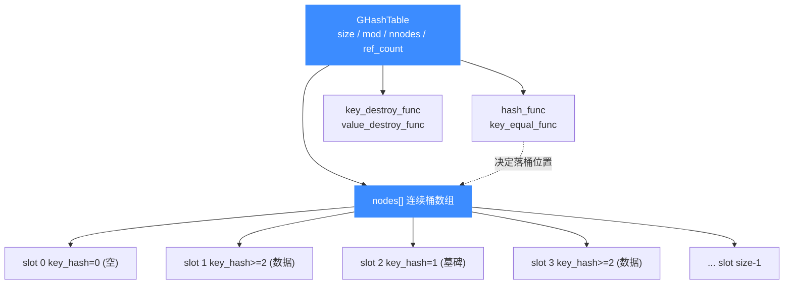

# GHashTable 哈希表

> 🗂️ `glib_compat/ghash.h`（实现位于 `glib_compat/glib_compat.c`）是 Unicorn 内置的 glib `GHashTable` 哈希表实现。本页讲它的内部结构、提供的 API 以及内置 QEMU Fork 为什么需要这份自带版本。

## 📌 概述

上游 QEMU 在内存子系统、TCG、各 target 的 CPU 状态里大量使用 `GHashTable` 做键值映射（如 `flat_views`、`cp_regs`、`helper_table`）。Unicorn 的 vendored QEMU Fork 不依赖系统 glib，于是 `glib_compat/` 提供一份从 glib 2.64.4 裁剪而来的最小替代——`GHashTable` 就是其中最核心的一块。读完本页你会清楚：每个 `g_hash_table_*` 调用在 Unicorn 里落到了什么样的数据结构上、和系统 glib 的差异在哪。

## 🧱 内部结构

实现采用**开放寻址法（open addressing）**：一张连续的 `GHashNode` 数组，冲突时线性探测下一个槽位。每个节点用 `key_hash` 的特殊值标记状态——`0` 表示空槽、`1` 表示墓碑（已删除待复用）、`>=2` 表示有数据：

```c
// glib_compat/glib_compat.c
typedef struct _GHashNode GHashNode;

struct _GHashNode {
    gpointer   key;
    gpointer   value;
    guint      key_hash;   // 0=空 1=墓碑 >=2=有数据
};

struct _GHashTable {
    gint             size;            // 桶数组容量
    gint             mod;             // 取模用的素数
    guint            mask;
    gint             nnodes;          // 实际节点数
    gint             noccupied;       // nnodes + 墓碑数
    GHashNode       *nodes;           // 连续桶数组
    GHashFunc        hash_func;
    GEqualFunc       key_equal_func;
    volatile gint    ref_count;       // 引用计数
    GDestroyNotify   key_destroy_func;
    GDestroyNotify   value_destroy_func;
};
```

当 `noccupied` 占比过高时（`g_hash_table_maybe_resize`），表会扩容：按 `nnodes * 2` 重新计算 `shift`，`g_new0` 一块新的 `nodes` 数组，把存活节点重新哈希搬过去。墓碑在 rehash 时自然被丢弃。

## 🔧 关键函数

| 函数 | 语义 |
| --- | --- |
| `g_hash_table_new(hash_func, key_equal_func)` | 创建表，不带析构回调 |
| `g_hash_table_new_full(hash_func, key_equal_func, key_destroy_func, value_destroy_func)` | 创建表，删除/销毁时自动释放 key/value |
| `g_hash_table_destroy(hash_table)` | 清空并释放（内部先 `remove_all` 再 `unref`） |
| `g_hash_table_insert(hash_table, key, value)` | 插入；key 已存在则**替换 value**，返回 `TRUE` 表示新增 |
| `g_hash_table_replace(hash_table, key, value)` | 插入；key 已存在则**连同 key 一起替换**（触发 key 析构） |
| `g_hash_table_remove(hash_table, key)` | 按 key 删除，命中返回 `TRUE`，触发析构 |
| `g_hash_table_remove_all(hash_table)` | 清空全部节点（保留表壳） |
| `g_hash_table_lookup(hash_table, key)` | 查找，返回 value 指针，未命中返回 `NULL` |
| `g_hash_table_foreach(hash_table, func, user_data)` | 遍历所有键值对 |
| `g_hash_table_size(hash_table)` | 返回 `nnodes` |
| `g_hash_table_ref(hash_table)` / `g_hash_table_unref(hash_table)` | 引用计数；归零时真正释放 |
| `g_int_hash(v)` / `g_int_equal(v1, v2)` | 整数 key 的内置哈希与相等函数 |
| `g_direct_hash(v)` / `g_direct_equal(v1, v2)` | 指针 key 的内置哈希与相等（`hash_func` 传 `NULL` 时默认） |

> ⚠️ `insert` 与 `replace` 的区别：`insert` 命中已存在 key 时**保留旧 key、只换 value**；`replace` 会先析构旧 key 再换上你给的新 key。若 key 是 `g_malloc` 出来的独立对象，用错会导致内存泄漏或双重释放。

## 💻 用法示例

ARM target 用 `g_int_hash`/`g_int_equal` 以 `cpreg` 编码为 key 存放协处理器寄存器定义，并带析构回调自动释放：

```c
// qemu/target/arm/cpu.c
cpu->cp_regs = g_hash_table_new_full(g_int_hash, g_int_equal,
                                     g_free, g_free);
```

而内存子系统用**指针直接做 key**（`hash_func` 传 `NULL` 走 `g_direct_hash`），以 `MemoryRegion` 指针为 key 缓存 flat view：

```c
// qemu/softmmu/memory.c
uc->flat_views = g_hash_table_new_full(NULL, NULL, NULL, ...);
```

Hook 系统也用同一套做「已插桩区域」去重：

```c
// include/uc_priv.h: hooked_regions_add()
if (!g_hash_table_lookup(h->hooked_regions, (void *)&tmp)) {
    g_hash_table_insert(h->hooked_regions, (void *)r, (void *)1);
}
```

这些符号全部由 `glib_compat/` 提供，链接时不会落到系统 `libglib-2.0`。

## 📊 节点关系



::: tip 为什么不直接用系统 glib？
1. **零外部依赖**：Unicorn 追求单一静态/动态库即可使用，Windows、Android NDK、嵌入式交叉编译等场景下系统不一定有 glib，自带实现让构建可预测。
2. **裁剪体积**：`glib_compat/` 只保留了 QEMU 用到的那部分 API（如本表所列），去掉了 glib 的类型系统、对象系统、IO、正则等，编译产物更小。
3. **版本锁定**：基于 glib 2.64.4 固定一份，避免不同发行版 glib 行为差异（尤其哈希随机化、迭代顺序）影响可复现性。
4. **与 QEMU 上游同步成本低**：vendored QEMU 代码原样保留 `g_hash_table_*` 调用，无需改写即可在兼容层上跑通。
:::

::: details 与上游 glib 的差异
这份实现删去了 `g_hash_table_iter_*` 系列的完整迭代器实现（`ghash.h` 里 `GHashTableIter` 结构体保留了 `dummy1..6` 占位字段以维持 ABI，但本头文件未导出 iter 相关函数），以及 `g_hash_table_lookup_extend`、`g_hash_table_contains`、`g_hash_table_get_keys`/`get_values` 等较新 API。QEMU Fork 只用到上表列出的那些，故裁剪安全。
:::

## 📖 参考

- glib 上游 `ghash.c` 注释（本实现的源头，见 `glib_compat/glib_compat.c` 文件头版权声明）
- glib 2.64.4 官方文档：`GHashTable` 章节

## 相关页面

- [glib_compat 兼容层](/internals/glib-compat)
- [内置 QEMU Fork](/internals/qemu-fork)
- [uc_struct 结构](/internals/uc-struct)
- [内存 API](/internals/memory-api)
