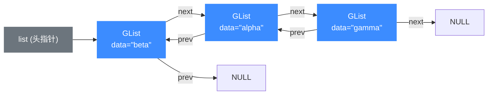
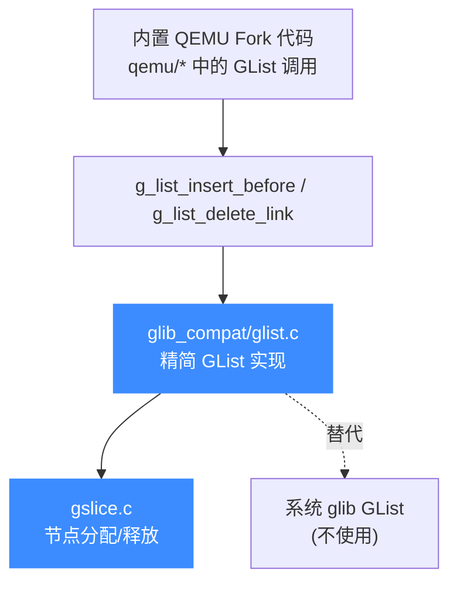

# glib_compat GList 双向链表

> 📌 本页讲 `glib_compat/glist.c` 提供的 `GList` 双向链表实现：节点结构、导出的几个操作函数，以及它在 Unicorn 内置 QEMU Fork 中替代系统 glib `GList` 的角色。读完你能知道这份链表能做什么、和原生 glib 比少了什么、节点指针如何串联。

## 📖 概述

`GList` 是 glib 里最通用的双向链表，上游 QEMU 在很多地方用到它。Unicorn 的内置 QEMU Fork 不链接系统 glib，于是 `glib_compat/glist.c` 重新实现了其中**实际被用到的那一小部分** API。整份文件只有约 150 行，是一个高度精简的子集，并非 glib 2.64.4 中 `GList` 的完整移植。

::: warning 不是完整 glib GList
原生 glib 的 `GList` 提供 `g_list_append`、`g_list_prepend`、`g_list_insert_sorted`、`g_list_remove`、`g_list_length`、`g_list_nth`、`g_list_foreach` 等几十个函数。这份 `glist.c` **只导出三个**：`g_list_alloc`、`g_list_insert_before`、`g_list_delete_link`。其余未被 Unicorn 用到的 API 一律未实现——调用它们会链接报错。需要完整能力时请改用 `GArray` / `GTree` 或自研结构。
:::

## 🧱 节点结构

节点定义在 `glib_compat/glist.h`，是一个标准的双向链表节点，三个字段：数据指针 + 前驱 + 后继。

```c
// glib_compat/glist.h
typedef struct _GList GList;

struct _GList
{
    gpointer data;   // 节点承载的数据（无类型指针）
    GList *next;     // 后继节点，链表末尾为 NULL
    GList *prev;     // 前驱节点，链表首节点为 NULL
};
```

与原生 glib 一致，`GList *` 既是「链表」也是「节点」：任意一个节点指针都能作为入口遍历整条链，函数返回的是（可能变化的）链表头指针。

## 🔧 内存来源

节点不是直接 `malloc`，而是走 `gslice` 分配器，这样和 `glib_compat` 其余容器保持一致的分配路径：

```c
// glib_compat/glist.c
#define _g_list_alloc()     g_slice_new (GList)      // 分配并清零一个节点
#define _g_list_alloc0()    g_slice_new0 (GList)
#define _g_list_free1(list) g_slice_free (GList, list) // 释放单个节点
```

`g_slice_*` 由 `gslice.c` 提供，是 glib 的 slab 风格分配器的精简版。删除节点时用 `_g_list_free1` 归还，确保分配/释放配对走同一条路径。

## 🔑 关键函数

下表列出 `glist.c` 导出的全部函数（即 `glist.h` 中声明、`glist.c` 中定义的 `g_` 开头符号）。`_g_list_remove_link` 是内部 `static inline` 辅助函数，未对外导出，但 `g_list_delete_link` 依赖它。

| 函数原型 | 语义 | 返回值 |
| --- | --- | --- |
| `GList *g_list_alloc(void)` | 分配一个**空的新节点**（data/next/prev 均置 0）。通常由 `g_list_insert_before` 内部调用，很少直接使用 | 新节点指针 |
| `GList *g_list_insert_before(GList *list, GList *sibling, gpointer data)` | 在 `sibling` 节点**之前**插入携带 `data` 的新节点；`sibling` 为 NULL 时插到链表末尾；`list` 为 NULL 时新建单节点链表 | （可能变化的）链表头 |
| `GList *g_list_delete_link(GList *list, GList *link_)` | 从链表中摘除 `link_` 节点**并释放**它（对比 `g_list_remove_link` 只摘除不释放，本仓未导出后者） | （可能变化的）链表头 |

::: details 内部辅助 _g_list_remove_link
`g_list_delete_link` 的核心是 `static inline _g_list_remove_link`，它做三件事：把 `link->prev->next` 指向 `link->next`、把 `link->next->prev` 指向 `link->prev`、若删的是头节点则把头后移到 `list->next`，最后把 `link` 自身的 `next/prev` 清空。原生 glib 还会在指针不一致时 `g_warning("corrupted double-linked list detected")`，本仓把这条警告**注释掉了**，只做静默修复——少一份依赖、少一份噪音。
:::

## 💻 用法示例

下面模拟在 QEMU Fork 代码里维护一条 `GList`：从空链表开始，在头部之前插入节点、在末尾追加节点、再删除某个节点。注意每次插入/删除都要用返回值更新链表头指针，因为操作可能改变头节点。

```c
#include "glist.h"
#include <stdio.h>

int main(void)
{
    GList *list = NULL;

    // list 为 NULL 时 insert_before 等价于创建单节点链表
    list = g_list_insert_before(list, NULL, (gpointer)"alpha");

    // 在首节点 "alpha" 之前插入 "beta" -> 头指针变为 "beta" 节点
    list = g_list_insert_before(list, list, (gpointer)"beta");

    // sibling 传 NULL：插到链表末尾
    list = g_list_insert_before(list, NULL, (gpointer)"gamma");

    // 正向遍历：beta -> alpha -> gamma
    for (GList *n = list; n; n = n->next) {
        printf("%s\n", (const char *)n->data);
    }

    // 删除中间节点 "alpha"
    GList *alpha = list->next;          // beta -> alpha -> gamma
    list = g_list_delete_link(list, alpha);

    return 0;
}
```

::: tip 头指针必须用返回值覆盖
`g_list_insert_before` / `g_list_delete_link` 可能在插入新头或删除旧头时改变链表起点。**永远写 `list = g_list_insert_before(list, ...)`**，不要丢弃返回值，否则头节点会丢失。
:::

## 🧬 节点关系

下图展示插入 `"beta"` 到 `"alpha"` 之前、再追加 `"gamma"` 后的链表形态。每个节点持有 `prev`/`next` 双向指针，`list` 指针始终指向当前头节点。



`g_list_delete_link(list, A)` 执行后，`B.next` 直接指向 `G`、`G.prev` 直接指向 `B`，`A` 节点经 `g_slice_free` 归还，链表变为 `beta -> gamma`。

## ⚙️ 在 Unicorn 中的作用

`glist.c` 是 `glib_compat` 容器家族的一员，专门填补 QEMU Fork 对 glib `GList` 的调用。它的位置如下：



由于本仓只导出三个函数，QEMU Fork 中凡是需要 `g_list_append`/`g_list_prepend`/`g_list_foreach` 等能力的代码路径，要么已被裁剪、要么改写为基于 `GArray`/`GTree` 的等价实现。换言之，`glist.c` 的存在是「按需补齐」而非「全面兼容」。

::: tip 为什么不直接用系统 glib？
Unicorn 的设计目标是**单一可移植产物**：Windows（MSVC/MinGW/MSYS2）、Android NDK、各类交叉编译、静态链接场景下，要求最终用户预装 glib 既不现实也徒增部署摩擦。把用到的那点 `GList` 能力（三个函数）自己写进 `glib_compat/`，随引擎一起编译，既消除了外部依赖、又能裁掉 glib 全家桶里用不上的体积。代价就是 API 子集很小——这正是 `glib_compat`「最小替代」哲学的体现。
:::

## 📖 参考

- 源码：`glib_compat/glist.c`、`glib_compat/glist.h`
- 上游 glib `GList` 文档（完整 API）：https://docs.gtk.org/glib/struct.List.html
- 节点分配器：`glib_compat/gslice.c`

## 相关页面

- [glib_compat 兼容层](/internals/glib-compat)
- [内置 QEMU Fork](/internals/qemu-fork)
