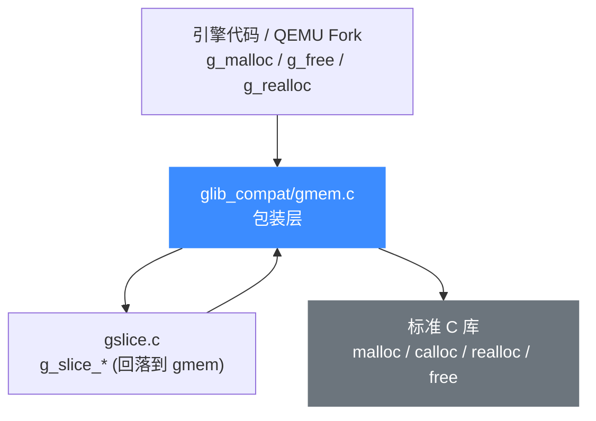

# gmem.c 内存分配包装

> 💾 `glib_compat/gmem.c` 把 glib 的 `g_malloc` / `g_free` / `g_realloc` 系列内存接口包装到标准 C 库的 `malloc` / `free` / `realloc` 之上。读完本页你会清楚：Unicorn 内置 QEMU Fork 用它替代了 glib 哪部分能力、每个函数的语义差异，以及为什么这些「g_ 开头」的函数在源码里随处可见却不会真正依赖系统 glib。

## 📌 概述

上游 QEMU 的代码（包括 Unicorn 改造过的 `qemu/softmmu/memory.c`、`memory_mapping.c` 等）几乎不用裸 `malloc`，而是统一走 glib 的 `g_malloc` / `g_malloc0` / `g_realloc` / `g_free`。这些函数原本由系统 glib 提供，Unicorn 为了做到**零外部 glib 依赖**，在 `glib_compat/gmem.c` 里用标准 C 库重新实现了一份，签名与语义保持一致，让引擎代码无需改动即可编译。

本文件替换的是 glib 的**通用堆内存分配层**（glib 的 `gmem` 模块），不涉及 slice 分配器自身的独立实现（slice 在 `gslice.c` 里，最终也回落到这里）。



## 🔧 实现要点

包装层只做三件事，却和原生 glib 有几处刻意为之的差异：

1. **委托给 libc**：`g_malloc`→`malloc`、`g_malloc0`→`calloc`、`g_realloc`→`realloc`、`g_free`→`free`。
2. **溢出检测**：`*_n` 变体用 `SIZE_OVERFLOWS(a,b)` 宏在乘法前检查 `a * b` 是否会溢出 `G_MAXSIZE`，溢出则返回 `NULL` 而非传入一个被截断的小尺寸。
3. **失败不 abort**：原生 glib 的 `g_malloc` 在分配失败时会调 `g_error` 直接终止进程；这里把那段 `g_error` **注释掉了**，改成返回 `NULL`。这让 Unicorn 在内存耗尽时能由上层自己处理错误，而不是把整个宿主进程拉崩。

```c
// glib_compat/gmem.c
#define SIZE_OVERFLOWS(a,b) (((b) > 0 && (a) > G_MAXSIZE / (b)))

gpointer g_malloc (gsize n_bytes)
{
    if (n_bytes) {
        gpointer mem = malloc (n_bytes);
        if (mem) return mem;
        //g_error (...);   // 原版 glib 会 abort，这里被注释掉
    }
    return NULL;
}
```

`g_try_malloc` 与 `g_malloc` 的唯一区别在于 **0 字节** 的处理：`g_try_malloc(0)` 返回 `NULL`，而 `g_malloc(0)` 在 libc `malloc(0)` 行为非 `NULL` 的平台上会返回一个可 `free` 的指针。

## 📖 关键函数

下表列出 `gmem.c` 导出的全部函数（原型来自 `gmem.h`）：

| 函数 | 原型 | 语义 | 对应 libc |
| --- | --- | --- | --- |
| `g_malloc` | `gpointer g_malloc(gsize n_bytes)` | 分配 `n_bytes`，失败返回 `NULL`（不 abort） | `malloc` |
| `g_malloc0` | `gpointer g_malloc0(gsize n_bytes)` | 分配并清零 | `calloc(1, …)` |
| `g_malloc_n` | `gpointer g_malloc_n(gsize n_blocks, gsize n_block_bytes)` | 带溢出检测的 `n_blocks * n_block_bytes` 分配 | `malloc` |
| `g_malloc0_n` | `gpointer g_malloc0_n(gsize n_blocks, gsize n_block_bytes)` | 带溢出检测的清零分配 | `calloc` |
| `g_try_malloc` | `gpointer g_try_malloc(gsize n_bytes)` | 分配，0 字节或失败均返回 `NULL` | `malloc` |
| `g_try_malloc0` | `gpointer g_try_malloc0(gsize n_bytes)` | 清零版 `g_try_malloc` | `calloc(1, …)` |
| `g_try_malloc_n` | `gpointer g_try_malloc_n(gsize n_blocks, gsize n_block_bytes)` | 带溢出检测的 try 版 | `malloc` |
| `g_realloc` | `gpointer g_realloc(gpointer mem, gsize n_bytes)` | 重分配；`n_bytes==0` 时释放并返回 `NULL` | `realloc` + `free` |
| `g_realloc_n` | `gpointer g_realloc_n(gpointer mem, gsize n_blocks, gsize n_block_bytes)` | 带溢出检测的 realloc | `realloc` |
| `g_free` | `void g_free(gpointer mem)` | 释放；`NULL` 安全（直接 `free`） | `free` |

> 类型别名：`gpointer` = `void *`，`gsize` = `unsigned long`，`G_MAXSIZE` 见 `gtypes.h`。这些类型同样由 `glib_compat/` 提供，不依赖系统 glib 头。

## 💻 用法示例

引擎里 `g_malloc` / `g_free` 随处可见。`uc_struct` 的停止地址集合就用 `g_malloc` 取节点、用 `g_free` 作析构回调：

```c
// include/uc_priv.h
static inline void uc_add_exit(uc_engine *uc, uint64_t addr) {
    uint64_t *new_exit = g_malloc(sizeof(uint64_t));   // 走 gmem.c -> malloc
    *new_exit = addr;
    g_tree_insert(uc->ctl_exits, (gpointer)new_exit, (gpointer)1);
}

// uc.c:282 —— 注册 GTree 时把 g_free 作为 key 析构函数
uc->ctl_exits = g_tree_new_full(uc_exits_cmp, NULL, g_free, NULL);
```

softmmu 的内存视图扩容则用 `g_realloc`，避免每次都重新分配：

```c
// qemu/softmmu/memory.c:466
view->ranges = g_realloc(view->ranges, ...);
```

```bash
# 验证 gmem.c 里导出了哪些 g_ 符号
nm build/libunicorn.a | grep ' T g_malloc\| T g_free\| T g_realloc'
```

## 🧩 与 gslice.c 的关系

`gslice.c`（glib 的 slab/slice 分配器）在原生 glib 里是一套独立的对象池，`glib_compat` 版本刻意把它**降级**成 `g_malloc` / `g_free` 的薄包装，省掉了整个 slab 机制：

```c
// glib_compat/gslice.c
gpointer g_slice_alloc (gsize mem_size)  { return g_malloc(mem_size); }
void     g_slice_free1 (gsize mem_size, gpointer mem_block) { g_free(mem_block); }
```

也就是说，引擎里所有 `g_slice_*` 调用最终都汇聚到 `gmem.c` 这一层。这也是为什么 `gmem.c` 是整个 `glib_compat/` 的「地基」——其它数据结构（`GHashTable`、`GTree`、`GArray`…）内部的节点分配都依赖它。

## ⚠️ 注意

- **不再 abort**：原版 glib 的 `g_malloc` 失败会 `g_error` 终止进程，本实现返回 `NULL`。所以移植自上游 QEMU 的代码若假定「`g_malloc` 必成功」，在 Unicorn 里这个假设不成立——耗尽内存时会拿到 `NULL`。
- **溢出也返回 `NULL`**：`*_n` 变体检测到 `n_blocks * n_block_bytes` 溢出时返回 `NULL`（原版同样会 abort，注释已去掉）。
- **`g_free(NULL)` 安全**：标准 `free(NULL)` 本就是 no-op，所以无需额外判空。

::: tip 为什么要自己实现而不直接用系统 glib
Unicorn 的设计目标是「一份源码、零外部 glib 依赖」地跨平台编译——Windows (MSVC/MinGW)、Android NDK、Linux 静态链接、嵌入式交叉编译等场景下，让用户先装好 glib 头文件和运行时是沉重的部署负担，且静态链接 glib 还牵扯线程/初始器等副作用。把用到的那部分 glib API 用标准 C 库重写成 `glib_compat/`，引擎代码一行不改就能编译，体积也可控。另一个收益是**行为可控**：像 `g_malloc` 失败时是否 abort 这种关键语义，Unicorn 可以按需调整（这里就改成不 abort），而系统 glib 改不了。详见 [glib_compat 兼容层](/internals/glib-compat)。
:::

## 相关页面

- [glib_compat 兼容层](/internals/glib-compat)
- [内置 QEMU Fork](/internals/qemu-fork)
- [list.c 链表工具](/internals/list)
- [uc_struct 结构](/internals/uc-struct)
