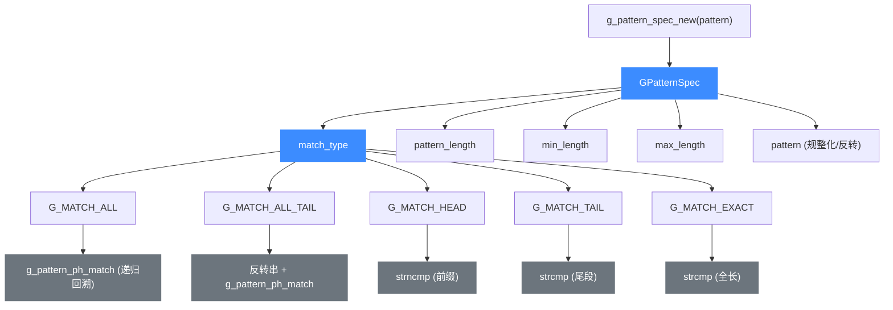
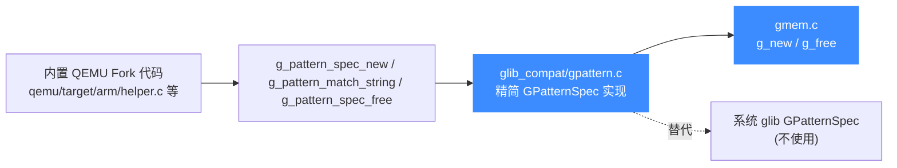

# glib_compat GPattern 通配符匹配

> 📌 本页讲 `glib_compat/gpattern.c` 提供的 glob 风格通配符匹配：`GPatternSpec` 编译态结构、五个内部匹配类型、四个导出函数，以及它在 Unicorn 内置 QEMU Fork 中替代系统 glib 模式匹配的角色。读完你能知道怎么编译一个模式、匹配时走的是哪条快速路径、和原生 glib 比缺了什么。

## 📖 概述

`gpattern.c` 实现的是 glib 的 **Glob-style pattern matching**：把含 `*`（匹配任意长度、可为空的串）和 `?`（匹配单个字符）的通配模式编译成 `GPatternSpec`，再拿去匹配字符串，语义近似标准 `glob()`，但有三点关键区别：

- `/` 字符**可以被** `*` / `?` 匹配（不像 shell glob 通常不跨目录）；
- **没有** `[...]` 字符区间；
- `*` 和 `?` **不可转义**，无法把它们作为字面量写进模式。

Unicorn 的内置 QEMU Fork 不链接系统 glib，于是这份 `glib_compat/gpattern.c` 替代了 glib 中**模式匹配这一窄面**的能力。整份文件约 280 行，是 glib 2.64.4 对应文件的精简移植，只导出实际被 QEMU 用到的四个函数。

## 🧱 数据结构

`GPatternSpec` 是一个**不透明**的「已编译模式」结构，定义在 `gpattern.c` 内部（头文件 `gpattern.h` 只前向声明 `typedef struct _GPatternSpec GPatternSpec`）。它把原始模式串规整化后，归类成五种匹配类型之一，并预计算长度上下界，匹配时据此走快速路径。

```c
// glib_compat/gpattern.c
typedef enum
{
    G_MATCH_ALL,       /* "*A?A*"   —— 前后都有通配，需双向回溯 */
    G_MATCH_ALL_TAIL,  /* "*A?AA"   —— 仅尾部有通配，模式整体反转后按 ALL 匹配 */
    G_MATCH_HEAD,      /* "AAAA*"   —— 前缀匹配，等价 strncmp */
    G_MATCH_TAIL,      /* "*AAAA"   —— 后缀匹配，等价尾段 strcmp */
    G_MATCH_EXACT,     /* "AAAAA"   —— 无通配，等价 strcmp */
    G_MATCH_LAST
} GMatchType;

struct _GPatternSpec
{
    GMatchType match_type;     // 归类后的匹配类型，决定匹配走哪条路径
    guint      pattern_length; // 规整化后模式串长度（不含结尾 '\0'）
    guint      min_length;     // 能匹配的字符串最短长度（'?' 计 1，'*' 计 0）
    guint      max_length;     // 能匹配的字符串最长长度（含通配时为 UINT_MAX）
    gchar     *pattern;        // 规整化后的模式串（ALL_TAIL 时为反转串）
};
```

`g_pattern_spec_new()` 在编译期做的事：压缩连续 `*`、统计 `?` 个数算出 `min_length`、按首个/末个通配位置把模式归入五种类型之一、对 `G_MATCH_ALL_TAIL` 把模式串**整体反转**（这样匹配时反向扫描，等价于「尾部通配」）。归类的意义在于：`G_MATCH_HEAD` / `G_MATCH_TAIL` / `G_MATCH_EXACT` 都能用 `strncmp` / `strcmp` 直接搞定，**完全不必走递归回溯**；只有 `G_MATCH_ALL` / `G_MATCH_ALL_TAIL` 才落到通用的递归匹配器 `g_pattern_ph_match`。

## 🔑 关键函数

下表列出 `gpattern.c` 导出的全部函数（`gpattern.h` 中声明、`gpattern.c` 中定义的 `g_` 开头符号）。`g_pattern_ph_match` 与 `string_reverse` 是 `static inline` / `static` 内部辅助，未对外导出。

| 函数原型 | 语义 | 返回值 |
| --- | --- | --- |
| `GPatternSpec *g_pattern_spec_new(const gchar *pattern)` | 编译一个 glob 模式为 `GPatternSpec`：压缩连续 `*`、算长度上下界、归类匹配类型、必要时反转模式串 | 新分配的 `GPatternSpec *` |
| `void g_pattern_spec_free(GPatternSpec *pspec)` | 释放 `g_pattern_spec_new` 分配的 `GPatternSpec`（先 `g_free` 内部 `pattern` 串，再 `g_free` 结构本身） | 无 |
| `gboolean g_pattern_match(GPatternSpec *pspec, guint string_length, const gchar *string, const gchar *string_reversed)` | 用已编译模式匹配定长字符串。`string_reversed` 可传 `NULL`，仅当模式为 `G_MATCH_ALL_TAIL` 时才会临时构造反转串；预先传入反转串可避免多次重复构造 | 匹配成功返回 `TRUE` |
| `gboolean g_pattern_match_string(GPatternSpec *pspec, const gchar *string)` | `g_pattern_match` 的便捷包装：内部 `strlen` 算长度、反转串传 `NULL`。代价是每次调用都可能临时构造反转串，**多模式批量匹配时改用 `g_pattern_match` 更省** | 匹配成功返回 `TRUE` |

::: details 内部匹配器 g_pattern_ph_match
`static inline g_pattern_ph_match(pattern, string, wildcard_reached_p)` 是通用回溯匹配器，处理 `G_MATCH_ALL` / `G_MATCH_ALL_TAIL` 两种类型。它逐字符扫描模式：遇到 `?` 消耗 `string` 一个字符；遇到 `*` 先标记 `wildcard_reached_p = TRUE` 并跳过后续连续 `*`/`?`，然后在 `string` 里找下一个能对齐模式剩余段的起点，递归尝试；遇到普通字符做精确比较。`wildcard_reached_p` 这个出参用于**剪枝**：一旦递归子调用报告「已经到达下一个通配」，说明剩余模式段已整体匹配成功、失败只可能发生在更后面，当前匹配位置无需再前进，直接返回 `FALSE`，避免无谓的回溯扫描。
:::

## 💻 用法示例

Unicorn 里这份匹配能力最真实的用法在 `qemu/target/arm/helper.c` 的 `modify_arm_cp_regs()`：把一组「用户态可见性规则」中的 glob 模式名编译成 `GPatternSpec`，再拿去匹配协处理寄存器表里的寄存器名，命中即把该寄存器在用户态降级为只读常量。

```c
// qemu/target/arm/helper.c: modify_arm_cp_regs()
for (m = mods; m->name; m++) {
    GPatternSpec *pat = NULL;
    if (m->is_glob) {
        pat = g_pattern_spec_new(m->name);          // 编译 glob 模式
    }
    for (r = regs; r->type != ARM_CP_SENTINEL; r++) {
        if (pat && g_pattern_match_string(pat, r->name)) {
            r->type = ARM_CP_CONST;                 // 命中：降级为只读常量
            r->access = PL0U_R;
            r->resetvalue = 0;
        } else if (strcmp(r->name, m->name) == 0) {
            /* 精确名匹配的另一条路径 */
            break;
        }
    }
    if (pat) {
        g_pattern_spec_free(pat);                   // 用完即释放
    }
}
```

下面是一个可直接跑的最小例子，演示编译/匹配/释放的完整生命周期，并体现五种模式类型的归类：

```c
#include "gpattern.h"
#include <stdio.h>
#include <string.h>

int main(void)
{
    GPatternSpec *head = g_pattern_spec_new("arm_*");      // G_MATCH_HEAD
    GPatternSpec *tail = g_pattern_spec_new("*_el1");      // G_MATCH_TAIL
    GPatternSpec *all  = g_pattern_spec_new("*cpu*");      // G_MATCH_ALL
    GPatternSpec *ex   = g_pattern_spec_new("fp_el0");     // G_MATCH_EXACT

    printf("%d\n", g_pattern_match_string(head, "arm_vbar"));   // 1
    printf("%d\n", g_pattern_match_string(tail, "spsr_el1"));   // 1
    printf("%d\n", g_pattern_match_string(all,  "cpuarmael1")); // 1
    printf("%d\n", g_pattern_match_string(ex,   "fp_el0"));     // 1
    printf("%d\n", g_pattern_match_string(ex,   "fp_el1"));     // 0

    // 长度预筛：min_length/max_length 不符直接返回 FALSE，不走回溯
    printf("%d\n", g_pattern_match_string(all, "cp"));          // 0（"cpu" 至少 3 字符）

    g_pattern_spec_free(head);
    g_pattern_spec_free(tail);
    g_pattern_spec_free(all);
    g_pattern_spec_free(ex);
    return 0;
}
```

::: tip 批量匹配优先用 g_pattern_match
`g_pattern_match_string` 每次调用都 `strlen` 且可能临时构造反转串。当你拿**同一个**模式去匹配**一大批**字符串时（如上面的寄存器表遍历），更高效的做法是：预先 `string_reverse` 一次目标串，然后循环里调 `g_pattern_match(pspec, len, str, str_rev)`——不过 `g_pattern_match_string` 内部已做长度预筛，单次开销其实很小，多数场景不必纠结。
:::

## 🧬 结构关系

下图展示 `GPatternSpec` 的字段归属与匹配时分发的五条路径。`g_pattern_spec_new` 根据模式里首个/末个通配位置把模式归入一种 `GMatchType`，`g_pattern_match` 再按类型选择快速路径（`strcmp`/`strncmp`）或落到通用回溯器 `g_pattern_ph_match`。



## ⚙️ 在 Unicorn 中的作用

`gpattern.c` 是 `glib_compat` 容器家族的一员，填补 QEMU Fork 对 glib 模式匹配的调用。它在引擎里的位置如下：



仓库中目前唯一调用点在 ARM 目标：`modify_arm_cp_regs()` 用它把 `ARMCPRegUserSpaceInfo` 里的 glob 名（如 `"arm_*"`、`"*_el1"`）展开到协处理寄存器表，决定用户态可见性。其余架构目标未直接使用——这份实现存在的意义是「按需补齐」：QEMU 上游用到，Unicorn 就跟着带上，但只导出四个函数，不做超出实际调用面的扩展。

::: warning 不支持转义与字符区间
和原生 glib 一致，这份实现里 `*` 和 `?` **不可转义**，也没有 `[a-z]` 字符区间。如果你的场景需要这些，得在调用前自行过滤或改用正则。另外 `G_MATCH_ALL_TAIL` 路径需要反转串，对**含多字节 UTF-8 字符**的字符串，`string_reverse` 只是按字节反转——寄存器名都是 ASCII，实际无碍，但通用场景下注意。
:::

::: tip 为什么不直接用系统 glib？
Unicorn 的设计目标是**单一可移植产物**：Windows（MSVC/MinGW/MSYS2）、Android NDK、各类交叉编译、静态链接场景下，要求最终用户预装 glib 既不现实也徒增部署摩擦。glib 的模式匹配这一小段逻辑（编译-归类-匹配，约 280 行）自己写进 `glib_compat/` 随引擎一起编译，既消除了外部依赖、又能裁掉 glib 全家桶里用不上的体积，还保证了跨平台行为一致。代价就是 API 子集很小（四个函数，无 `g_pattern_match_simple` 便捷封装）——这正是 `glib_compat`「最小替代」哲学的体现。
:::

## 📖 参考

- 源码：`glib_compat/gpattern.c`、`glib_compat/gpattern.h`
- 上游 glib `GPatternSpec` 文档（完整 API）：https://docs.gtk.org/glib/struct.PatternSpec.html
- 真实调用点：`qemu/target/arm/helper.c` 的 `modify_arm_cp_regs()`
- 内存分配来源：`glib_compat/gmem.c`（`g_new` / `g_free`）

## 相关页面

- [glib_compat 兼容层](/internals/glib-compat)
- [内置 QEMU Fork](/internals/qemu-fork)
- [ARM 目标后端](/internals/target-arm)
