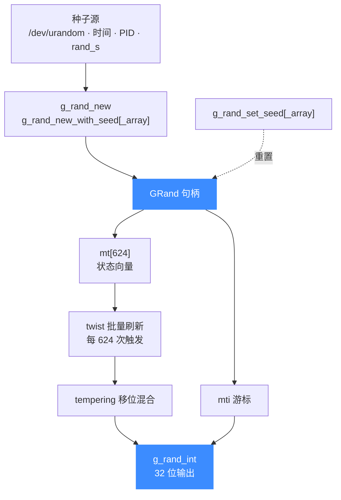

# glib_compat/grand.c — 伪随机数生成器

> 🎲 本页讲 `glib_compat/grand.c` 这份 Mersenne Twister（马赛克旋转）伪随机数实现：它替换了 glib 的 `GRand` 一族函数，让内置 QEMU Fork 在不依赖系统 glib 的前提下也能拿到随机数。读完你能掌握 `GRand` 结构体的内部布局、各 `g_rand_*` 函数的语义，以及为何 Unicorn 要自己实现一份而不是用系统 glib。

## 📌 概述

`grand.c` 实现的是经典的 **MT19937** 伪随机算法（Makoto Matsumoto 与 Takuji Nishimura 提出），对应 glib 的 `GRand` 类型与 `g_rand_*` 一族 API。Unicorn 内置的 QEMU Fork 在若干路径上需要随机源（例如初始化、生成不确定值），但 Unicorn 整体刻意不依赖系统 glib，于是把这部分算法原样裁进 `glib_compat/`，与引擎一起编译。

它替代的是 glib 中「带状态的伪随机数生成器」这一部分能力：

- `GRand` 结构体及其状态向量；
- `g_rand_new` / `g_rand_new_with_seed` 等构造函数；
- `g_rand_set_seed` / `g_rand_set_seed_array` 等播种函数；
- `g_rand_int` 输出 32 位均匀分布随机数；
- 附带的 `g_get_real_time`，作为「无 `/dev/urandom` 时拿时间作种子」的回退依赖。

::: warning 不提供全局便捷接口
上游 glib 还有一批 `g_random_int` / `g_random_double` 等「隐式全局 `GRand`」的便捷函数，本兼容层并未实现，只保留了**显式带 `GRand*` 句柄**的那一组。需要随机数的调用方应自己 `g_rand_new()` 后再用。
:::

## 🔧 实现要点

### 状态结构

`GRand` 内部就是 MT19937 的 624 字状态向量加一个游标：

```c
// glib_compat/grand.c
#define N 624
#define M 397
#define MATRIX_A 0x9908b0df   /* 常向量 a */
#define UPPER_MASK 0x80000000 /* 最高 w-r 位 */
#define LOWER_MASK 0x7fffffff /* 最低 r 位 */

struct _GRand
{
    guint32 mt[N]; /* 状态向量 */
    guint mti;     /* 下一个待输出下标 */
};
```

`mti` 一旦走到 `N`（624），就触发一次「twist」批量刷新整段 `mt[]`，再从头输出——这就是 MT 算法「一次生成 624 个」的批量特性。

### 播种

`g_rand_set_seed` 支持两套初始化（由 `get_random_version()` 选择，本兼容层固定走 `22`）：

- **v2.0（旧）**：用 `69069` 做线性同余填充，`seed==0` 会被替换成 `0x6b842128`，否则后续输出全是零；
- **v2.2（现用）**：按 Knuth TAOCP Vol.2 第 106 页的乘数 `1812433253UL`，让种子低位也能影响整段状态数组，分布更均匀。

`g_rand_set_seed_array` 在 `g_rand_set_seed(19650218UL)` 基础上再做两轮非线性混合，把任意长度的种子数组「注入」到 `mt[]`，最后把 `mt[0]` 的最高位置 1 保证初值非零——适合低熵种子或需要 >32 位熵的场景。

### 输出与回退取种

`g_rand_int` 每次取一个 `mt[mti]`，经四步 tempering（移位+掩码+异或）输出 32 位无符号整数。`g_rand_new` 则负责在没有显式种子时「找种子」：优先读 `/dev/urandom`（4 个 `guint32`），失败则回退到 `g_get_real_time()` 的秒/微秒 + `getpid()`/`getppid()`；Windows 上用 `rand_s()`，老 MSVC/XP 退回到时间戳。

## 📖 关键函数

| 函数 | 原型 | 语义 |
| --- | --- | --- |
| `g_rand_new_with_seed` | `GRand* g_rand_new_with_seed(guint32 seed)` | 用单个 32 位种子构造并初始化一个 `GRand` |
| `g_rand_new_with_seed_array` | `GRand* g_rand_new_with_seed_array(const guint32 *seed, guint seed_length)` | 用种子数组构造 `GRand`，首 624 个有效，适合高熵播种（Since: 2.4） |
| `g_rand_new` | `GRand* g_rand_new(void)` | 无参构造：优先 `/dev/urandom`，回退到当前时间+PID（Windows 用 `rand_s`） |
| `g_rand_set_seed` | `void g_rand_set_seed(GRand *rand, guint32 seed)` | 重置已有 `GRand` 的状态向量；`seed==0`（旧版）会被替换以避免全零输出 |
| `g_rand_set_seed_array` | `void g_rand_set_seed_array(GRand *rand, const guint32 *seed, guint seed_length)` | 用数组重新初始化已存在的 `GRand`，要求 `seed_length >= 1` |
| `g_rand_int` | `guint32 g_rand_int(GRand *rand)` | 返回下一个 `[0..2^32-1]` 均匀分布的 32 位随机数；每 624 次触发一次 twist |
| `g_get_real_time` | `gint64 g_get_real_time(void)` | 返回自 Unix 纪元起的微秒数，供 `g_rand_new` 回退取种使用（POSIX 用 `gettimeofday`，Windows 用 `GetSystemTimeAsFileTime` 并做 Y2038 安全换算） |

::: details g_rand_int 的核心 twist 与 temper
```c
guint32 g_rand_int(GRand *rand) {
    guint32 y;
    static const guint32 mag01[2] = {0x0, MATRIX_A};

    if (rand->mti >= N) {            // 624 个用完，批量刷新
        int kk;
        for (kk = 0; kk < N - M; kk++) {
            y = (rand->mt[kk]&UPPER_MASK)|(rand->mt[kk+1]&LOWER_MASK);
            rand->mt[kk] = rand->mt[kk+M] ^ (y >> 1) ^ mag01[y & 0x1];
        }
        for (; kk < N - 1; kk++) {
            y = (rand->mt[kk]&UPPER_MASK)|(rand->mt[kk+1]&LOWER_MASK);
            rand->mt[kk] = rand->mt[kk+(M-N)] ^ (y >> 1) ^ mag01[y & 0x1];
        }
        y = (rand->mt[N-1]&UPPER_MASK)|(rand->mt[0]&LOWER_MASK);
        rand->mt[N-1] = rand->mt[M-1] ^ (y >> 1) ^ mag01[y & 0x1];
        rand->mti = 0;
    }

    y = rand->mt[rand->mti++];
    y ^= TEMPERING_SHIFT_U(y);                       // y >> 11
    y ^= TEMPERING_SHIFT_S(y) & TEMPERING_MASK_B;    // (y << 7) & 0x9d2c5680
    y ^= TEMPERING_SHIFT_T(y) & TEMPERING_MASK_C;    // (y << 15) & 0xefc60000
    y ^= TEMPERING_SHIFT_L(y);                       // y >> 18
    return y;
}
```
:::

## 🧬 数据结构关系



## 💻 用法示例

```c
#include <glib_compat/grand.h>
#include <stdio.h>

int main(void) {
    /* 1. 用固定种子构造，结果可复现 */
    GRand *r = g_rand_new_with_seed(0xC0FFEE);

    for (int i = 0; i < 4; i++) {
        printf("rand[%d] = %u\n", i, g_rand_int(r));
    }

    /* 2. 运行中重置种子，回到同一序列 */
    g_rand_set_seed(r, 0xC0FFEE);
    printf("reset -> %u\n", g_rand_int(r));

    /* 3. 用高熵数组播种 */
    guint32 seed[4] = {0x11111111u, 0x22222222u, 0x33333333u, 0x44444444u};
    GRand *r2 = g_rand_new_with_seed_array(seed, 4);
    printf("array  -> %u\n", g_rand_int(r2));

    /* GRand 由 glib_compat 的 gmem 分配，用 g_free 释放（此处省略） */
    return 0;
}
```

::: tip 可复现性是关键
正是因为 `g_rand_new_with_seed` 给定相同种子就产出完全相同的序列，Unicorn 在需要确定性结果的测试与回归场景里可以稳定复现随机行为——而不必引入系统级随机源。
:::

## ⚠️ 注意

- **非密码学安全**：MT19937 是伪随机，状态可由观测输出反推，**不要**用于密钥/令牌生成等安全敏感场景。
- **零种子陷阱**：旧版播种逻辑下 `seed==0` 会让 PRNG 只输出零，故代码里硬编码替换成 `0x6b842128`；现用 v2.2 已无此问题，但仍应避免把 0 当作「随机」种子。
- **无全局便捷函数**：本兼容层未实现 `g_random_int` / `g_random_double` / `g_random_set_seed` 等隐式全局 `GRand` 接口，调用方必须显式持有 `GRand*`。
- **`/dev/urandom` 不可用时的回退**：用 `g_get_real_time()` + PID 凑种子，熵较低，跨进程/同秒启动可能撞种子。

## 🔧 为何自己实现而不直接用系统 glib

::: tip 为什么 Unicorn 要把 grand.c 重写进 glib_compat
1. **零外部依赖**：vendored QEMU Fork 的目标是在 Windows、Android NDK、各类交叉编译、静态链接等环境下「开箱即编」。系统 glib 在这些平台上要么不存在、要么版本碎片化、要么带来动态库连带依赖，把 `grand.c` 这一小段算法内嵌进引擎就能彻底绕开。
2. **可复现构建**：把 MT19937 的具体实现固定在仓库里，所有平台跑出同一套播种逻辑与输出序列，便于回归测试与跨平台一致性，不随系统 glib 版本漂移。
3. **裁剪即所得**：Unicorn 只用到 `GRand` 的带状态接口，没必要把整套 glib 拖进来；自实现一份只多约 380 行 C，远小于链接系统 glib 的成本。
4. **与 glib_compat 整体一致**：`GRand` 依赖 `gmem.c`（`g_new0`）、`gmessages.c`（`g_return_if_fail`）等也都在 `glib_compat/` 内，整条链路自给自足，不破「不依赖系统 glib」的承诺。
:::

## 相关页面

- [glib_compat 兼容层](/internals/glib-compat)
- [内置 QEMU Fork](/internals/qemu-fork)
- [CMake 构建系统](/internals/build-system)
- [uc_struct 结构](/internals/uc-struct)
