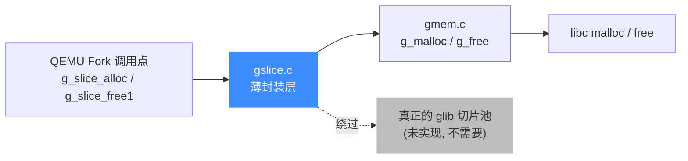
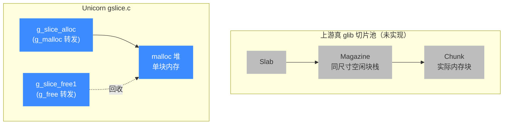

# g_slice 切片分配器

> 🧩 `glib_compat/gslice.c` 把 glib 的切片分配器（slice allocator）收窄成 `g_malloc`/`g_free` 的薄封装。本页讲它提供了哪些函数、为什么 Unicorn 不需要真正的切片池。读完你会知道引擎里每处 `g_slice_alloc` 最终落在哪。

## 📌 概述

上游 glib 的 `g_slice_*` 是一套**面向固定大小小块的快速并发分配器**：内部维护按尺寸分桶的空闲链表杂志（magazine），避免反复敲 `malloc`/`free`，常用于频繁创建销毁的同型对象（如 `GList` 节点、临时节点）。QEMU Fork 里大量地方按 glib 习惯写了 `g_slice_alloc(sizeof(SomeStruct))`。

Unicorn 的 `glib_compat` 不需要那套复杂的池化机制——它把每个 `g_slice_*` 调用**直接转交给 `gmem.c` 里的 `g_malloc` / `g_free`**，即标准 C 堆分配。签名与语义保持一致，调用方代码不用改一行。



## 🔧 提供的函数

`gslice.c` 仅导出三个函数，签名与上游 glib 完全一致：

| 函数 | 原型 | 语义 |
| --- | --- | --- |
| `g_slice_alloc` | `gpointer g_slice_alloc(gsize mem_size)` | 分配 `mem_size` 字节，返回至少 `sizeof(void*)` 对齐的指针；`mem_size == 0` 时返回 `NULL`。内部即 `g_malloc(mem_size)`。 |
| `g_slice_alloc0` | `gpointer g_slice_alloc0(gsize mem_size)` | 等同 `g_slice_alloc`，并把返回的内存清零（`memset(..., 0, mem_size)`）。 |
| `g_slice_free1` | `void g_slice_free1(gsize mem_size, gpointer mem_block)` | 释放 `g_slice_alloc` / `g_slice_alloc0` 返回的块；`mem_block == NULL` 时什么也不做。内部即 `g_free(mem_block)`。 |

::: warning 参数一致性
上游 glib 要求 `g_slice_free1` 的 `mem_size` 必须与分配时一致，否则可能命中不同尺寸的杂志桶。本实现里 `mem_size` 仅用于满足签名契约，**实际释放逻辑忽略它**——因为底层就是普通 `free`，不需要按桶回收。但调用方仍应保持传相同值，以便日后若换回真 glib 不出问题。
:::

## 💻 用法示例

QEMU Fork 里这类写法随处可见，例如分配一个链表节点结构：

```c
#include "gslice.h"

typedef struct {
    int       key;
    void     *data;
} MyNode;

MyNode *node = g_slice_alloc0(sizeof(MyNode));   // 分配并清零
node->key  = 42;
node->data = (void *)0xdeadbeef;

/* ... 使用 node ... */

g_slice_free1(sizeof(MyNode), node);             // 释放，mem_size 与分配时相同
node = NULL;
```

等价于下面的纯 `g_malloc` 写法——这正是 `gslice.c` 内部做的事：

```c
MyNode *node = g_malloc0(sizeof(MyNode));
/* ... */
g_free(node);
```

## 🔧 实现要点

整个文件去掉注释只剩三行函数体，核心就是把 slice 语义折叠回普通 malloc：

```c
// glib_compat/gslice.c
gpointer g_slice_alloc (gsize mem_size) {
    return g_malloc (mem_size);
}

gpointer g_slice_alloc0 (gsize mem_size) {
    gpointer mem = g_slice_alloc (mem_size);
    if (mem) memset (mem, 0, mem_size);
    return mem;
}

void g_slice_free1 (gsize mem_size, gpointer mem_block) {
    g_free (mem_block);
}
```

- **无全局状态**：真 glib 的切片池有 per-thread 杂志、锁、缓存配额等复杂状态；本实现没有任何静态变量，天然线程安全（线程安全性继承自底层 `malloc`/`free`）。
- **无环境变量开关**：上游支持 `G_SLICE=always-malloc` 强制走 malloc 路径、`G_DEBUG=gc-friendly` 改变释放行为。本实现**始终**走 malloc，这些开关被静默忽略，文档里提到的环境变量不再生效。
- **对齐保证**：返回指针的对齐由 `g_malloc`（即 `malloc`）决定，满足上游承诺的「至少 `sizeof(void*)` 对齐」。

## 📖 数据结构节点关系

由于本实现不做池化，所谓「数据结构」只剩「调用方持有的内存块」与「底层 C 堆」一条边。下图把它和上游真切片池的结构对照出来，帮助理解被省略掉的部分：



## ⚠️ 注意

- **不是性能优化**：真切片池的价值在于高频小对象场景下减少 `malloc` 开销。Unicorn 直接转发给 `malloc`，**放弃了这部分性能优势**，换取实现简单与零外部依赖。对模拟器主循环（翻译块、TLB、寄存器）而言，热点不在 slice 分配上，这点开销可忽略。
- **不要依赖池化语义**：上游 glib 中，同一尺寸反复 `g_slice_alloc`/`g_slice_free1` 可能复用同一块内存（地址可预测）。本实现每次都过 `malloc`，**不保证地址复用**。若有代码依赖该副作用（极少见），会行为不一致。
- **`mem_size` 仅作契约**：如上所述，`g_slice_free1` 的尺寸参数不被使用，但仍应传分配时的值，保持与上游签名契约一致。

::: tip 为什么不直接用系统 glib？
Unicorn 的目标平台包括 Windows（MSVC/MinGW）、Android NDK、各类嵌入式交叉编译环境，以及「静态链接成一个 `libunicorn`」的发布形态。系统 glib 在这些场景下要么不存在、要么版本飘忽、要么拖入一整套 GLib 运行时依赖（线程、代理、字符串校验等），与「轻量纯 C 模拟器框架」的定位冲突。把 `g_slice_*` 等用到的那点 API 在 `glib_compat/` 里薄封装一份，既保留了 QEMU 上游调用习惯，又做到**零外部 glib 依赖、单库自包含**。这是引擎整体策略，不止 slice——`GHashTable`、`GTree`、`GArray` 等都走同一路径，详见 [glib_compat 兼容层](/internals/glib-compat)。
:::

## 相关页面

- [glib_compat 兼容层](/internals/glib-compat)
- [内置 QEMU Fork](/internals/qemu-fork)
