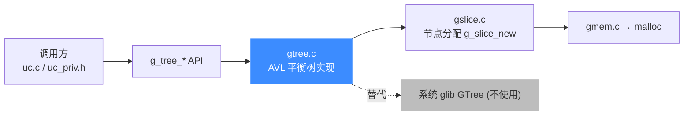
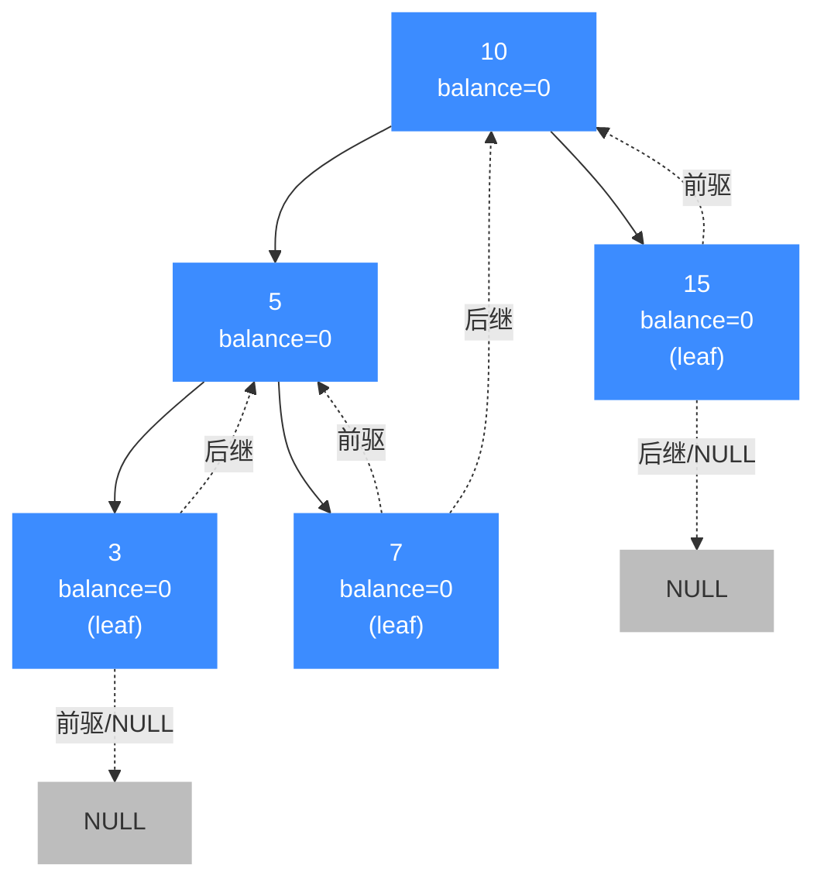

# g_tree 平衡二叉树

> 🧩 `glib_compat/gtree.c` 是 Unicorn 内置的一份 AVL 风格平衡二叉搜索树（`GTree`）实现，裁剪自 glib 2.64.4。本页讲它提供了哪些函数、节点怎么组织、以及引擎里哪里用到了它。读完你会知道 `uc->ctl_exits` 那棵停止地址集合树是怎么运转的。

## 📌 概述

上游 glib 的 `GTree` 是一个**按 key 排序的 key/value 集合**，底层是一棵自平衡二叉搜索树：插入/删除时通过旋转维持「左右子树高度差不超过 1」，从而保证查找、插入、删除都是 O(log n)。QEMU Fork 里有几处按 glib 习惯写了 `g_tree_*` 调用，最典型的是 Unicorn 自己在 `uc_struct` 里维护的 `ctl_exits`（`uc_emu_start(..., until=addr)` 的停止地址集合）。

Unicorn 的 `glib_compat/gtree.c` 把这套 API **原样实现一份**塞进引擎，与 `glib_compat/` 里的 `GHashTable`、`GArray` 等并列，让内置 QEMU Fork 不必链接系统 glib。和 `gslice.c` 那种「薄封装转交 malloc」不同，`gtree.c` 是**真平衡树实现**——旋转、回溯路径、balance 因子全在，没有偷工减料。



## 🧱 数据结构

`GTree` 与 `GTreeNode` 都是私有结构，调用方只拿到 `GTree *` 不透明指针。两个字段值得记住：`balance` 是「右子树高度 − 左子树高度」，取值 `{-2,-1,0,1,2}`，超出即触发旋转；`left_child` / `right_child` 标记左右指针是否指向真实子节点（threaded AVL 的标志——叶子节点的 `left`/`right` 可指向前驱/后继而非 NULL，用于 O(1) 中序遍历推进）。

```c
// glib_compat/gtree.c
struct _GTree {
    GTreeNode        *root;
    GCompareDataFunc  key_compare;        // qsort 风格比较函数
    GDestroyNotify    key_destroy_func;   // 删节点时释放 key
    GDestroyNotify    value_destroy_func; // 删节点时释放 value
    gpointer          key_compare_data;   // 传给比较函数的 user_data
    guint             nnodes;             // 节点总数
    gint              ref_count;          // 引用计数
};

struct _GTreeNode {
    gpointer   key;
    gpointer   value;
    GTreeNode *left;        // 左子树（或前驱）
    GTreeNode *right;       // 右子树（或后继）
    gint8      balance;     // height(right) - height(left)
    guint8     left_child;  // left 是否为真实子节点
    guint8     right_child; // right 是否为真实子节点
};
```

## 📊 节点关系

下图展示一棵插入 `10 / 5 / 15 / 3 / 7` 后的平衡树：实线是父子关系（`*_child = TRUE`），虚线是 threaded 指针（叶子节点的 `left`/`right` 指向中序前驱/后继）。每个节点旁标 `balance` 值。



插入导致某条路径变高时，`g_tree_insert_internal` 沿记录的 `path[]` 回溯，对 `balance` 偏移 ±1，一旦某节点 `balance` 跌出 `{-1,0,1}` 就调用 `g_tree_node_balance` 做单旋/双旋重平衡。

## 🔧 提供的函数

`gtree.c` 导出的全部 `g_` 开头函数（签名与上游 glib 一致）：

| 函数 | 原型 | 语义 |
| --- | --- | --- |
| `g_tree_new` | `GTree *g_tree_new(GCompareFunc key_compare_func)` | 用无 user_data 的比较函数创建空树。内部转发到 `g_tree_new_full`。 |
| `g_tree_new_with_data` | `GTree *g_tree_new_with_data(GCompareDataFunc key_compare_func, gpointer key_compare_data)` | 创建带 user_data 的比较函数的树，无销毁回调。 |
| `g_tree_new_full` | `GTree *g_tree_new_full(GCompareDataFunc key_compare_func, gpointer key_compare_data, GDestroyNotify key_destroy_func, GDestroyNotify value_destroy_func)` | 完整构造：比较函数 + user_data + key/value 销毁回调。`ref_count=1`。 |
| `g_tree_ref` | `GTree *g_tree_ref(GTree *tree)` | 引用计数 +1，返回 `tree`。 |
| `g_tree_unref` | `void g_tree_unref(GTree *tree)` | 引用计数 −1；归零时 `g_tree_remove_all` + `g_slice_free` 释放树本体。 |
| `g_tree_destroy` | `void g_tree_destroy(GTree *tree)` | 等价 `g_tree_unref`（兼容旧 API）。 |
| `g_tree_insert` | `void g_tree_insert(GTree *tree, gpointer key, gpointer value)` | 插入 key/value；key 已存在时**保留旧 key**、替换 value（旧 value 走销毁回调）。 |
| `g_tree_replace` | `void g_tree_replace(GTree *tree, gpointer key, gpointer value)` | 同 `g_tree_insert`，但 key 已存在时**用新 key 替换旧 key**（旧 key 走销毁回调）。 |
| `g_tree_remove` | `gboolean g_tree_remove(GTree *tree, gconstpointer key)` | 删除指定 key 的节点并重平衡；命中返回 `TRUE`。 |
| `g_tree_steal` | `gboolean g_tree_steal(GTree *tree, gconstpointer key)` | 同 `g_tree_remove` 但**不调用** key/value 销毁回调（调用方接管内存）。 |
| `g_tree_remove_all` | `void g_tree_remove_all(GTree *tree)` | 清空所有节点（触发销毁回调），`root = NULL, nnodes = 0`。 |
| `g_tree_lookup` | `gpointer g_tree_lookup(GTree *tree, gconstpointer key)` | 按 key 查找，返回对应 value；未命中返回 `NULL`。 |
| `g_tree_lookup_extended` | `gboolean g_tree_lookup_extended(GTree *tree, gconstpointer lookup_key, gpointer *orig_key, gpointer *value)` | 查找并回传原始 key 与 value 指针；命中返回 `TRUE`。 |
| `g_tree_foreach` | `void g_tree_foreach(GTree *tree, GTraverseFunc func, gpointer user_data)` | 按 key 升序（中序）遍历，`func` 返回 `TRUE` 即停止。**遍历中不可增删节点**。 |
| `g_tree_traverse` | `void g_tree_traverse(GTree *tree, GTraverseFunc traverse_func, GTraverseType traverse_type, gpointer user_data)` | 按 `G_PRE_ORDER` / `G_IN_ORDER` / `G_POST_ORDER` 遍历（`G_LEVEL_ORDER` 未实现）。上游已废弃，推荐用 `g_tree_foreach`。 |
| `g_tree_search` | `gpointer g_tree_search(GTree *tree, GCompareFunc search_func, gconstpointer user_data)` | 用比较函数搜索：返回 0 命中、−1 走左、+1 走右；返回命中 value。 |
| `g_tree_height` | `gint g_tree_height(GTree *tree)` | 树高；空树 0、仅根 1。内部沿 `left_child` 下行累加 `1 + max(balance,0)`。 |
| `g_tree_nnodes` | `gint g_tree_nnodes(GTree *tree)` | 返回 `tree->nnodes`，O(1)。 |

## 💻 用法示例

引擎里最直接的用例是 `uc->ctl_exits`——`uc_emu_start(..., until=addr)` 注册的停止地址集合。`uc.c` 在 `uc_init` 时建树，`uc_priv.h` 内联地插/查：

```c
// uc.c —— 建树，比较函数 uc_exits_cmp 比较 uint64_t，key 用 g_free 释放
uc->ctl_exits = g_tree_new_full(uc_exits_cmp, NULL, g_free, NULL);

// include/uc_priv.h —— 注册一个停止地址
static inline void uc_add_exit(uc_engine *uc, uint64_t addr) {
    uint64_t *new_exit = g_malloc(sizeof(uint64_t));
    *new_exit = addr;
    g_tree_insert(uc->ctl_exits, (gpointer)new_exit, (gpointer)1);
}

// include/uc_priv.h —— 运行时判断当前 PC 是否命中停止集合
static inline bool uc_is_exit(uc_engine *uc, uint64_t addr) {
    return g_tree_lookup(uc->ctl_exits, (gpointer)(&addr)) == (gpointer)1;
}
```

`uc_ctl` 接口暴露退出地址列表时，则用 `g_tree_nnodes` 拿总数、`g_tree_foreach` 按升序遍历收集、最后 `g_tree_remove_all` 清空：

```c
// uc.c（节选）
*exits_cnt = g_tree_nnodes(uc->ctl_exits);
if (cnt < g_tree_nnodes(uc->ctl_exits)) { /* 缓冲区不够 */ }
g_tree_foreach(uc->ctl_exits, uc_read_exit_iter, (void *)&req);
/* ... 写回用户缓冲区后 ... */
g_tree_remove_all(uc->ctl_exits);
```

销毁引擎时一句 `g_tree_destroy(uc->ctl_exits)` 即递归释放所有节点（每个 key 走 `g_free`）与树本体。

## 🔧 实现要点

- **AVL 风格自平衡**：每个节点存 `balance = h(right) − h(left)`。`g_tree_insert_internal` 用一个 `path[MAX_GTREE_HEIGHT]` 数组（`MAX_GTREE_HEIGHT = 40`，足以容纳约 10⁹ 个节点）记录从根到插入点的路径，插入后沿路径回溯调 `g_tree_node_balance`，按四种失衡形态做单旋/双旋。删除走 `g_tree_remove_internal` 的对称逻辑。
- **threaded 树线索化**：叶子节点的 `left`/`right` 即便 `*_child = FALSE` 也不为 NULL，而是指向中序前驱/后继。`g_tree_first_node` / `g_tree_node_next` 利用这点做 O(1) 中序推进，`g_tree_foreach` 的循环正是这么写的。
- **节点内存**：`GTreeNode` 经 `g_slice_new` 分配，落到底层就是 `g_malloc`（见 [g_slice 切片分配器](/internals/glib-compat-gslice)），无独立内存池。
- **引用计数**：`ref_count` 初始 1，`g_tree_ref`/`g_tree_unref` 配对；归零才真正释放，允许调用方共享同一棵树。
- **比较函数可带 user_data**：`GCompareDataFunc` 签名为 `cmp(a, b, user_data)`，第三参数来自 `tree->key_compare_data`，由 `g_tree_new_full` 设定。

## ⚠️ 注意

- **遍历中不可增删**：`g_tree_foreach` / `g_tree_traverse` 依赖 threaded 指针稳定，遍历期间 `g_tree_insert` / `g_tree_remove` 会破坏线索，行为未定义。需要按条件批量删除时，先在 `GTraverseFunc` 里把待删 key 收集进一个 `GArray`，遍历结束再逐个 `g_tree_remove`。
- **`g_tree_traverse` 的 `G_LEVEL_ORDER` 未实现**：源码里该分支是空 + 注释掉的 `g_warning`，传它会静默无效。需要层序遍历请改用自维护队列，或干脆换数据结构。
- **`g_tree_lookup` 用 `NULL` 表示未命中**：若你存入的合法 value 就是 `NULL`，无法与「未命中」区分。这种情况改用 `g_tree_lookup_extended`，它返回 `gboolean` 表示是否命中。
- **key 生命周期**：`g_tree_new_full` 注册了 `key_destroy_func` 时，删除/替换节点会自动释放 key。Unicorn 的 `ctl_exits` 把 `g_free` 作为 key 销毁回调，因此 `uc_add_exit` 里 `g_malloc` 出来的 key 在 `g_tree_remove` / `g_tree_remove_all` / `g_tree_destroy` 时会被自动 `g_free`，调用方**不能再自己 free**。

::: tip 为什么不直接用系统 glib？
Unicorn 的目标平台横跨 Windows（MSVC/MinGW）、Android NDK、各类嵌入式交叉编译环境，以及「静态链接成单个 `libunicorn`」的发布形态。系统 glib 在这些场景下要么不存在、要么版本飘忽、要么拖入一整套 GLib 运行时依赖（线程、代理、字符串校验等），与「轻量纯 C 模拟器框架」的定位冲突。把 `GTree` 用到的那点 API 在 `glib_compat/gtree.c` 里完整重实现一份，既保留了 QEMU 上游调用习惯，又做到**零外部 glib 依赖、单库自包含**。这是引擎整体策略，不止 `GTree`——`GHashTable`、`GArray`、`GList`、`g_slice_*` 等都走同一路径，详见 [glib_compat 兼容层](/internals/glib-compat)。
:::

## 相关页面

- [glib_compat 兼容层](/internals/glib-compat)
- [内置 QEMU Fork](/internals/qemu-fork)
- [g_slice 切片分配器](/internals/glib-compat-gslice)
- [uc_struct 结构](/internals/uc-struct)
