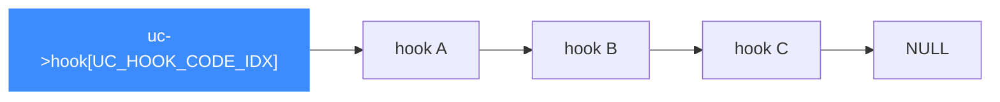

# list.c 链表工具

> 🔗 [`list.c`](https://github.com/android-security-engineer/unicorn-skills/blob/master/list.c) / [`include/list.h`](https://github.com/android-security-engineer/unicorn-skills/blob/master/include/list.h) 是 Unicorn 自研的一份**极简单向链表**，专门用来维护 Hook 链表等内部结构。它刻意不走 glib，追求最小开销与可预测的遍历顺序。本页讲它的结构与在 Hook 系统里的角色。

## 🧱 结构定义

链表由「表头 + 节点」两个结构组成，节点只存一个 `void *data` 和 `next` 指针；表头额外带一个可选的析构回调 `delete_fn`：

```c
// include/list.h
typedef void (*delete_fn)(void *data);

struct list_item {
    struct list_item *next;
    void *data;
};

struct list {
    struct list_item *head, *tail;
    delete_fn delete_fn;
};
```

[`struct list_item`](https://github.com/android-security-engineer/unicorn-skills/blob/master/include/list.h#L8) 在 [list.h:8](https://github.com/android-security-engineer/unicorn-skills/blob/master/include/list.h#L8)、[`struct list`](https://github.com/android-security-engineer/unicorn-skills/blob/master/include/list.h#L13) 在 [L13](https://github.com/android-security-engineer/unicorn-skills/blob/master/include/list.h#L13)、[`delete_fn`](https://github.com/android-security-engineer/unicorn-skills/blob/master/include/list.h#L6) 在 [L6](https://github.com/android-security-engineer/unicorn-skills/blob/master/include/list.h#L6)。它是**单向链表**（只有 `next`），但同时保存 `head` 和 `tail`，所以头插和尾插都是 O(1)。

## 🔧 API 一览

| 函数 | 行为 | 复杂度 |
| --- | --- | --- |
| [`list_new()`](https://github.com/android-security-engineer/unicorn-skills/blob/master/list.c#L7) | `calloc` 一个空表 | O(1) |
| [`list_insert(list, data)`](https://github.com/android-security-engineer/unicorn-skills/blob/master/list.c#L30) | 头插（插到最前） | O(1) |
| [`list_append(list, data)`](https://github.com/android-security-engineer/unicorn-skills/blob/master/list.c#L51) | 尾插（插到最后） | O(1) |
| [`list_remove(list, data)`](https://github.com/android-security-engineer/unicorn-skills/blob/master/list.c#L69) | 按数据指针查找并摘除，命中时调 `delete_fn` | O(n) |
| [`list_exists(list, data)`](https://github.com/android-security-engineer/unicorn-skills/blob/master/list.c#L101) | 是否存在某数据指针 | O(n) |
| [`list_clear(list)`](https://github.com/android-security-engineer/unicorn-skills/blob/master/list.c#L13) | 清空所有节点（对每个 data 调 `delete_fn`） | O(n) |

::: tip 头插 vs 尾插的用途
[`list_insert`](https://github.com/android-security-engineer/unicorn-skills/blob/master/list.c#L30) 头插用于「必须最先执行」的 Hook——例如指令计数 `count_hook`，`uc_emu_start` 里先置 `uc->hook_insert = 1`（[uc.c:1207](https://github.com/android-security-engineer/unicorn-skills/blob/master/uc.c#L1207)）再 `uc_hook_add`，保证它排在链表最前。默认 [`uc_hook_add`](https://github.com/android-security-engineer/unicorn-skills/blob/master/uc.c#L1908)（[uc.c:1908](https://github.com/android-security-engineer/unicorn-skills/blob/master/uc.c#L1908)）是 `list_append` 尾插。
:::

## 🪝 在 Hook 系统里的角色

`uc_struct` 为每种 Hook 类型各保存一条链表：

```c
// include/uc_priv.h
struct list hook[UC_HOOK_MAX];   // 每种 Hook 类型一条链表（[L362](https://github.com/android-security-engineer/unicorn-skills/blob/master/include/uc_priv.h#L362)）
struct list hooks_to_del;        // 延迟删除队列（[L363](https://github.com/android-security-engineer/unicorn-skills/blob/master/include/uc_priv.h#L363)）
```

遍历用 [`include/uc_priv.h`](https://github.com/android-security-engineer/unicorn-skills/blob/master/include/uc_priv.h) 的宏 [`HOOK_FOREACH`](https://github.com/android-security-engineer/unicorn-skills/blob/master/include/uc_priv.h#L242)（[L242](https://github.com/android-security-engineer/unicorn-skills/blob/master/include/uc_priv.h#L242)），就是在这份链表上走：

```c
#define HOOK_FOREACH(uc, hh, idx)                          \
    for (cur = (uc)->hook[idx##_IDX].head;                 \
         cur != NULL && ((hh) = (struct hook *)cur->data); \
         cur = cur->next)
```



::: warning 延迟删除
用户在回调里删 Hook 时，不能立即从正在遍历的链表里摘除，否则会破坏遍历。Unicorn 的做法是把 `to_delete` 置位、挪进 `hooks_to_del`，等安全时机再真正 `list_remove` 释放。`struct hook` 的 `refs` 引用计数配合此机制，因为同一 Hook 可能出现在多条链表里。
:::

## 📂 相关源码

| 文件 | 角色 |
|------|------|
| [`list.c`](https://github.com/android-security-engineer/unicorn-skills/blob/master/list.c) | `list_new` / `list_insert` / `list_append` / `list_remove` / `list_clear` 等实现 |
| [`include/list.h`](https://github.com/android-security-engineer/unicorn-skills/blob/master/include/list.h) | `struct list` / `struct list_item` / `delete_fn` 定义 |
| [`include/uc_priv.h`](https://github.com/android-security-engineer/unicorn-skills/blob/master/include/uc_priv.h) | `hook[UC_HOOK_MAX]` / `hooks_to_del` 字段、`HOOK_FOREACH` 宏 |
| [`uc.c`](https://github.com/android-security-engineer/unicorn-skills/blob/master/uc.c) | `uc_hook_add` 用 `list_insert`/`list_append` 维护 Hook 链表 |

## 相关页面

- [Hook 体系](/features/hooks)
- [uc_struct 结构](/internals/uc-struct)
- [glib_compat 兼容层](/internals/glib-compat)
- [cpu-exec 执行循环](/internals/cpu-exec)
