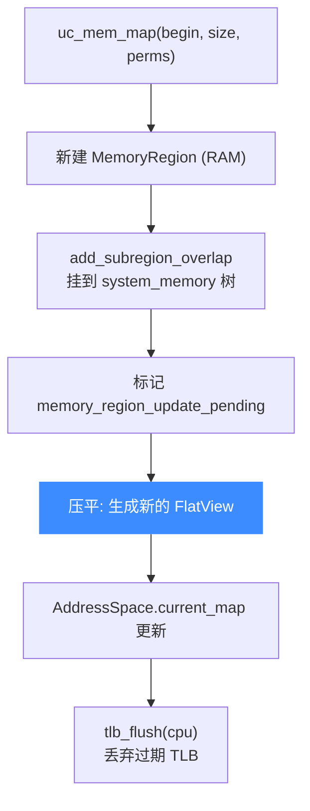

# MemoryRegion / FlatView

> 🧩 `MemoryRegion` 与 `FlatView` 是 Unicorn 从 QEMU 继承的内存模型。前者是「树形的内存区域描述」，后者是「压平后的、供 softmmu 快速查找的区间视图」。本页讲二者在 Unicorn 里的角色，以及一次 `uc_mem_map` 如何落进 `FlatView`。相关定义在 [`qemu/include/exec/memory.h`](https://github.com/android-security-engineer/unicorn-skills/blob/master/qemu/include/exec/memory.h)、[`qemu/softmmu/memory.c`](https://github.com/android-security-engineer/unicorn-skills/blob/master/qemu/softmmu/memory.c)。

## 🌳 MemoryRegion：树形描述

`MemoryRegion` 描述一段 guest 物理地址空间的一块区域——可以是 RAM、MMIO 或容器。它们组成一棵以 `uc->system_memory` 为根的树：

```c
// qemu/include/exec/memory.h（节选，[struct MemoryRegion](https://github.com/android-security-engineer/unicorn-skills/blob/master/qemu/include/exec/memory.h#L300) 在 L300）
struct MemoryRegion {
    bool ram;
    bool readonly;
    RAMBlock *ram_block;      // 真正的宿主内存
    const MemoryRegionOps *ops;  // MMIO 读写回调
    MemoryRegion *container;  // 父容器
    Int128 size;
    hwaddr addr;
    int32_t priority;         // 覆盖优先级（快照层级会用它）
    struct uc_struct *uc;
    uint32_t perms;           // UC_PROT_*
    hwaddr end;
};
```

`uc_mem_map()` 就是新建一个 RAM 型 `MemoryRegion`，用 [`memory_region_add_subregion_overlap`](https://github.com/android-security-engineer/unicorn-skills/blob/master/qemu/softmmu/memory.c#L56) 挂到 `system_memory` 树上：

```c
// qemu/softmmu/memory.c: memory_map()
memory_region_init_ram(uc, ram, size, perms);
memory_region_add_subregion_overlap(uc->system_memory, begin, ram,
                                     uc->snapshot_level);
```

## 🧾 FlatView：压平的查找视图

树形结构便于表达「重叠/优先级/容器」，但访存时需要快速回答「地址 X 落在哪块」。为此内存模型把 `MemoryRegion` 树**压平**成 `FlatView`——一组不重叠、已排序的 `FlatRange`：

```c
// qemu/include/exec/memory.h（[struct FlatView](https://github.com/android-security-engineer/unicorn-skills/blob/master/qemu/include/exec/memory.h#L441) 在 L441）
struct FlatView {
    unsigned ref;
    FlatRange *ranges;         // 排好序、互不重叠的区间数组
    unsigned nr;
    unsigned nr_allocated;
    struct AddressSpaceDispatch *dispatch;
    MemoryRegion *root;
};
```

每个 `AddressSpace`（如 `uc->address_space_memory`）持有一个「当前 FlatView」：

```c
static inline FlatView *address_space_to_flatview(AddressSpace *as) {
    return as->current_map;
}
```

[`address_space_to_flatview`](https://github.com/android-security-engineer/unicorn-skills/blob/master/qemu/include/exec/memory.h#L450) 定义于 [memory.h:450](https://github.com/android-security-engineer/unicorn-skills/blob/master/qemu/include/exec/memory.h#L450)。

## 🔁 从 map 到 FlatView 的落地



- [`uc->flat_views`](https://github.com/android-security-engineer/unicorn-skills/blob/master/include/uc_priv.h) 是一个 `GHashTable`（来自 [glib_compat](/internals/glib-compat)），按根区域缓存已构建的 FlatView，避免重复压平。
- 映射变化时置 `memory_region_update_pending`，随后重建 FlatView 并刷 TLB。
- `flatview_copy` 函数指针（[`uc_flatview_copy_t`](https://github.com/android-security-engineer/unicorn-skills/blob/master/include/uc_priv.h#L117)，定义于 [uc_priv.h:117](https://github.com/android-security-engineer/unicorn-skills/blob/master/include/uc_priv.h#L117)）用于快照场景下复制视图，见 [快照与 COW 实现](/internals/snapshot-impl)。

::: tip GPA→HVA 就发生在这里
softmmu 把 guest 物理地址翻成宿主地址时，正是靠 FlatView 找到对应 `MemoryRegion` 及其 `ram_block`，再算出宿主指针。见 [softmmu 软件 MMU](/internals/softmmu)。
:::

## 📂 相关源码

| 文件 | 角色 |
|------|------|
| [`qemu/include/exec/memory.h`](https://github.com/android-security-engineer/unicorn-skills/blob/master/qemu/include/exec/memory.h) | `MemoryRegion` / `FlatView` / `FlatRange` 与 `address_space_to_flatview` 定义 |
| [`qemu/softmmu/memory.c`](https://github.com/android-security-engineer/unicorn-skills/blob/master/qemu/softmmu/memory.c) | `memory_map` 等后端、`memory_region_add_subregion_overlap`、FlatView 压平 |
| [`include/uc_priv.h`](https://github.com/android-security-engineer/unicorn-skills/blob/master/include/uc_priv.h) | `uc_flatview_copy_t` typedef、`flat_views` / `address_space_memory` 字段 |
| [`uc.c`](https://github.com/android-security-engineer/unicorn-skills/blob/master/uc.c) | `uc_mem_map` 公共 API 转调后端、快照场景调 `flatview_copy` |

## 相关页面

- [softmmu 软件 MMU](/internals/softmmu)
- [快照与 COW 实现](/internals/snapshot-impl)
- [内存模型总览](/memory/overview)
- [glib_compat 兼容层](/internals/glib-compat)
