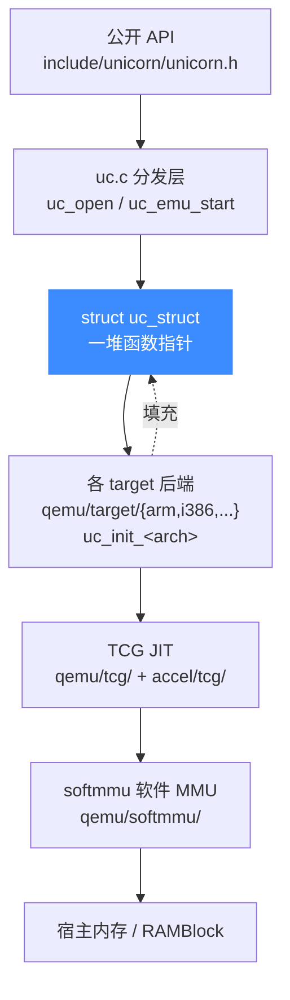

# 内部实现总览

> 🧠 本页鸟瞰 Unicorn 的整体分层：一层瘦瘦的 C API（`uc.c`）、一份内置改造版 QEMU（`qemu/`）、以及一套替代系统 glib 的兼容层（`glib_compat/`）。读完你会知道「一次 `uc_emu_start()` 调用」在源码里到底穿过了哪些层。

## 🧩 三大组成部分

Unicorn 不是从零写的模拟器，而是把 QEMU 的 TCG 动态翻译引擎「掏空外壳、库化」后，套上一层架构中立的 C API。整个引擎可以拆成三块：

| 层 | 位置 | 职责 |
| --- | --- | --- |
| 瘦 C API 层 | `uc.c`、`list.c`、`include/uc_priv.h` | 对外暴露 `uc_open` / `uc_emu_start` / `uc_reg_*` / `uc_hook_*`，把调用转发给后端 |
| 内置 QEMU Fork | `qemu/`（`tcg/`、`accel/tcg/`、`softmmu/`、`target/*`） | 动态二进制翻译（JIT）、软件 MMU、各架构 CPU 语义 |
| glib 兼容层 | `glib_compat/` | 提供 `GHashTable` / `GArray` / `GTree` 等最小实现，去掉对系统 glib 的依赖 |

## 🏗️ 分层架构图



关键在于中间那层 **`struct uc_struct`**：它不是普通的状态结构，而是一张「函数指针表」。`uc_open()` 根据架构挑好一个 `uc_init_<arch>`，由后端把 `reg_read`、`mem_map`、`gen_tb`、`set_tlb` 等指针一次性填好，之后 API 全靠这些指针分发——热路径上没有 `switch (arch)`。

## 📥 一次调用的真实路径

以 `include/uc_priv.h` 中的结构为例，`uc_emu_start()` 的核心只是调用了后端填好的 `vm_start`：

```c
// uc.c: uc_emu_start() 结尾
uc->vm_start(uc);   // 进入 QEMU 主循环 cpu_exec()
```

而 `vm_start`、`uc_gen_tb`、`set_tlb` 这些字段都定义在 `struct uc_struct`（`include/uc_priv.h`）里，由架构后端在 `uc_init_<arch>` 时赋值。

::: tip 从哪读起
如果你想顺着源码读一遍，推荐顺序：本页 → [uc.c 分发层](/internals/uc-dispatch) → [uc_struct 结构](/internals/uc-struct) → [函数指针后端](/internals/function-pointers) → [TCG 翻译流水线](/internals/tcg-pipeline) → [cpu-exec 执行循环](/internals/cpu-exec)。
:::

::: warning 这是「改造版」QEMU，不是原版
`qemu/` 目录里的代码源自 QEMU，但被 Unicorn 深度裁剪与库化：去掉了设备模型、命令行与主循环，把全局状态收进 `uc_struct`，并用 `glib_compat/` 替换系统 glib。因此别拿上游 QEMU 的文件结构直接对号入座，以本仓库为准。详见 [内置 QEMU Fork](/internals/qemu-fork)。
:::

## 🗂️ 本区页面索引

- 分发与结构：[uc.c 分发层](/internals/uc-dispatch)、[uc_struct 结构](/internals/uc-struct)、[函数指针后端](/internals/function-pointers)
- QEMU 引擎：[内置 QEMU Fork](/internals/qemu-fork)、[TCG 翻译流水线](/internals/tcg-pipeline)、[translate-all 翻译块](/internals/translate-all)、[cpu-exec 执行循环](/internals/cpu-exec)
- 内存与地址：[softmmu 软件 MMU](/internals/softmmu)、[TLB 与地址翻译](/internals/tlb)、[MemoryRegion / FlatView](/internals/memory-api)、[快照与 COW 实现](/internals/snapshot-impl)
- 工具与构建：[glib_compat 兼容层](/internals/glib-compat)、[list.c 链表工具](/internals/list)、[CMake 构建系统](/internals/build-system)

## 相关页面

- [架构总览](/guide/architecture)
- [JIT 与动态翻译](/features/jit)
- [内存模型总览](/memory/overview)
- [uc_struct 结构](/internals/uc-struct)
