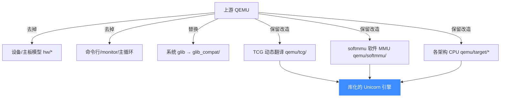

# 内置 QEMU Fork

> 🔧 Unicorn 并不依赖系统安装的 QEMU，而是在 [`qemu/`](https://github.com/android-security-engineer/unicorn-skills/blob/master/qemu/) 目录内**内置了一份深度改造的 QEMU 源码**。本页讲清为什么要 fork、改了哪些地方、以及 `qemu/target/*` 的布局。

## 🧩 为什么 fork 而不是链接系统 QEMU

QEMU 原本是一个「完整系统模拟器 / 用户态模拟器」的可执行程序，带有设备模型、命令行、主循环、系统 glib 依赖等。Unicorn 想要的只是其中的**动态翻译内核**（TCG + softmmu + 各架构 CPU 语义），并且要作为**一个进程内的库**被反复创建 / 销毁。这与 QEMU「一个进程模拟一台机器」的假设冲突，因此必须 fork 并改造。



## ✂️ 改了什么

| 改造 | 说明 |
| --- | --- |
| 去系统层 | 删掉可执行入口、monitor、大部分 `hw/` 设备模型；`qemu/softmmu/vl.c` 被大幅简化为库初始化 |
| 单进程库化 | 所有原本的全局状态收进 `struct uc_struct`，可在一个进程里并存多个引擎实例 |
| 去全局单例 | 大量原本依赖 `current_cpu`、全局 `TCGContext` 的代码改为通过 `uc->cpu`、`uc->tcg_ctx` 访问 |
| glib 兼容层 | 用 [`glib_compat/`](https://github.com/android-security-engineer/unicorn-skills/blob/master/glib_compat/glib_compat.h) 替代系统 glib，见 [glib_compat 兼容层](/internals/glib-compat) |
| Unicorn 胶水 | 每个架构目录下新增 `unicorn.c` / `unicorn.h`，实现 `uc_init_<arch>` 并填充函数指针 |

::: tip 如何辨认 Unicorn 的改动
QEMU 树里以 `unicorn*.c` / `unicorn*.h` 命名的文件都是 Unicorn 特有的胶水层。`format.sh` 也只格式化这些文件，不动其余 vendored QEMU 代码。
:::

## 🗂️ qemu/target/* 布局

每种架构一个子目录，含 CPU 定义、寄存器语义、以及把 guest 指令翻译成 TCG IR 的 `translate*.c`：

```
qemu/target/
├── arm/      translate.c / translate-a64.c / cpu.c / unicorn*.c
├── i386/     translate.c / unicorn.c / unicorn.h
├── mips/     ...
├── ppc/  riscv/  s390x/  sparc/  m68k/  tricore/
```

以 i386 为例，[`qemu/target/i386/unicorn.c`](https://github.com/android-security-engineer/unicorn-skills/blob/master/qemu/target/i386/unicorn.c#L2073) 里的 [`uc_init`](https://github.com/android-security-engineer/unicorn-skills/blob/master/qemu/target/i386/unicorn.c#L2073)（[L2073](https://github.com/android-security-engineer/unicorn-skills/blob/master/qemu/target/i386/unicorn.c#L2073)，经 [`qemu/x86_64.h`](https://github.com/android-security-engineer/unicorn-skills/blob/master/qemu/x86_64.h) 的宏 `#define uc_init uc_init_x86_64` 暴露为 `uc_init_x86_64`）——它就是 [uc.c 分发层](/internals/uc-dispatch) 里 `uc->init_arch` 指向的那个函数，负责创建 CPU、注册 `reg_read`/`reg_write`/`memory_map` 等函数指针。

## 🏗️ 与构建的关系

每种架构被编译成**独立的目标文件集合**，带各自的预处理宏（如 `-DUNICORN_HAS_X86`）与 target 定义，最后一起链接进单个 `libunicorn`。这就是为什么 `UNICORN_ARCH` 同时决定「编译时间」和「哪些 `uc_init_*` 符号存在」。详见 [CMake 构建系统](/internals/build-system)。

## 📂 相关源码

| 文件 | 角色 |
|------|------|
| [`qemu/`](https://github.com/android-security-engineer/unicorn-skills/blob/master/qemu/) | 内置的深度改造 QEMU 源码树 |
| [`qemu/target/<arch>/unicorn.c`](https://github.com/android-security-engineer/unicorn-skills/blob/master/qemu/target/i386/unicorn.c) | 各架构胶水层：`uc_init_<arch>` 填函数指针（i386 示例） |
| [`qemu/softmmu/vl.c`](https://github.com/android-security-engineer/unicorn-skills/blob/master/qemu/softmmu/vl.c) | 简化为库初始化的 QEMU 主入口 |
| [`glib_compat/`](https://github.com/android-security-engineer/unicorn-skills/blob/master/glib_compat/glib_compat.h) | 替代系统 glib 的最小实现 |
| [`qemu/tcg/`](https://github.com/android-security-engineer/unicorn-skills/blob/master/qemu/tcg/tcg.c) | 保留并改造的 TCG 动态翻译内核 |
| [`qemu/softmmu/`](https://github.com/android-security-engineer/unicorn-skills/blob/master/qemu/softmmu/memory.c) | 保留并改造的 softmmu 软件 MMU |

## 相关页面

- [TCG 翻译流水线](/internals/tcg-pipeline)
- [glib_compat 兼容层](/internals/glib-compat)
- [CMake 构建系统](/internals/build-system)
- [架构总览](/guide/architecture)
