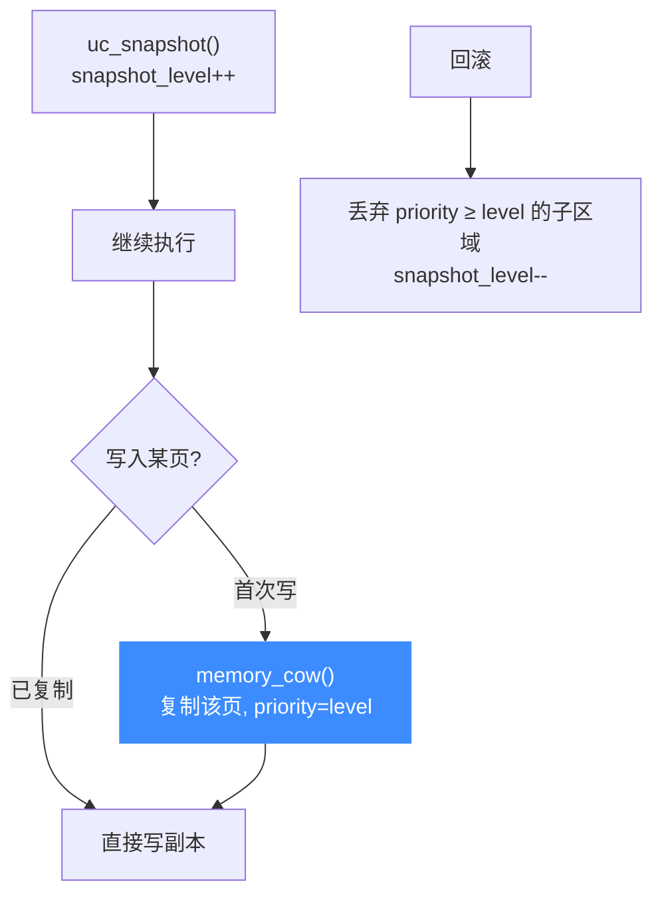

# 快照与 COW 实现

> 🧠 Unicorn 支持在模拟过程中「打快照 / 回滚」，底层靠**分层的写时复制（COW）** 与 `uc_context` 结合实现。本页讲 `snapshot_level`、`memory_cow`、以及 `uc_context_save/restore` 如何在底层保存与恢复内存与 CPU 状态。相关代码在 [`uc.c`](https://github.com/android-security-engineer/unicorn-skills/blob/master/uc.c) 与 [`qemu/softmmu/memory.c`](https://github.com/android-security-engineer/unicorn-skills/blob/master/qemu/softmmu/memory.c)。

## 🎯 核心思路：层级 + COW

Unicorn 不在快照时立刻复制整块内存，而是维护一个**快照层级** `uc->snapshot_level`（`int32_t`，见 [uc_priv.h:430](https://github.com/android-security-engineer/unicorn-skills/blob/master/include/uc_priv.h#L430)）。每打一次快照，层级 +1；此后对某页的**首次写入**才触发该页的 COW，把原页复制一份叠在更高优先级的层上。回滚时丢弃高于目标层级的所有子区域即可。



[`uc_snapshot`](https://github.com/android-security-engineer/unicorn-skills/blob/master/uc.c#L2990)（[uc.c:2990](https://github.com/android-security-engineer/unicorn-skills/blob/master/uc.c#L2990)）本身极简，只是抬升层级（到 `INT32_MAX` 返回资源错误）：

```c
// uc.c: uc_snapshot()
if (uc->snapshot_level == INT32_MAX) return UC_ERR_RESOURCE;
uc->snapshot_level++;
return UC_ERR_OK;
```

## 🧬 memory_cow：写时复制一页

当有快照层存在且写命中低层区域时，`uc.c` 在映射查找处调用 `uc->memory_cow`（[uc.c:979](https://github.com/android-security-engineer/unicorn-skills/blob/master/uc.c#L979)）：

```c
// uc.c（节选）
if (uc->snapshot_level && uc->snapshot_level > mr->priority) {
    mr = uc->memory_cow(uc, mr, address & ~align, ...);
}
```

[`memory_cow`](https://github.com/android-security-engineer/unicorn-skills/blob/master/qemu/softmmu/memory.c#L97)（`qemu/softmmu/memory.c`，[L97](https://github.com/android-security-engineer/unicorn-skills/blob/master/qemu/softmmu/memory.c#L97)）新建一块 RAM，把原内容 memcpy 过来，以**当前 `snapshot_level` 为 priority** 叠加为子区域，并刷新受影响页的 TLB：

```c
// qemu/softmmu/memory.c: memory_cow()
memory_region_init_ram(uc, ram, size, current->perms);
memcpy(ramblock_ptr(ram->ram_block, 0),
       ramblock_ptr(current->ram_block, current_offset), size);
memory_region_add_subregion_overlap(current->container, offset, ram,
                                     uc->snapshot_level);   // 高优先级覆盖
for (addr = ram->addr; ...) tlb_flush_page(uc->cpu, addr);
```

高 `priority` 的子区域会**覆盖**低层同地址内容，于是「读」自然读到最新副本，而底层原页保持不变，用于回滚。

## 💾 uc_context：把状态装进壳

[`uc_context_save()`](https://github.com/android-security-engineer/unicorn-skills/blob/master/uc.c#L2277)（[uc.c:2277](https://github.com/android-security-engineer/unicorn-skills/blob/master/uc.c#L2277)） / [`uc_context_restore()`](https://github.com/android-security-engineer/unicorn-skills/blob/master/uc.c#L2561)（[uc.c:2561](https://github.com/android-security-engineer/unicorn-skills/blob/master/uc.c#L2561)）保存/恢复的不只是 CPU 寄存器。`struct uc_context`（[`include/uc_priv.h`](https://github.com/android-security-engineer/unicorn-skills/blob/master/include/uc_priv.h#L438)，[L438](https://github.com/android-security-engineer/unicorn-skills/blob/master/include/uc_priv.h#L438)）记录：

| 字段 | 含义 |
| --- | --- |
| `context_size` | 内部上下文结构大小 |
| `mode` / `arch` | 上下文所属模式/架构 |
| `snapshot_level` | 要恢复到的内存快照层级 |
| `ramblock_freed` / `last_block` | ramblock 链表状态 |
| `fv` | 当前 FlatView 的副本 |
| `data[0]` | 变长的真实 CPU 上下文 |

若开启了内存快照内容（`UC_CTL_CONTEXT_MEMORY`），保存时会用 [`flatview_copy`](https://github.com/android-security-engineer/unicorn-skills/blob/master/uc.c#L2289)（[uc.c:2289](https://github.com/android-security-engineer/unicorn-skills/blob/master/uc.c#L2289)）复制当前视图并 `uc_snapshot()` 抬层；再按 `UC_CTL_CONTEXT_CPU` 决定是否 memcpy CPU 状态或调后端 `context_save`：

```c
// uc.c: 保存内存快照部分
uc->flatview_copy(uc, context->fv, uc->address_space_memory.current_map, false);
ret = uc_snapshot(uc);
context->snapshot_level = uc->snapshot_level;
// CPU 部分
if (!uc->context_save)
    memcpy(context->data, uc->cpu->env_ptr, context->context_size);
else
    ret = uc->context_save(uc, context);
```

::: tip 层级恢复
恢复时 [`uc_restore_latest_snapshot`](https://github.com/android-security-engineer/unicorn-skills/blob/master/uc.c#L2999)（`uc.c`，[L2999](https://github.com/android-security-engineer/unicorn-skills/blob/master/uc.c#L2999)）遍历子区域，**卸载 priority ≥ 当前层级的区域**、把之前 moveout 的区域 movein 回来，最后 `snapshot_level--`，即回到上一层。
:::

::: warning 与 uc_context 的关系
`uc_context` 主要面向「CPU 寄存器上下文」的快速保存/恢复；内存快照层是可选叠加（由 `context_content` 控制）。二者组合才能完整回滚「寄存器 + 内存」。
:::

## 📂 相关源码

| 文件 | 角色 |
|------|------|
| [`uc.c`](https://github.com/android-security-engineer/unicorn-skills/blob/master/uc.c) | `uc_snapshot` / `uc_restore_latest_snapshot` / `uc_context_save` / `uc_context_restore`，写命中时调 `memory_cow` |
| [`qemu/softmmu/memory.c`](https://github.com/android-security-engineer/unicorn-skills/blob/master/qemu/softmmu/memory.c) | `memory_cow` 写时复制一页、`memory_region_add_subregion_overlap` 按层级叠加 |
| [`include/uc_priv.h`](https://github.com/android-security-engineer/unicorn-skills/blob/master/include/uc_priv.h) | `struct uc_context`、`snapshot_level` 字段、`uc_mem_cow_t` / `uc_flatview_copy_t` typedef |
| [`qemu/include/exec/memory.h`](https://github.com/android-security-engineer/unicorn-skills/blob/master/qemu/include/exec/memory.h) | `MemoryRegion.priority` 用于决定 COW 覆盖顺序 |

## 相关页面

- [上下文控制](/features/context)
- [MemoryRegion / FlatView](/internals/memory-api)
- [softmmu 软件 MMU](/internals/softmmu)
- [uc_struct 结构](/internals/uc-struct)
