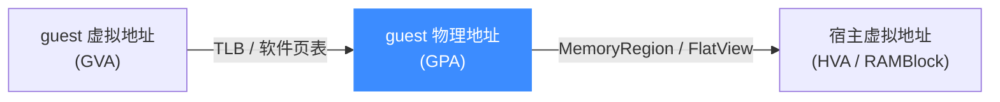
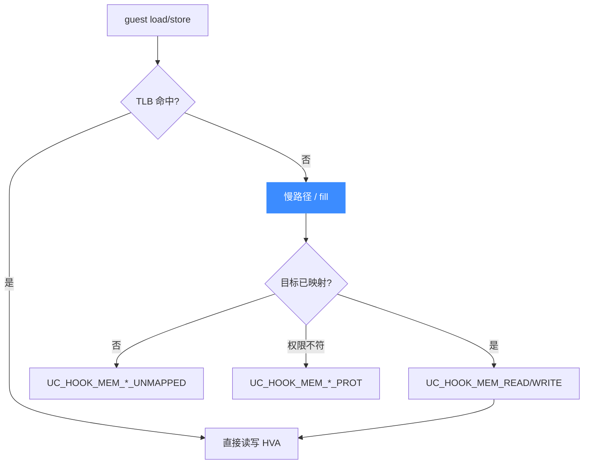

# softmmu 软件 MMU

> 🧠 softmmu（software MMU）是 QEMU/Unicorn 用软件模拟的内存管理单元，负责把 guest 虚拟地址一路翻译到宿主内存。本页讲这条翻译链、`MemoryRegion` 内存模型，以及访存 Hook 注入的位置。相关代码在 [`qemu/softmmu/`](https://github.com/android-security-engineer/unicorn-skills/blob/master/qemu/softmmu/memory.c) 与 [`qemu/accel/tcg/cputlb.c`](https://github.com/android-security-engineer/unicorn-skills/blob/master/qemu/accel/tcg/cputlb.c)。

## 🧭 三段地址翻译

guest 代码里的地址是「虚拟地址」，真正读写的是「宿主内存」。中间要过两道翻译：



- **GVA → GPA**：由软件 TLB（[`cputlb.c`](https://github.com/android-security-engineer/unicorn-skills/blob/master/qemu/accel/tcg/cputlb.c) 的 [`tlb_fill`](https://github.com/android-security-engineer/unicorn-skills/blob/master/qemu/accel/tcg/cputlb.c#L998) 在 [L998](https://github.com/android-security-engineer/unicorn-skills/blob/master/qemu/accel/tcg/cputlb.c#L998)）完成，未命中则 fill（见 [TLB 与地址翻译](/internals/tlb)）。
- **GPA → HVA**：由内存模型解析——`MemoryRegion` 树在 `uc_mem_map()` 时挂进 `uc->system_memory`，再压平成 `FlatView` 供快速查找（见 [MemoryRegion / FlatView](/internals/memory-api)）。

## 🧱 MemoryRegion：映射的载体

`uc_mem_map()` 的后端就是 [`qemu/softmmu/memory.c`](https://github.com/android-security-engineer/unicorn-skills/blob/master/qemu/softmmu/memory.c) 里的 [`memory_map`](https://github.com/android-security-engineer/unicorn-skills/blob/master/qemu/softmmu/memory.c#L45)（[memory.c:45](https://github.com/android-security-engineer/unicorn-skills/blob/master/qemu/softmmu/memory.c#L45)）：它新建一个 RAM 型 `MemoryRegion`，加为 `system_memory` 的子区域，并刷 TLB。

```c
// qemu/softmmu/memory.c: memory_map()
MemoryRegion *memory_map(struct uc_struct *uc, hwaddr begin,
                         size_t size, uint32_t perms) {
    MemoryRegion *ram = g_new(MemoryRegion, 1);
    memory_region_init_ram(uc, ram, size, perms);
    if (ram->addr == -1 || !ram->ram_block) { g_free(ram); return NULL; }
    memory_region_add_subregion_overlap(uc->system_memory, begin, ram,
                                        uc->snapshot_level);
    if (uc->cpu) tlb_flush(uc->cpu);   // 映射变化后必须刷 TLB
    return ram;
}
```

| 映射方式 | 后端函数 | 特点 |
| --- | --- | --- |
| 普通 RAM | [`memory_map`](https://github.com/android-security-engineer/unicorn-skills/blob/master/qemu/softmmu/memory.c#L45) | Unicorn 自行分配宿主内存 |
| 用户内存 | [`memory_map_ptr`](https://github.com/android-security-engineer/unicorn-skills/blob/master/qemu/softmmu/memory.c#L65) | 映射到调用方提供的 `void *ptr` |
| MMIO | [`memory_map_io`](https://github.com/android-security-engineer/unicorn-skills/blob/master/qemu/softmmu/memory.c#L160) | 绑定读写回调，访存转成 C 回调（`mmio_cbs`） |

::: warning 映射变更必刷 TLB
任何 `memory_map` / `memory_unmap` / COW 都会 `tlb_flush(uc->cpu)` 或按页 `tlb_flush_page`，否则旧的 TLB 条目会指向失效映射。
:::

## 🪝 访存 Hook 注入点

softmmu 的访存慢路径是嵌入内存 Hook 的天然位置：



- 有效访存触发 `UC_HOOK_MEM_READ` / `WRITE` / `FETCH`。
- 访问未映射区触发对应 `*_UNMAPPED` Hook；权限不足触发 `*_PROT` Hook——回调可返回是否「补映射后继续」。
- MMIO 区的访问被转成用户注册的 `uc_cb_mmio_read/write_t` 回调。

## 📂 相关源码

| 文件 | 角色 |
|------|------|
| [`qemu/softmmu/memory.c`](https://github.com/android-security-engineer/unicorn-skills/blob/master/qemu/softmmu/memory.c) | `memory_map` / `memory_map_ptr` / `memory_map_io` / `memory_unmap` |
| [`qemu/accel/tcg/cputlb.c`](https://github.com/android-security-engineer/unicorn-skills/blob/master/qemu/accel/tcg/cputlb.c) | 软件 TLB fill、慢路径访存与 Hook 注入（`tlb_fill` / `tlb_flush`） |
| [`qemu/softmmu/unicorn_vtlb.c`](https://github.com/android-security-engineer/unicorn-skills/blob/master/qemu/softmmu/unicorn_vtlb.c) | `UC_TLB_VIRTUAL` 模式下的 fill 接管 |
| [`include/uc_priv.h`](https://github.com/android-security-engineer/unicorn-skills/blob/master/include/uc_priv.h) | `memory_map` 等函数指针 typedef |

## 相关页面

- [TLB 与地址翻译](/internals/tlb)
- [MemoryRegion / FlatView](/internals/memory-api)
- [内存模型总览](/memory/overview)
- [MMU 与虚拟内存](/features/mmu)
