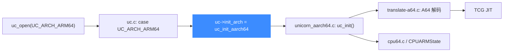

# AArch64 后端

> 🧩 本页讲 Unicorn 的 64 位 ARM（AArch64）后端：它与 32 位 ARM **共享** `qemu/target/arm/` 目录，但走独立入口 `uc_init_aarch64`。读完你能看清 `uc_init_aarch64` 与 `uc_init_arm` 的差异，以及 A64 指令翻译的落点。

AArch64 不是独立目录，而是 ARM 目录里专门的一组 A64 翻译/CPU 文件。`uc_open(UC_ARCH_ARM64, …)` 会把 `uc->init_arch` 指向 `uc_init_aarch64`。

## 🚀 从分发到后端的路径



## 📁 目录关键文件（AArch64 专属部分）

| 文件 | 职责 |
| --- | --- |
| `translate-a64.c` | A64 指令翻译主体（区别于 32 位的 `translate.c`） |
| `translate-sve.c` / `decode-sve.inc.c` | SVE 可伸缩向量扩展翻译 |
| `cpu64.c` | 64 位 CPU 模型（如 Cortex-A57、`max`）注册 |
| `unicorn_aarch64.c` | 64 位 Unicorn 胶水层，实现 `uc_init`、`arm64_set_pc` 等 |
| `helper-a64.c` | A64 专用运行期辅助例程 |
| `pauth_helper.c` | 指针认证（PAC）辅助 |
| `sve_helper.c` / `vec_helper.c` | SVE 与向量运算 |

## 🔧 uc_init_aarch64 vs uc_init_arm

```c
// qemu/target/arm/unicorn_aarch64.c
void uc_init(struct uc_struct *uc)
{
    uc->reg_read = reg_read;
    uc->reg_write = reg_write;
    uc->reg_reset = reg_reset;
    uc->set_pc = arm64_set_pc;
    uc->get_pc = arm64_get_pc;
    uc->release = arm64_release;
    uc->cpus_init = arm64_cpus_init;
    uc->cpu_context_size = offsetof(CPUARMState, cpu_watchpoint);
    uc_common_init(uc);
}
```

对比 32 位的 `uc_init_arm`，AArch64 版本**更精简**：

| 函数指针 | uc_init_arm | uc_init_aarch64 |
| --- | --- | --- |
| `set_pc` / `get_pc` | `arm_set_pc` / `arm_get_pc` | `arm64_set_pc` / `arm64_get_pc` |
| `stop_interrupt` | ✅ `arm_stop_interrupt` | ❌ 未单独设置 |
| `query` | ✅ `arm_query` | ❌（无 Thumb 概念，无需查询模式） |
| `opcode_hook_invalidate` | ✅ | ❌ |
| `context_save/restore` | ✅ 自定义 | ❌ 用通用实现 |

两者共用同一个 `CPUARMState`，所以 `cpu_context_size` 的计算相同（都到 `cpu_watchpoint` 偏移为止）。

::: tip 没有 Thumb
AArch64 只有单一 32 位定长指令集（A64），不存在 ARM/Thumb 状态切换，这也是它不需要 `query`、不设 `uc->thumb` 的原因。
:::

::: warning mode 校验
`uc.c` 中 ARM64 分支只检查 `mode & ~UC_MODE_ARM_MASK`。传入非法位会返回 `UC_ERR_MODE`。
:::

## 相关页面

- [ARM64 架构页](/arch/arm64/)
- [ARM 后端](/internals/target-arm)
- [uc.c 分发层](/internals/uc-dispatch)
- [TCG 翻译流水线](/internals/tcg-pipeline)
