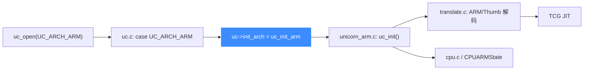
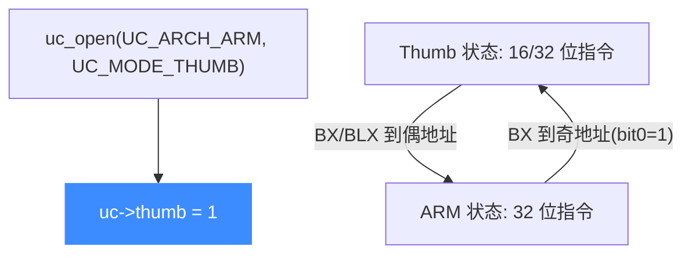

# ARM 后端

> 🧩 本页讲 Unicorn 的 32 位 ARM 后端：它位于 `qemu/target/arm/`（与 AArch64 共享同一目录），由 `uc_init_arm` 挂载函数指针，并支持在 ARM 与 Thumb 两种指令状态间切换。读完你能理解 `uc_open(UC_ARCH_ARM, …)` 之后代码如何走向翻译。

ARM 与 AArch64 复用同一份 QEMU 目标目录，但入口函数不同：32 位走 `uc_init_arm`（`unicorn_arm.c`），64 位走 `uc_init_aarch64`（`unicorn_aarch64.c`）。

## 🚀 从分发到后端的路径



## 📁 目录关键文件

| 文件 | 职责 |
| --- | --- |
| `translate.c` | A32/T32 指令翻译主体，配合 `decode-a32*.inc.c`、`decode-t16/t32.inc.c` |
| `cpu.c` / `cpu.h` | `CPUARMState`、ARM CPU 模型与复位 |
| `unicorn_arm.c` | 32 位 Unicorn 胶水层，实现 `uc_init`、`arm_set_pc` 等 |
| `helper.c` / `op_helper.c` | 运行期辅助例程（协处理器、异常等） |
| `neon_helper.c` / `vfp_helper.c` | NEON SIMD 与 VFP 浮点 |
| `m_helper.c` | Cortex-M（v7-M/v8-M）相关逻辑 |
| `tlb_helper.c` | MMU/TLB 缺页处理 |

## 🔧 uc_init_arm 挂了哪些函数指针

```c
// qemu/target/arm/unicorn_arm.c
void uc_init(struct uc_struct *uc)
{
    uc->reg_read = reg_read;
    uc->reg_write = reg_write;
    uc->reg_reset = reg_reset;
    uc->set_pc = arm_set_pc;
    uc->get_pc = arm_get_pc;
    uc->stop_interrupt = arm_stop_interrupt;
    uc->release = arm_release;
    uc->query = arm_query;
    uc->cpus_init = arm_cpus_init;
    uc->opcode_hook_invalidate = arm_opcode_hook_invalidate;
    uc->cpu_context_size = offsetof(CPUARMState, cpu_watchpoint);
    uc->context_size = uc_arm_context_size;
    uc->context_save = uc_arm_context_save;
    uc->context_restore = uc_arm_context_restore;
    uc_common_init(uc);
}
```

注意 ARM 后端还额外挂了 `query`（供 `uc_query` 查询当前指令模式）以及自定义的 `context_*`——因为 ARM 上下文比通用实现多了一些状态要保存。

## 🔀 ARM ↔ Thumb 状态



`uc.c` 的 ARM 分支里若 `mode & UC_MODE_THUMB` 就设置 `uc->thumb = 1`。运行期切换则遵循 ARM 体系规则：跳转目标地址的最低位（bit 0）决定进入 Thumb（1）还是 ARM（0）状态，也可通过写 CPSR 的 T 位改变。

::: tip 从 Thumb 起步
即使没传 `UC_MODE_THUMB`，只要让起始 PC 的 bit0 = 1（或写入 CPSR.T），CPU 也会以 Thumb 解码。调试反汇编对不上时，先确认当前处于哪种状态。
:::

::: warning mode 校验
`uc.c` 中 ARM 分支只校验 `mode & ~UC_MODE_ARM_MASK`，允许通过 `UC_MODE_BIG_ENDIAN`、`UC_MODE_THUMB` 等标志组合，但不接受未定义位。
:::

## 相关页面

- [ARM 架构页](/arch/arm/)
- [AArch64 后端](/internals/target-aarch64)
- [uc.c 分发层](/internals/uc-dispatch)
- [TCG 翻译流水线](/internals/tcg-pipeline)
