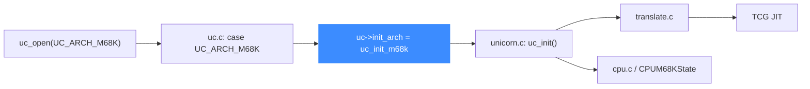

# M68K 后端

> 🧩 本页讲 Unicorn 的 Motorola 68000（M68K）后端：它位于 `qemu/target/m68k/`，由 `uc_init_m68k` 挂载函数指针。M68K 是纯大端架构，也是 `uc.c` 分发 switch 里的第一个 case。读完你能理解它的目录结构与入口。

M68K 只有单一入口 `uc_init_m68k`，无位宽/端序变体——它固定大端。

## 🚀 从分发到后端的路径



## 📁 目录关键文件

| 文件 | 职责 |
| --- | --- |
| `translate.c` | M68K 指令翻译主体 |
| `cpu.c` / `cpu.h` | `CPUM68KState`、CPU 模型与复位 |
| `unicorn.c` | Unicorn 胶水层，实现 `uc_init`、`m68k_set_pc` 等 |
| `op_helper.c` / `helper.c` | 运行期辅助例程（异常、特权指令等） |
| `fpu_helper.c` | 68881/68882 浮点协处理器 |
| `softfloat.c` / `softfloat.h` | 软件浮点实现（M68K 扩展精度） |

## 🔧 uc_init_m68k 挂了哪些函数指针

```c
// qemu/target/m68k/unicorn.c
void uc_init(struct uc_struct *uc)
{
    uc->release = m68k_release;
    uc->reg_read = reg_read;
    uc->reg_write = reg_write;
    uc->reg_reset = reg_reset;
    uc->set_pc = m68k_set_pc;
    uc->get_pc = m68k_get_pc;
    uc->cpus_init = m68k_cpus_init;
    uc->cpu_context_size = offsetof(CPUM68KState, end_reset_fields);
    uc_common_init(uc);
}
```

这是各后端里最精简的一类：只填了寄存器、PC、CPU 初始化与释放，其余全靠 `uc_common_init` 补齐通用实现。

## 🔀 分发中的位置

`uc.c` 的 `switch (arch)` 里 M68K 是第一个 `case`：

```c
// uc.c
case UC_ARCH_M68K:
    if ((mode & ~UC_MODE_M68K_MASK) || !(mode & UC_MODE_BIG_ENDIAN)) {
        free(uc);
        return UC_ERR_MODE;
    }
    uc->init_arch = uc_init_m68k;
    break;
```

::: warning 必须大端
M68K 分支强制要求 `mode & UC_MODE_BIG_ENDIAN`。传入小端或未定义位都会返回 `UC_ERR_MODE`。M68K 没有小端模式。
:::

::: tip 软浮点
M68K 使用扩展精度（80 位）浮点，`softfloat.c` 与 `softfloat_fpsp_tables.h` 提供了对应的软件实现，无需依赖宿主 FPU。
:::

## 相关页面

- [M68K 架构页](/arch/m68k/)
- [uc.c 分发层](/internals/uc-dispatch)
- [TCG 翻译流水线](/internals/tcg-pipeline)
- [uc_struct 与函数指针](/internals/function-pointers)
