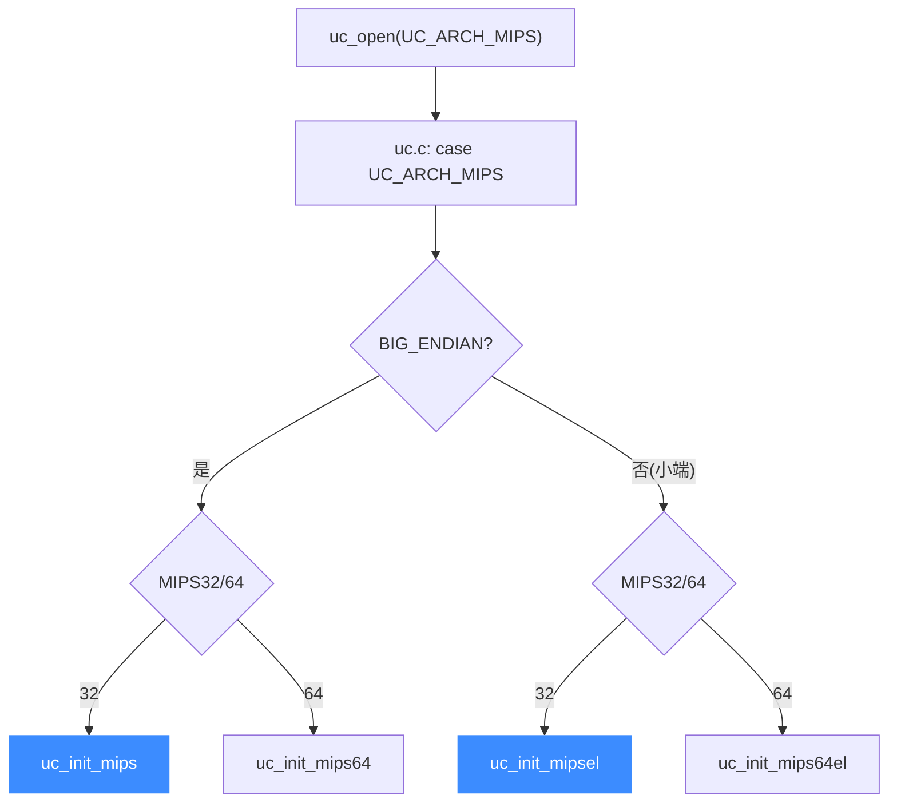

# MIPS 后端

> 🧩 本页讲 Unicorn 的 MIPS 后端：它位于 `qemu/target/mips/`，通过 `uc.c` 里一段较特殊的分发逻辑，按「大端/小端 × 32/64 位」四种组合选出 `uc_init_mips` / `uc_init_mipsel` / `uc_init_mips64` / `uc_init_mips64el` 之一。读完你能理解 MIPS 的字节序与位宽是怎么落到具体入口的。

MIPS 是唯一一个把「端序」和「位宽」都编进入口函数名的架构：四个 `uc_init_*` 共享 `qemu/target/mips/`，只是编译时的目标定义不同。

## 🚀 从分发到后端的路径



## 📁 目录关键文件

| 文件 | 职责 |
| --- | --- |
| `translate.c` | MIPS 指令翻译主体，配合 `translate_init.inc.c` 注册 CPU |
| `cpu.c` / `cpu.h` | `CPUMIPSState`、CPU 模型与复位 |
| `unicorn.c` | Unicorn 胶水层，实现 `uc_init`、`mips_set_pc` 等 |
| `op_helper.c` / `helper.c` | 运行期辅助例程 |
| `cp0_helper.c` / `cp0_timer.c` | CP0 协处理器（系统控制）与定时器 |
| `fpu_helper.c` | FPU 浮点 |
| `dsp_helper.c` / `msa_helper.c` | DSP ASE 与 MSA SIMD 扩展 |

## 🔧 uc_init（四个入口共用同一份实现）

```c
// qemu/target/mips/unicorn.c
void uc_init(struct uc_struct *uc)
{
    uc->reg_read = reg_read;
    uc->reg_write = reg_write;
    uc->reg_reset = reg_reset;
    uc->release = mips_release;
    uc->set_pc = mips_set_pc;
    uc->get_pc = mips_get_pc;
    uc->cpus_init = mips_cpus_init;
    uc->cpu_context_size = offsetof(CPUMIPSState, end_reset_fields);
    uc_common_init(uc);
}
```

同一份 `uc_init` 源码经不同目标宏编译成四个符号：`qemu/mips.h`→`uc_init_mips`、`qemu/mipsel.h`→`uc_init_mipsel`、`qemu/mips64.h`→`uc_init_mips64`、`qemu/mips64el.h`→`uc_init_mips64el`。

## 🔀 端序与位宽如何决定入口

| mode 组合 | 入口函数 |
| --- | --- |
| `UC_MODE_MIPS32 + UC_MODE_BIG_ENDIAN` | `uc_init_mips` |
| `UC_MODE_MIPS64 + UC_MODE_BIG_ENDIAN` | `uc_init_mips64` |
| `UC_MODE_MIPS32`（小端，默认） | `uc_init_mipsel` |
| `UC_MODE_MIPS64`（小端） | `uc_init_mips64el` |

::: tip 端序不是运行期开关
MIPS 的字节序在 `uc_open` 时就固定为一个具体后端符号，不能中途切换。要换端序就得重新 `uc_open`。
:::

::: warning mode 校验
`uc.c` 中 MIPS 分支要求 `mode` 必须含 `UC_MODE_MIPS32` 或 `UC_MODE_MIPS64` 之一，否则返回 `UC_ERR_MODE`。若某个端序/位宽组合对应的 `UNICORN_HAS_*` 未编译进来，`init_arch` 会保持 `NULL`，最终返回 `UC_ERR_ARCH`。
:::

## 相关页面

- [MIPS 架构页](/arch/mips/)
- [uc.c 分发层](/internals/uc-dispatch)
- [TCG 翻译流水线](/internals/tcg-pipeline)
- [构建系统与 UNICORN_ARCH](/internals/build-system)
