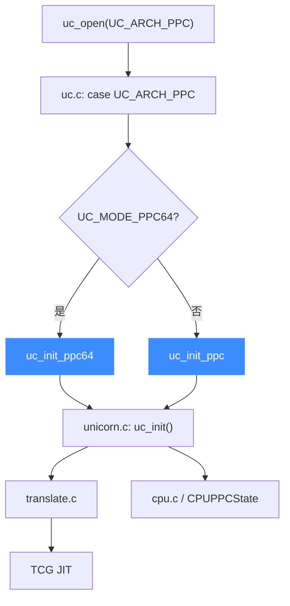

# PowerPC 后端

> 🧩 本页讲 Unicorn 的 PowerPC 后端：它位于 `qemu/target/ppc/`，`uc.c` 按 `UC_MODE_PPC32/PPC64` 在 `uc_init_ppc` 与 `uc_init_ppc64` 间二选一。读完你能理解 PPC 后端的目录结构与 32/64 位入口区别。

PowerPC 是大端优先的架构：`uc.c` 的 PPC 分支强制要求 `UC_MODE_BIG_ENDIAN`，并按位宽分派到两个入口。

## 🚀 从分发到后端的路径



## 📁 目录关键文件

| 文件 | 职责 |
| --- | --- |
| `translate.c` | PPC 指令翻译主体 |
| `cpu.c` / `cpu.h` | `CPUPPCState`、CPU 复位 |
| `cpu-models.c` / `cpu-models.h` | 大量 PowerPC CPU 型号定义 |
| `unicorn.c` | Unicorn 胶水层，实现 `uc_init`、`ppc_set_pc` 等 |
| `int_helper.c` / `fpu_helper.c` | 整数、浮点辅助例程 |
| `mmu_helper.c` / `mmu-hash32.c` / `mmu-hash64.c` / `mmu-radix64.c` | 多种 MMU 模型（哈希页表、Radix 等） |
| `dfp_helper.c` | 十进制浮点（DFP） |

## 🔧 uc_init（ppc 与 ppc64 共用实现）

```c
// qemu/target/ppc/unicorn.c
void uc_init(struct uc_struct *uc)
{
    uc->reg_read = reg_read;
    uc->reg_write = reg_write;
    uc->reg_reset = reg_reset;
    uc->release = ppc_release;
    uc->set_pc = ppc_set_pc;
    uc->get_pc = ppc_get_pc;
    uc->cpus_init = ppc_cpus_init;
    uc->cpu_context_size = offsetof(CPUPPCState, uc);
    uc_common_init(uc);
}
```

同一份 `uc_init` 经 `qemu/ppc.h`（`uc_init_ppc`）与 `qemu/ppc64.h`（`uc_init_ppc64`）两套目标定义编译成两个符号。注意 `cpu_context_size` 取到 `CPUPPCState` 的 `uc` 字段偏移。

## 🔀 32/64 位如何决定入口

| mode 组合 | 入口函数 |
| --- | --- |
| `UC_MODE_PPC32 + UC_MODE_BIG_ENDIAN` | `uc_init_ppc` |
| `UC_MODE_PPC64 + UC_MODE_BIG_ENDIAN` | `uc_init_ppc64` |

::: warning 必须大端
`uc.c` 中 PPC 分支要求 `mode & UC_MODE_BIG_ENDIAN` 必须置位，且必须含 `UC_MODE_PPC32/PPC64` 之一，否则返回 `UC_ERR_MODE`。Unicorn 的 PPC 后端不提供小端模式。
:::

::: tip 型号众多
`cpu-models.c` 列了几十种 PowerPC 处理器型号。默认 `cpu_model = INT_MAX` 表示使用后端默认型号，可用 `uc_ctl` 的 CPU model 相关接口切换。
:::

## 相关页面

- [PowerPC 架构页](/arch/ppc/)
- [uc.c 分发层](/internals/uc-dispatch)
- [TCG 翻译流水线](/internals/tcg-pipeline)
- [uc_struct 与函数指针](/internals/function-pointers)
