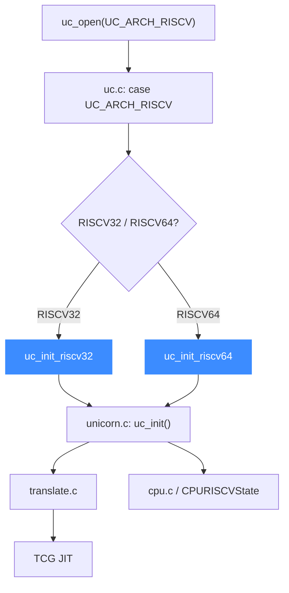

# RISC-V 后端

> 🧩 本页讲 Unicorn 的 RISC-V 后端：它位于 `qemu/target/riscv/`，`uc.c` 按 `UC_MODE_RISCV32/RISCV64` 在 `uc_init_riscv32` 与 `uc_init_riscv64` 间二选一。读完你能理解 RV32/RV64 两个入口的分派与后端结构。

RISC-V 后端支持 RV32 与 RV64 两种位宽，二者共享 `qemu/target/riscv/`，仅编译期目标定义不同。

## 🚀 从分发到后端的路径



## 📁 目录关键文件

| 文件 | 职责 |
| --- | --- |
| `translate.c` | RISC-V 指令翻译主体 |
| `cpu.c` / `cpu.h` | `CPURISCVState`、CPU 模型与复位 |
| `cpu_helper.c` | 取指、异常、地址转换等核心辅助 |
| `unicorn.c` | Unicorn 胶水层，实现 `uc_init`、`riscv_set_pc` 等 |
| `csr.c` / `cpu_bits.h` | 控制状态寄存器（CSR）实现与位定义 |
| `op_helper.c` / `fpu_helper.c` | 运行期辅助、浮点 |
| `pmp.c` / `pmp.h` | 物理内存保护（PMP） |
| `instmap.h` | 指令编码映射 |

## 🔧 uc_init（riscv32 与 riscv64 共用实现）

```c
// qemu/target/riscv/unicorn.c
void uc_init(struct uc_struct *uc)
{
    uc->reg_read = reg_read;
    uc->reg_write = reg_write;
    uc->reg_reset = reg_reset;
    uc->release = riscv_release;
    uc->set_pc = riscv_set_pc;
    uc->get_pc = riscv_get_pc;
    uc->stop_interrupt = riscv_stop_interrupt;
    uc->insn_hook_validate = riscv_insn_hook_validate;
    uc->cpus_init = riscv_cpus_init;
    uc->cpu_context_size = offsetof(CPURISCVState, rdtime_fn);
    uc_common_init(uc);
}
```

同一份 `uc_init` 经 `qemu/riscv32.h`（`uc_init_riscv32`）与 `qemu/riscv64.h`（`uc_init_riscv64`）编译成两个符号。RISC-V 后端还挂了 `stop_interrupt` 与 `insn_hook_validate`（用于校验指令级 Hook）。

## 🔀 RV32/RV64 如何决定入口

| mode 组合 | 入口函数 |
| --- | --- |
| `UC_MODE_RISCV32` | `uc_init_riscv32` |
| `UC_MODE_RISCV64` | `uc_init_riscv64` |

::: warning 必须显式指定位宽
`uc.c` 中 RISC-V 分支要求 `mode` 必须含 `UC_MODE_RISCV32` 或 `UC_MODE_RISCV64`；两者都没有时直接返回 `UC_ERR_MODE`（这里不像其它架构有默认回退）。
:::

::: tip CSR 与 PMP
若模拟涉及特权级切换、定时器（`rdtime`）、内存保护，重点看 `csr.c` 与 `pmp.c`。`cpu_context_size` 恰好取到 `rdtime_fn` 之前的字段，说明该函数指针不属于可保存的 CPU 上下文。
:::

## 相关页面

- [RISC-V 架构页](/arch/riscv/)
- [uc.c 分发层](/internals/uc-dispatch)
- [TCG 翻译流水线](/internals/tcg-pipeline)
- [uc_struct 与函数指针](/internals/function-pointers)
