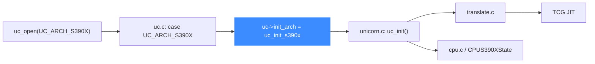

# S390X 后端

> 🧩 本页讲 Unicorn 的 IBM System/390（s390x）后端：它位于 `qemu/target/s390x/`，由 `uc_init_s390x` 挂载函数指针。s390x 是纯大端的 64 位大型机架构，单一入口。读完你能理解它的目录结构与入口。

s390x 只有一个入口 `uc_init_s390x`，固定大端、64 位，无变体。

## 🚀 从分发到后端的路径



## 📁 目录关键文件

| 文件 | 职责 |
| --- | --- |
| `translate.c` | s390x 指令翻译主体 |
| `cpu.c` / `cpu.h` | `CPUS390XState`、CPU 复位 |
| `cpu_models.c` / `cpu_features.c` | CPU 型号与特性位（z 系列各代） |
| `unicorn.c` | Unicorn 胶水层，实现 `uc_init`、`s390_set_pc` 等 |
| `helper.c` / `int_helper.c` / `fpu_helper.c` | 运行期辅助、整数、浮点 |
| `mem_helper.c` / `mmu_helper.c` | 访存与 MMU（DAT 地址转换） |
| `interrupt.c` / `excp_helper.c` | 中断与异常 |
| `crypto_helper.c` | CPACF 加密指令 |

## 🔧 uc_init_s390x 挂了哪些函数指针

```c
// qemu/target/s390x/unicorn.c
void uc_init(struct uc_struct *uc)
{
    uc->release = s390_release;
    uc->reg_read = reg_read;
    uc->reg_write = reg_write;
    uc->reg_reset = reg_reset;
    uc->set_pc = s390_set_pc;
    uc->get_pc = s390_get_pc;
    uc->cpus_init = s390_cpus_init;
    uc->cpu_context_size = offsetof(CPUS390XState, end_reset_fields);
    uc_common_init(uc);
}
```

与 M68K、TriCore 一样属于精简型：核心几项之外全部依赖 `uc_common_init`。注意胶水层里的符号前缀是 `s390_`（而非 `s390x_`），但通过 `qemu/s390x.h` 的改名机制导出为 `uc_init_s390x`。

## 🔀 分发中的位置

```c
// uc.c
case UC_ARCH_S390X:
    if ((mode & ~UC_MODE_S390X_MASK) || !(mode & UC_MODE_BIG_ENDIAN)) {
        free(uc);
        return UC_ERR_MODE;
    }
    uc->init_arch = uc_init_s390x;
    break;
```

::: warning 必须大端
s390x 分支强制要求 `mode & UC_MODE_BIG_ENDIAN`。大型机体系一律大端，传小端会返回 `UC_ERR_MODE`。
:::

::: tip 特性位众多
z 架构历经多代，`cpu_features.c` / `cpu_features_def.inc.h` 用位图描述每种型号支持的指令扩展。默认使用后端默认 CPU 型号。
:::

## 相关页面

- [S390X 架构页](/arch/s390x/)
- [uc.c 分发层](/internals/uc-dispatch)
- [TCG 翻译流水线](/internals/tcg-pipeline)
- [uc_struct 与函数指针](/internals/function-pointers)
