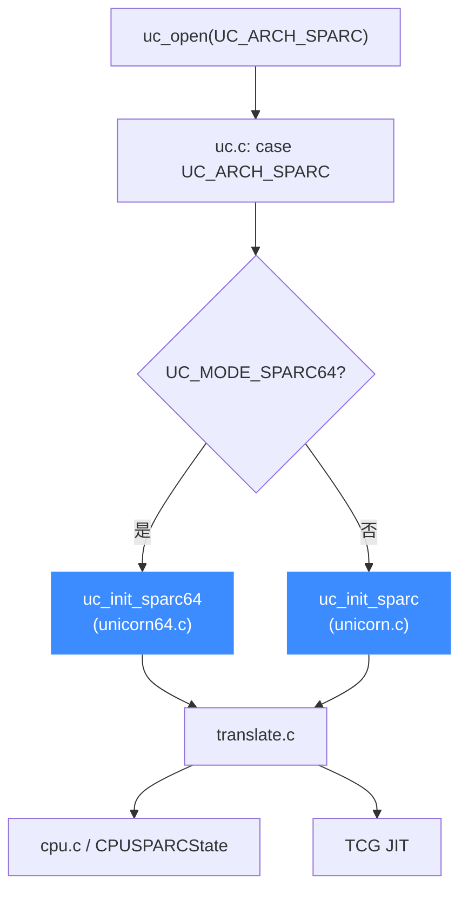

# SPARC 后端

> 🧩 本页讲 Unicorn 的 SPARC 后端：它位于 `qemu/target/sparc/`，`uc.c` 按 `UC_MODE_SPARC32/SPARC64` 在 `uc_init_sparc` 与 `uc_init_sparc64` 间二选一。读完你能理解 32/64 位入口的差异（32 位额外设置了 `cpu_context_size`）。

SPARC 是大端架构，后端同时支持 32 位（V8）与 64 位（V9）。两者的 Unicorn 胶水层分处两个文件：`unicorn.c`（32 位）与 `unicorn64.c`（64 位）。

## 🚀 从分发到后端的路径



## 📁 目录关键文件

| 文件 | 职责 |
| --- | --- |
| `translate.c` | SPARC 指令翻译主体 |
| `cpu.c` / `cpu.h` | `CPUSPARCState`、CPU 模型与复位 |
| `unicorn.c` | 32 位 Unicorn 胶水层，`uc_init` = `uc_init_sparc` |
| `unicorn64.c` | 64 位 Unicorn 胶水层，`uc_init` = `uc_init_sparc64` |
| `int32_helper.c` / `int64_helper.c` | 32/64 位陷阱与中断处理 |
| `win_helper.c` | 寄存器窗口（register window）管理 |
| `fop_helper.c` | 浮点运算辅助 |
| `ldst_helper.c` / `mmu_helper.c` | 访存与 MMU |

## 🔧 uc_init_sparc vs uc_init_sparc64

```c
// qemu/target/sparc/unicorn.c —— 32 位
void uc_init(struct uc_struct *uc)
{
    uc->release = sparc_release;
    uc->reg_read = reg_read;
    uc->reg_write = reg_write;
    uc->reg_reset = reg_reset;
    uc->set_pc = sparc_set_pc;
    uc->get_pc = sparc_get_pc;
    uc->stop_interrupt = sparc_stop_interrupt;
    uc->cpus_init = sparc_cpus_init;
    uc->cpu_context_size = offsetof(CPUSPARCState, irq_manager);
    uc_common_init(uc);
}
```

64 位版本（`unicorn64.c`）几乎相同，但**没有**设置 `cpu_context_size`：

| 函数指针 | uc_init_sparc | uc_init_sparc64 |
| --- | --- | --- |
| `set_pc` / `get_pc` | `sparc_set_pc` / `sparc_get_pc` | 同左（共用） |
| `stop_interrupt` | ✅ | ✅ |
| `cpu_context_size` | ✅ `offsetof(…, irq_manager)` | ❌ 未设置 |

两版共用 `sparc_set_pc`、`sparc_release` 等符号名——因为它们编译时属于不同目标（`qemu/sparc.h` 对 `qemu/sparc64.h`），符号不会冲突。

::: warning 必须大端 + 指定位宽
`uc.c` 中 SPARC 分支要求 `UC_MODE_BIG_ENDIAN` 置位，且必须含 `UC_MODE_SPARC32/SPARC64` 之一，否则返回 `UC_ERR_MODE`。
:::

::: tip 寄存器窗口
SPARC 的 `%i/%l/%o` 寄存器随函数调用滑动窗口切换，模拟时要留意 `win_helper.c` 的 SAVE/RESTORE 语义，直接读 `%o`/`%i` 可能对应不同物理寄存器。
:::

## 相关页面

- [SPARC 架构页](/arch/sparc/)
- [uc.c 分发层](/internals/uc-dispatch)
- [TCG 翻译流水线](/internals/tcg-pipeline)
- [uc_struct 与函数指针](/internals/function-pointers)
